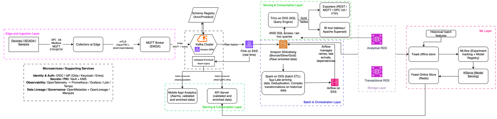
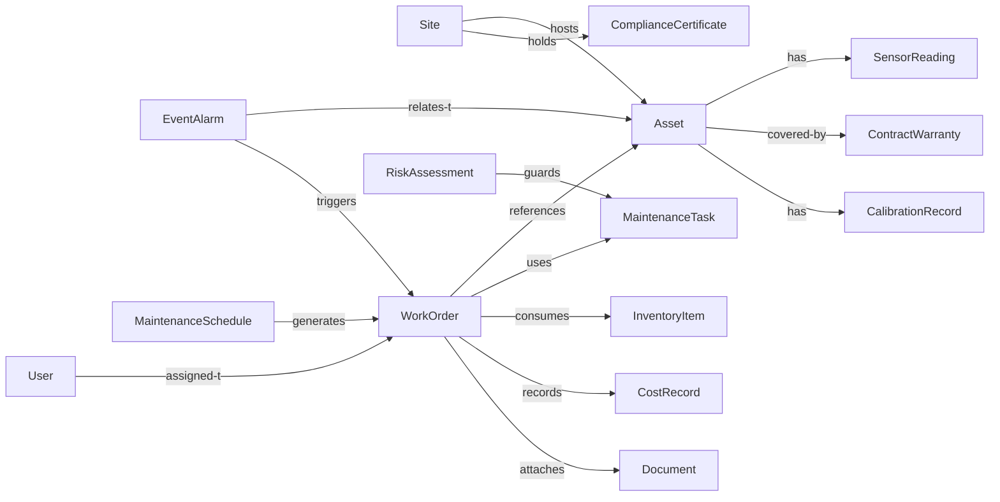

# 1. dCMMS Product Requirements Document (PRD)

## 1.1 Executive Summary

dCMMS is a computerized maintenance management platform tailored for non-conventional energy assets (utility-scale solar, wind, hybrid microgrids, battery energy storage). The product vision is to deliver a field-ready MVP quickly, then iterate in clearly defined releases that add analytics, AI-driven automation, and compliance features without disrupting existing workflows. Each release is scoped to produce a deployable increment with automated tests, supporting a test-driven development (TDD) model from Sprint 0.

## 1.2 Document Structure

This PRD combines program-level planning (personas, releases, dependencies, roadmap) with high-level functional and technical requirements. Every section is numbered for traceability.

**For detailed technical implementation:** See the `specs/` directory which contains 24 comprehensive specifications (~23,900 lines) addressing all requirements gaps identified in `GAP_ANALYSIS.md`. These specifications cover:
- **P0 (MVP)**: 13 specifications including API design, state machines, auth/authz, mobile offline sync, data ingestion, security
- **P1 (Release 1)**: 8 specifications including notifications, compliance, analytics, UX design, performance, edge computing
- **P2 (Release 2)**: 3 specifications including AI/ML implementation, cost management, internationalization

Refer to `GAP_STATUS_REPORT.md` for complete specification coverage status and `README.md` for a quick reference guide.

## 1.3 Table of Contents

- [1. dCMMS Product Requirements Document (PRD)](#1-dcmms-product-requirements-document-prd)
  - [1.1 Executive Summary](#11-executive-summary)
  - [1.2 Document Structure](#12-document-structure)
  - [1.3 Table of Contents](#13-table-of-contents)
  - [1.4 Related Documents](#14-related-documents)
- [2. Vision & Goals](#2-vision--goals)
- [3. Personas & Key Workflows](#3-personas--key-workflows)
- [4. Product Scope](#4-product-scope)
- [5. Release Plan & Requirements](#5-release-plan--requirements)
- [6. Detailed Functional Requirements](#6-detailed-functional-requirements)
- [7. Architecture Overview](#7-architecture-overview)
- [8. Data Architecture & Schemas](#8-data-architecture--schemas)
- [9. Performance & Scalability Requirements](#9-performance--scalability-requirements)
- [10. Security Architecture](#10-security-architecture)
- [11. Data Governance & Privacy](#11-data-governance--privacy)
- [12. Disaster Recovery & Business Continuity](#12-disaster-recovery--business-continuity)
- [13. Change Management Process](#13-change-management-process)
- [14. User Experience Design](#14-user-experience-design)
- [15. Mobile Strategy & Field Operations](#15-mobile-strategy--field-operations)
- [16. AI/ML Requirements & Governance](#16-aiml-requirements--governance)
- [17. Advanced Weather Integration](#17-advanced-weather-integration)
- [18. Dependency Matrix](#18-dependency-matrix)
- [19. Implementation Roadmap (TDD Friendly)](#19-implementation-roadmap-tdd-friendly)
- [20. Testing Strategy (Summary)](#20-testing-strategy-summary)
- [21. Risks & Mitigations](#21-risks--mitigations)
- [22. Open Issues](#22-open-issues)
- [23. Glossary](#23-glossary)
- [24. Next Steps](#24-next-steps)
- [25. Cost Considerations](#25-cost-considerations)
- [26. Appendix A: Power Generation Prediction (Solar & Wind)](#26-appendix-a-power-generation-prediction-solar--wind)
- [27. Appendix B: Sustainability & ESG Integration](#27-appendix-b-sustainability--esg-integration)
- [28. Appendix C: Extended AI/ML Governance](#28-appendix-c-extended-aiml-governance)

## 1.4 Related Documents

This PRD is supported by comprehensive technical specifications:

| Document | Purpose | Status |
|----------|---------|--------|
| `GAP_ANALYSIS.md` | Identifies 20+ requirement gaps with prioritization | Complete |
| `GAP_STATUS_REPORT.md` | Tracks specification coverage (100% complete) | Complete |
| `specs/` directory | 24 detailed technical specifications (~23,900 lines) | 100% Complete |
| `README.md` | Quick reference and navigation guide | Complete |

**For Implementation Teams:**
- **Architects**: Start with `specs/01_API_SPECIFICATIONS.md` and `specs/10_DATA_INGESTION_ARCHITECTURE.md`
- **Security**: See `specs/03_AUTH_AUTHORIZATION.md` and `specs/13_SECURITY_IMPLEMENTATION.md`
- **Frontend**: See `specs/17_UX_DESIGN_SYSTEM_TRAINING.md` and `specs/04_MOBILE_OFFLINE_SYNC.md`
- **Backend**: See `specs/10_DATA_INGESTION_ARCHITECTURE.md` and `specs/18_PERFORMANCE_SCALABILITY.md`
- **DevOps**: See `specs/05_DEPLOYMENT_RUNBOOKS.md` and `specs/21_EDGE_COMPUTING.md`

**Complete Specification List:**

**P0 (MVP) - 13 Specifications:**
1. `01_API_SPECIFICATIONS.md` - REST API design, versioning, error handling
2. `02_STATE_MACHINES.md` - Work order, asset, inventory state machines
3. `03_AUTH_AUTHORIZATION.md` - OAuth2/OIDC, JWT, RBAC/ABAC
4. `04_MOBILE_OFFLINE_SYNC.md` - Offline-first architecture, conflict resolution
5. `05_DEPLOYMENT_RUNBOOKS.md` - Deployment, rollback, incident response
6. `06_MIGRATION_ONBOARDING.md` - 5-phase onboarding, data migration
7. `07_TESTING_STRATEGY.md` - Unit, integration, E2E, performance testing
8. `08_ORGANIZATIONAL_STRUCTURE.md` - Industry-researched user roles
9. `09_ROLE_FEATURE_ACCESS_MATRIX.md` - 17 roles × 73 features
10. `10_DATA_INGESTION_ARCHITECTURE.md` - High-speed telemetry ingestion
11. `11_COMPLETE_DATA_MODELS.md` - Complete entity schemas
12. `12_INTEGRATION_ARCHITECTURE.md` - ERP, weather, IdP, MDM integration
13. `13_SECURITY_IMPLEMENTATION.md` - Audit logs, encryption, certificates

**P1 (Release 1) - 8 Specifications:**
14. `14_NOTIFICATION_ALERTING_SYSTEM.md` - Multi-channel notifications
15. `15_COMPLIANCE_REGULATORY_REPORTING.md` - NERC/CEA/MNRE compliance
16. `16_ANALYTICS_REPORTING.md` - Advanced analytics, report builder
17. `17_UX_DESIGN_SYSTEM_TRAINING.md` - Design system, training modules
18. `18_PERFORMANCE_SCALABILITY.md` - Load balancing, caching, auto-scaling
19. `19_DOCUMENTATION_SYSTEM.md` - API docs, user guides, admin guides
20. `20_VENDOR_PROCUREMENT.md` - Vendor management, procurement workflows
21. `21_EDGE_COMPUTING.md` - Edge analytics, local processing

**P2 (Release 2) - 3 Specifications:**
22. `22_AI_ML_IMPLEMENTATION.md` - Feature store, model training, inference
23. `23_COST_MANAGEMENT.md` - Work order costing, budget management
24. `24_INTERNATIONALIZATION.md` - Multi-language support, locale formatting

## 2. Vision & Goals

| Goal | Measure of Success |
| --- | --- |
| Reduce unplanned downtime | ≥15% reduction within year one (CMMS downtime stats) |
| Enable field technicians to work offline | ≥90% of work orders closed successfully on mobile PWA without network dependency |
| Embed AI/ML for predictive maintenance | Model-assisted work orders generate ≥10% of corrective actions by end of Release 2 |
| Maintain regulatory readiness | 100% compliance with mandatory reporting rules in target markets |

## 3. Personas & Key Workflows

| Persona | Core Needs | KPIs / Signals | Supporting Releases |
| --- | --- | --- | --- |
| Field Technician | Offline work order execution, safety checklists, part scanning | WO turnaround time, safety compliance, offline sync success | MVP, Release 1 |
| Maintenance Supervisor | Scheduling, SLA compliance, crew balancing | SLA breach %, backlog, labor utilization | MVP, Release 1 |
| Operations Manager | KPI dashboards, anomaly detection | MTTR, MTBF, energy yield variance | Release 1, Release 2 |
| Reliability/Analytics Engineer | Telemetry access, model lifecycle, explainability | Model precision, alert-to-WO conversion, drift rate | Release 2 |
| Compliance Officer | Audit trails, regulatory reporting | Audit closure times, report submission accuracy | Release 2, Release 3 |
| IT/Admin | Security, integrations, rollout controls | Access review completion, uptime, IdP integration | All releases |

Each persona will have user stories and KPIs recorded in the backlog. Representative workflows include:

- Technician completes corrective WO offline and syncs photos/checklists.
- Supervisor auto-schedules preventive maintenance based on predictive alerts.
- Operations Manager reviews telemetry deviations leading to automatic WO creation.

## 4. Product Scope

### 4.1 In Scope (First 12 Months)

- Asset registry and hierarchy management
- Complete work order lifecycle (create → schedule → assign → execute → close)
- Technician mobile PWA with offline sync
- Inventory/parts reservation and consumption tracking
- Telemetry ingestion, alerting, dashboards
- AI/ML data platform, model governance, predictive WO creation
- Security baseline (RBAC/ABAC, MFA, audit trails)
- Regulatory reporting (CEA/MNRE initially, NERC/AEMO/NESO in Release 3+)
- Cloud-agnostic architecture with IdP adapter pattern
- Production readiness (DR, incident response, security operations)

### 4.2 Future Enhancements (Release 3+)

- Global compliance (NERC, AEMO, NESO for USA, Australia, Europe markets)
- Multi-language support (15+ languages beyond Hindi)
- ERP integration (SAP, Oracle, MS Dynamics)
- ESG dashboards and sustainability analytics (unless mandated earlier)
- Advanced weather-market integrations
- AR-guided mobile workflows, multi-tenant chargeback

## 5. Release Plan & Requirements

Each release produces a deployable increment with automated regression coverage.

### 5.1 Release 0 – MVP (Target: Month 3)

| ID | Feature | Description | Persona | Priority | Dependencies | TDD Hooks |
| --- | --- | --- | --- | --- | --- | --- |
| R0-F1 | Asset Hierarchy | CRUD for site → asset → component with tagging and geo metadata | Supervisor | P0 | PostgreSQL, REST API | Unit/contract tests for CRUD |
| R0-F2 | Work Order Lifecycle | Create, schedule, assign, complete, close; checklists; attachments | Technician | P0 | Asset registry, mobile app | BDD tests on state transitions |
| R0-F3 | Mobile PWA (Offline) | Offline queue, conflict resolution, attachment sync | Technician | P0 | Local DB, sync APIs | Integration tests against mocked server |
| R0-F4 | Inventory Tie-In | Parts reservation and decrement on completion | Supervisor | P1 | Inventory service | API contract tests |
| R0-F5 | Core Dashboard | Open/overdue WOs, asset availability, backlog | Manager | P1 | Reporting service | Snapshot tests |

### 5.2 Release 1 – Core Operations (Target: Month 6, Weeks 15-26)

| ID | Feature | Description | Persona | Priority | Dependencies | TDD Hooks |
| --- | --- | --- | --- | --- | --- | --- |
| R1-F1 | Scheduler & Dispatch | Skills-based assignment, calendar views, crew utilization | Supervisor | P0 | Personnel data, work orders | Scheduler service unit tests |
| R1-F2 | Telemetry Ingestion | MQTT → Kafka → QuestDB pipelines | Ops Manager | P0 | Kafka, Flink, QuestDB | Replay-based integration tests |
| R1-F3 | Alerting & Notifications | Threshold, anomaly alerts, multi-channel escalation | Ops Manager | P0 | Telemetry, notification service | Load/fan-out tests |
| R1-F4 | Compliance Reporting | CEA/MNRE automated reporting (India focus initially) | Compliance | P1 | Data warehouse | Report validation scripts |
| R1-F5 | Role-Based Security | RBAC, MFA, audit logs, IdP adapter pattern | IT Admin | P0 | IdP (Auth0/Okta/Keycloak) | Security regression scripts |

### 5.3 Release 2 – Predictive & AI-First (Target: Month 9, Weeks 27-40)

| ID | Feature | Description | Persona | Priority | Dependencies | TDD Hooks |
| --- | --- | --- | --- | --- | --- | --- |
| R2-F1 | AI Data Platform | Feature store, model registry, drift/bias monitoring | Analytics Engineer | P0 | Kafka, object store | Data quality and drift tests |
| R2-F2 | Predictive WO Creation | ML-driven alerts auto-create WOs with human oversight | Supervisor | P0 | AI platform, work orders | Simulation tests on historical data |
| R2-F3 | Model Explainability UI | SHAP/LIME explanations embedded in dashboards | Ops Manager | P1 | AI platform | UI regression tests |
| R2-F4 | Internationalization | Hindi as second language (15+ languages in future) | All Users | P1 | i18n library (react-i18next) | Locale switching tests |
| R2-F5 | Production Readiness | DR plan, incident response, security operations | DevOps/IT Admin | P0 | Cloud infrastructure | DR drill tests |

### 5.4 Release 3 – Enhancements & ESG (Target: Month 12+)

| ID | Feature | Description | Persona | Priority | Dependencies | Notes |
| --- | --- | --- | --- | --- | --- | --- |
| R3-F1 | Global Compliance | NERC, AEMO, NESO reporting (USA, Australia, Europe) | Compliance | P1 | Data warehouse | Deferred from Release 1 per stakeholder decision |
| R3-F2 | Multi-Language i18n | 15+ languages beyond Hindi (Spanish, French, German, etc.) | All Users | P1 | i18n framework | Deferred from Release 2 per stakeholder decision |
| R3-F3 | ERP Integration | SAP, Oracle, MS Dynamics integration for procurement | IT Admin | P1 | ERP APIs, integration platform | Deferred per stakeholder decision |
| R3-F4 | ESG Dashboards | Carbon footprint, REC tracking, stakeholder reporting | ESG Officer | P2 | Data warehouse | Defer unless regulatory need |
| R3-F5 | Weather-Informed Scheduling | Maintenance windows based on forecasts | Supervisor | P1 | Weather API, scheduler | Dependent on vendor contract |
| R3-F6 | Multi-Tenant Architecture | Tenant isolation, billing, chargeback | IT Admin | P1 | IAM, billing | Align with go-to-market |
| R3-F7 | Advanced Mobile Workflows | AR-guided inspections, voice commands, wearables | Technician | P2 | Mobile hardware | Prototype after field feedback |
| R3-F8 | GenAI Document Intelligence | Knowledge search across manuals/PPAs/tickets; contextual Q&A | Ops/Techs | P2 | Vector store, doc ingestion | Add if field demand proves strong |

## 6. Detailed Functional Requirements

### 6.1 Product Features

#### 6.1.1 Core Features (MVP)

1. **Asset Registry & Hierarchy**
   - CRUD operations for assets with hierarchical relationships (site → subsite → asset → component).
   - Tagging, metadata, and geo-location tracking.
   - API endpoints for managing hierarchy and telemetry associations.
2. **Work Order Management**
   - Full lifecycle management (create, schedule, assign, execute, close).
   - Support for manual, scheduled, and automated creation.
   - State machine enforcement with validations and audit trail.
   - Integration with assets, maintenance tasks, parts, and labor tracking.
   - Mobile-friendly execution with checklists, signatures, attachments.
3. **Preventive Maintenance Scheduling**
   - Template-based definitions with calendar/runtime/cycle rules.
   - Automated WO generation and overdue tracking.
   - Integration with asset condition monitoring and health scores.
4. **Mobile Technician Application**
   - PWA with offline capabilities and conflict resolution.
   - Work order execution (checklists, photos, signatures, barcodes).
   - Parts management, time tracking, safety prompts, geotagging.
5. **Inventory & Spare Parts Management**
   - Stock level management, reorder points, reservations.
   - Consumption tracking, lot/batch identification, audit logs.
   - Procurement/ERP integration hooks.
6. **Reporting & Dashboards**
   - Operational dashboards (KPIs, backlog, availability, alarms).
   - Custom reports (open WOs, asset health, parts usage).
   - Export capabilities (CSV, JSON, PDF) and API access.
7. **Security & Access Control**
   - RBAC/ABAC, MFA, OAuth/OIDC integration.
   - Audit logging for all critical operations.
   - Encryption at rest and in transit.

#### 6.1.2 Advanced Features (Release 1)

- Telemetry ingestion and analytics (MQTT/OPC-UA/Modbus).
- Time-series storage, anomaly detection, alerting workflows.
- SCADA/HMI integration with adapters and bidirectional data flow.
- SLA tracking, contractor performance, cost capture and billing integration.
- Document and certificate management with expiry alerts.
- Multi-channel notifications (email/SMS/push/webhooks) with escalation rules.

#### 6.1.3 Strategic Features (Release 2+)

- ML-based anomaly detection with explainability.
- Digital twin and simulation for maintenance planning.
- Route optimization and skills-based resource allocation.
- Multi-tenant configuration and centralized monitoring.
- Regulatory templates and automated submission workflows.
- GenAI document intelligence and knowledge search across manuals, contracts, tickets.

#### 6.1.4 Domain Analytics Addendum

- Portfolio/Site KPIs: Performance Ratio (PR), Capacity Factor (CF), Availability, OEE, energy yield variance, financial KPIs (revenue, PPA compliance).
- Hydrogen Analytics: electrolyzer efficiency (kWh/kg H2), compressor utilization, storage/dispatch optimization.
- Thermography Analytics: solar hotspot/PID/tracker misalignment; wind bearing/gearbox overheating, blade crack detection.
- BESS Analytics: SOC/SOH, round-trip efficiency, degradation prediction.

### 6.2 User Journeys (Examples)

- **Technician:** Receives predictive alert, reviews AI explanation, executes WO offline, syncs data and photos on reconnect.
- **Supervisor:** Uses scheduler to plan PMs around forecasted low-production windows, checks SLA dashboard.
- **Operations Manager:** Investigates anomaly, confirms cause via telemetry overlays, promotes close-out checklist.

## 7. Architecture Overview

### 7.1 High-Level Architecture

The platform follows a cloud-native, edge-to-cloud architecture supporting on-prem or hybrid deployments.

**📊 Comprehensive Architecture Diagrams (v2.0):**

For complete system architecture with 100% specification coverage, see **[`media/ARCHITECTURE_DIAGRAMS_V2.md`](media/ARCHITECTURE_DIAGRAMS_V2.md)** which contains 5 detailed Mermaid diagrams:

1. **Complete System Architecture** - All layers from users to storage, 10+ microservices, complete integration layer
2. **Layered Architecture with Technology Stack** - Detailed technology choices, performance configs, caching strategies
3. **Data Flow Architecture** - End-to-end flow from devices to actions, hot/cold paths, stream processing
4. **Mobile Offline Sync Architecture** - Sequence diagram showing offline operations and conflict resolution
5. **Notification & Alerting Flow** - Multi-channel routing with 4-level escalation

These diagrams represent the complete dCMMS system based on all 24 detailed specifications, including:
- Frontend layer (Web/Mobile/PWA)
- API Gateway & CDN
- All business microservices (Work Orders, Notifications, Compliance, Vendor, Cost, i18n, etc.)
- Mobile offline sync with conflict resolution
- Multi-channel notification system
- Security infrastructure (Vault, KMS, Cert Manager)
- Complete observability stack

**Legacy Diagrams (Data Pipeline Focus):**

The diagrams below focus primarily on the data/telemetry pipeline but don't represent the complete application architecture:




### 7.2 Step-by-Step Architecture

i) **Edge & Ingestion Layer**

- Devices/SCADA/PLCs communicate via OPC-UA, Modbus, MQTT, FTP/SFTP.
- Edge collectors filter, buffer, and secure telemetry before forwarding.
- Telemetry is published to EMQX (MQTT) using mTLS or short-lived tokens.

ii) **MQTT → Kafka Ingestion**

- EMQX bridges topics to Kafka (Amazon MSK or equivalent).
- Avro/Protobuf schemas stored in Schema Registry.
- Raw topics preserve unprocessed telemetry for replay.

iii) **Real-Time Stream Processing**

- Apache Flink validates and enriches raw events (lookups, geodata, unit conversions).
- Outputs include validated topics, alarm topics, and Iceberg bronze tables.

iv) **Storage Layer**

- S3 + Iceberg store bronze/silver/gold tables with ACID semantics.
- Analytical RDS/OLAP stores curated relational data.
- Transactional RDS supports OLTP operations.

v) **Batch & Orchestration Layer**

- Apache Spark handles historical ETL, dedupe, and heavy transforms.
- Airflow orchestrates jobs (daily batch, feature materialization, reprocessing).

vi) **Serving & Consumption Layer**

- Trino exposes gold datasets for ad-hoc SQL/BI.
- APIs, exporters, and BI tools consume validated topics.

vii) **ML Layer**

- Feature store (Feast) backed by Iceberg/Parquet.
- Online store (Redis) for low-latency inference.
- MLflow/KServe manage model lifecycle and serving.

viii) **Supporting Services**

- Identity & Auth: OIDC/IdP (Okta/Keycloak/Entra), Vault + KMS.
- Observability: OpenTelemetry, Prometheus, Grafana, Loki.
- Data lineage via OpenMetadata/Marquez.

### 7.3 Data Flow Summary

Device → Edge Collector → EMQX (MQTT) → Kafka Raw → Flink Real-Time Processing → Kafka Validated + S3 Iceberg Bronze → Spark Batch → Silver/Gold → Trino/BI/Feast Offline → Feast Materialize → Redis Online → MLflow/KServe → API/Apps.

### 7.4 Preferred Platforms & Tech Stack

- Backend: Node.js (TypeScript) or Python (FastAPI); Go for high-throughput services; containerized services.
- Streaming & Processing: Apache Kafka, Apache Flink (or Kafka Streams) with Schema Registry.
- Time-series DB: TimescaleDB, InfluxDB, or VictoriaMetrics; partition by site/time; retention/rollups.
- OLTP & Analytics: PostgreSQL for transactions; Trino/ClickHouse/OpenSearch for analytics/BI.
- Object Storage: S3-compatible (cloud S3 or MinIO); Iceberg tables for lakehouse ACID.
- Frontend & Mobile: React (TypeScript); React Native or Flutter; PWA fallback.
- ML/MLOps: Python (scikit-learn, PyTorch), MLflow registry, Feast feature store, KServe/Seldon/Triton for serving.
- Orchestration & IaC: Kubernetes, Terraform; operators for stateful services; CI/CD pipelines.

### 7.5 Integration & Open Standards

- Protocols: MQTT, OPC-UA, Modbus (via gateway), IEC 61850 (substations); REST/GraphQL for enterprise APIs.
- Energy/DER Standards: OpenADR (demand response), IEEE 2030, IEC 61400 (wind), OCPP (charging where applicable).
- Data exchange: OData/REST for ERP/EAM; webhooks/events for downstream systems; CSV/JSON/PDF exports.
- Adapters: SCADA/HMI connectors, ERP/procurement integration, notification providers (email/SMS/webhooks/push).

## 8. Data Architecture & Schemas

### 8.1 Key Data Domains

- Site, Asset, Sensor Reading, Work Order, Maintenance Task, Inventory Item, User, Document, Event/Alarm, Contract/Warranty, Cost Record, Compliance Certificate, Calibration Record, Risk Assessment, Maintenance Schedule.

### 8.2 Data Flows

- Telemetry: sensors → edge → MQTT/Kafka → TSDB → alerts/PdM.
- Work Orders: request → planning → execution → closure → accounting.
- Inventory: demand creation → reservation → consumption → replenishment.

### 8.3 Entity Relationships



### 8.4 Schema References (metadata folder)

- `metadata/asset.schema.json`
- `metadata/calibrationrecord.schema.json`
- `metadata/compliancecertificate.schema.json`
- `metadata/contractwarranty.schema.json`
- `metadata/costrecord.schema.json`
- `metadata/document.schema.json`
- `metadata/energy_output.feed.schema.json`
- `metadata/eventalarm.schema.json`
- `metadata/inventoryitem.schema.json`
- `metadata/issue.feed.schema.json`
- `metadata/maintenanceschedule.schema.json`
- `metadata/maintenancetask.schema.json`
- `metadata/riskassessment.schema.json`
- `metadata/sensorreading.schema.json`
- `metadata/site.schema.json`
- `metadata/status.feed.schema.json`
- `metadata/user.schema.json`
- `metadata/workorder.schema.json`

### 8.5 Work Order Details (Expanded)

Typical WO types: preventive, predictive, corrective, inspection, emergency, upgrade.

Minimum fields include IDs, type, priority, status, site/asset references, tasks, skills, permits, scheduling windows, duration, parts required/used, labor records, attachments, measurements, root cause, cost, SLA references, audit metadata, automation provenance, tags/custom fields, mobile sync state.

Example instance:

```json
{
  "workOrderId": "WO-20251101-0001",
  "type": "corrective",
  "title": "Replace inverter AC contactor - Inverter 3A",
  "priority": "high",
  "status": "scheduled",
  "siteId": "SITE-ALPHA-001",
  "assetId": "INV-3A",
  "scheduledStart": "2025-11-03T08:00:00Z",
  "assignedTo": "crew-7",
  "tasks": [
    {"id": "t1", "title": "Isolate AC supply", "requiresPermit": true},
    {"id": "t2", "title": "Replace contactor", "requiresPermit": false}
  ],
  "partsRequired": [{"partId": "CTR-AC-120", "qty": 1}],
  "automationMetadata": {"origin": "alarm", "alarmId": "ALARM-9876"},
  "createdBy": "ops-user-5",
  "createdAt": "2025-11-01T12:10:00Z"
}
```

### 8.6 Process Considerations

- Automation triggers (alarms, predictive models, PM schedules, inventory thresholds, weather rules).
- Mobile workflows (offline first, safety checklists, barcode scanning, time capture, photo/geotagging, conflict resolution).
- Scheduling and dispatch (skills matrix, parts availability checks, resource preemption).
- KPIs (response time, repair time, MTTR/MTBF, first-time fix rate, parts consumption, backlog, safety incidents).
- Auditability (sign-offs, evidence, permit logs, RBAC enforcement).
- Concurrency and edge cases (duplicate WO detection, part reservation races, large attachment sync, emergency overrides, split work orders).

## 9. Performance & Scalability Requirements

- API latency: p95 ≤300 ms for CRUD, ≤1 s for analytics queries.
- Telemetry E2E: <5 s from edge to dashboard.
- Pilot volumes: 100 sites, 10k sensors, 800 EPS, 26 GB/day.
- Production volumes: 2000 sites, 72k EPS, 2.4 TB/day.
- Storage retention: raw 30–90 days, aggregated 1–5+ years.
- Scalability: stateless services with horizontal scaling, partitioning by site/time, compression and downsampling strategies.

## 10. Security Architecture

### 10.1 Authentication & Authorization

- OAuth2/OIDC with enterprise IdP (Okta, Azure AD, Google Workspace).
- MFA for administrative and field accounts.
- mTLS for service-to-service and device authentication with automated certificate rotation.
- RBAC for baseline permissions; ABAC for context-aware policies (e.g., technicians limited to assigned sites).

### 10.2 Data Protection

- AES-256 encryption at rest (databases, object storage) via cloud KMS.
- TLS 1.3 for all communication, perfect forward secrecy, certificate pinning on mobile.
- Data classification (Public, Internal, Confidential, Restricted) with handling rules.

### 10.3 Network Security

- WAF and DDoS protection for external endpoints.
- Network segmentation between ingestion, application, and management zones.
- Zero-trust access for remote operations, VPN/ZTNA for maintenance access.
- Edge security (firewalls, IDS/IPS, secure boot, TPM integrity checks).

### 10.4 Compliance & Audit

- Align with ISO 27001, IEC 62443, NIST CSF, SOC 2 Type II.
- Audit logging integrated with SIEM for threat detection.
- Periodic penetration testing, vulnerability scanning, and patch management.

### 10.5 Operational Security

- Least privilege enforcement, automated provisioning/deprovisioning, scheduled access reviews.
- Incident response procedures with forensic logging, escalation, and communication plans.
- Mobile security: app attestation, biometric auth, encrypted offline storage, remote wipe.

## 11. Data Governance & Privacy

- Data stewardship assignments and governance council.
- Automated data quality checks, cleansing, master data management.
- GDPR/CCPA compliance with privacy-by-design, minimal collection, consent management.
- Data retention policies (maintenance records 5–10+ years, safety records employment + 30 years, telemetry 1–5 years aggregated, audit logs 7 years).
- Access governance (approval workflows, automated provisioning, monitoring, anonymization for analytics).
- Responsible AI alignment (bias detection, explainability, documentation).

## 12. Disaster Recovery & Business Continuity

- Recovery Time Objective: critical systems <4 h, important <24 h, standard <72 h.
- Recovery Point Objective: critical data <15 min, important <1 h, standard <24 h.
- Backup strategy (full weekly, incremental daily, continuous for critical DBs).
- Storage (on-site, off-site, cloud, immutable backups).
- High availability (multi-AZ deployment, automated failover, load balancing, redundant power/network).
- DR scenarios (data center outage, regional disaster, ransomware) with playbooks.
- Communication plans (internal, external, regulatory, stakeholder).
- Regular testing (quarterly failover, semi-annual simulations, annual BC exercises).
- Monitoring (backup success, replication lag, failover validation) and alerts.

## 13. Change Management Process

- Change types: standard, normal, emergency with CAB oversight.
- Lifecycle: request → review → approval → planning → testing → implementation → validation → closure.
- Version control (Git with protected branches, semantic versioning, code reviews).
- Release management (feature flags, blue/green, canary, automated rollbacks).
- Configuration management (Infrastructure as Code, drift detection, secret rotation).
- Deployment patterns (rolling, blue/green, canary, feature flags, DB migration strategies).
- Testing gates (linting, coverage, integration, performance, security).
- Rollback planning/execution with automated triggers and impact assessment.
- Monitoring and incident response tied to deployments.
- Compliance documentation and audit trails.

## 14. User Experience Design

- Personas (field technician, supervisor, operations manager, safety officer, IT admin).
- User journeys (daily tasks, emergencies, maintenance cycles, compliance checks).
- Information architecture (hierarchical navigation, contextual data, progressive disclosure, multifaceted search).
- Visualization (customizable dashboards, asset health indicators, workflow progress, analytics charts).
- Interface patterns (responsive web, mobile UI with large touch targets, offline indicators, camera/GPS integration).
- Accessibility (WCAG 2.1 AA, keyboard navigation, screen readers, high contrast, text resizing, ARIA labels).
- Inclusive design (multi-language, voice input, reduced motion).
- Workflow optimization (drag-and-drop assignment, bulk operations, template creation, collaboration tools).
- Usability testing (UAT with field techs, think-aloud sessions, A/B tests, field condition trials).
- Design system (component library, color/typography standards, iconography, spacing, interaction patterns).
- Training and adoption (tooltips, tutorials, videos, quick reference, super-user programs).

## 15. Mobile Strategy & Field Operations

### 15.1 Architecture & Performance

- Cross-platform builds (React Native or Flutter) with PWA fallback.
- Modular architecture, state management, local secure storage (SQLite/SQLCipher).
- Background sync with conflict detection and retry.
- Performance: code splitting, image optimization, battery/memory management.

### 15.2 Offline & Sync

- Offline caching of critical data (WOs, assets, procedures) with selective sync per role.
- Bidirectional sync, manual triggers, conflict resolution (last-write-wins with manual override for critical fields).
- Audit trail for conflict resolutions.

### 15.3 Field-Specific Features

- WO management offline/online, multimedia capture, voice notes.
- QR/barcode/NFC for asset/part identification.
- Structured checklists with conditional logic and measurement capture.
- Safety tools (LOTO checklists, permit management, emergency modes).

### 15.4 Security & Remote Management

- Biometric authentication, encryption of local data, jailbreak/root detection.
- Remote wipe, mobile device management integration, session timeouts.

### 15.5 Notifications & Analytics

- Push notifications for assignments, alerts, safety events with priority controls.
- Analytics on usage patterns, crash rates, battery performance, productivity metrics.
- OTA updates, beta channels, staged rollouts.

## 16. AI/ML Requirements & Governance

- Lifecycle governance (model versioning, approval gates, documentation, audits).
- Data governance (quality monitoring, bias detection, privacy compliance, feature store metadata).
- Responsible AI (bias metrics, mitigation strategies, stakeholder review, transparency).
- Explainability (local/global explanations, confidence scores, counterfactuals).
- Monitoring (performance, drift, availability, alert thresholds, retraining cadence weekly/monthly).
- Incident response (classification, escalation, root cause analysis, communication, remediation).
- Ethical considerations (safety validation, human-in-the-loop, accountability).
- MLOps pipeline (CI/CD for models, packaging, deployment automation, environment parity).

## 17. Advanced Weather Integration

- Data sources (global/regional NWP models, satellite, radar, ground stations, mobile sensors).
- Processing pipeline (ingestion, QA/QC, interpolation, enrichment, uncertainty scoring).
- Forecasting capability (short-term nowcasting, medium-term, long-term outlooks).
- Operational use cases (power forecasting, maintenance scheduling, asset protection, crew routing).
- Integration architecture (data lake, streaming, APIs, event-driven alerts).
- Advanced analytics (pattern recognition, impact modeling, predictive insights).
- Monitoring (dashboard, alert management, performance metrics).
- Compliance (data accuracy, audit trails, retention).
- Implementation considerations (stack, scalability, cost, emerging tech).

## 18. Dependency Matrix

| Area | Dependency | Needed By | Owner | Risk Mitigation |
| --- | --- | --- | --- | --- |
| Hardware | Secure edge gateways with TPM | Release 0 | Infra | Pre-provision inventory, vendor SLAs |
| Software | Kafka + Schema Registry | Release 1 | Platform | HA cluster, failover tests |
| Software | Trino/BI stack | Release 1 | Data | PoC during Sprint 0 |
| Mobile | React Native/Flutter baseline | Release 0 | Mobile | Device lab, MDM integration |
| Integrations | ERP/Procurement APIs | Release 0 | Integration Team | Provide mock services for TDD |
| Integrations | Weather API contract | Release 3 | Data | Negotiate and sandbox vendor |
| Security | IdP (Okta/Entra) | Release 0 | SecOps | Identity readiness checklist |
| Compliance | NERC reporting specs | Release 2 | Compliance | Legal liaison, documentation |

## 19. Implementation Roadmap (TDD Friendly)

| Phase | Timeframe | Focus | TDD Enablement |
| --- | --- | --- | --- |
| Sprint 0 | Weeks 1–2 | Environment setup, CI/CD, baseline tests | Test harnesses, smoke tests, contract mocks |
| Phase 1 | Weeks 3–12 | MVP delivery (Release 0) | BDD for WOs, mobile automation suite |
| Phase 2 | Weeks 13–24 | Release 1 capabilities | Telemetry load tests, API contracts, security regression |
| Phase 3 | Weeks 25–36 | Release 2 AI & compliance | Model unit/integration tests, explainability validation |
| Phase 4 | Week 37+ | Release 3 enhancements | Extend coverage based on production telemetry |

Continuous delivery: nightly builds, automated regression, staging deploy before production.

## 20. Testing Strategy (Summary)

- Unit tests for services and components.
- Contract tests for REST/GraphQL and event streams.
- Mobile UI automation (offline/online scenarios).
- Load/performance tests for telemetry pipelines, scheduler, alerts.
- Security scans and penetration testing per release.
- UAT checklists by persona (field technician, supervisor, ops manager, compliance).
- Detailed acceptance criteria stored in QA/Test Plan.

## 21. Risks & Mitigations

| Risk | Impact | Mitigation |
| --- | --- | --- |
| Telemetry volume underestimated | Data loss, pipeline lag | Back-pressure controls, scalable architecture |
| Offline sync conflicts | Data consistency issues | Version tokens, conflict resolution UI, audit trail |
| Model false positives | Technician fatigue, mistrust | Human oversight, threshold tuning, feedback loop |
| Compliance change mid-cycle | Rework, release delays | Continuous regulatory monitoring, buffer in Release 2 |
| Weather vendor dependency | Scheduling accuracy | Maintain alternative provider, cached forecasts |

## 22. Open Issues

1. Confirm regulatory reporting formats for target geographies to finalize Release 2 scope.
2. Select and contract weather API provider before Release 3 development.
3. Validate inventory integration approach with ERP stakeholders during Sprint 0.

## 23. Glossary

- **BESS:** Battery Energy Storage System
- **CMMS:** Computerized Maintenance Management System
- **MTTR/MTBF:** Mean Time To Repair / Mean Time Between Failures
- **PWA:** Progressive Web App
- **RBAC/ABAC:** Role-Based / Attribute-Based Access Control
- **NWP:** Numerical Weather Prediction
- **LOTO:** Lock-Out Tag-Out

## 24. Next Steps

**✅ COMPLETED:**
- All technical specification gaps have been addressed (see `GAP_STATUS_REPORT.md`)
- 24 detailed technical specifications created in `specs/` directory covering P0, P1, and P2 (~23,900 lines)
- 100% specification coverage achieved for MVP, Release 1, and Release 2

**NEXT ACTIONS:**
- Align program leads on release timelines, dependencies, and resource assignments
- Produce the detailed QA/Test Plan with acceptance criteria per feature
- Conduct backlog refinement workshops to tie user stories, KPIs, and dependencies to releases
- Begin Phase 1 (MVP) implementation following specifications in `specs/01-13`
- Set up development infrastructure per `specs/05_DEPLOYMENT_RUNBOOKS.md`
- Establish testing framework per `specs/07_TESTING_STRATEGY.md`
- Configure CI/CD pipeline with automated testing
- Initialize feature store and MLOps infrastructure (for Release 2 readiness)

## 25. Cost Considerations

- Primary cost drivers: telemetry streaming and storage (broker/TSDB/obj-store), analytics compute, and mobile device fleet.
- OPEX vs CAPEX: managed services reduce ops overhead but increase monthly costs; prefer OSS/containerized options with clear fallback paths.
- Cost controls: compression/downsampling, data lifecycle policies, partitioning strategy, autoscaling with SLO-based thresholds, cold tier storage for historical data.
- Vendor strategy: only adopt managed offerings with self-hosted equivalents to preserve portability and negotiating leverage.

## 26. Appendix A: Power Generation Prediction (Solar & Wind)

This appendix consolidates detailed forecasting requirements and design from the original input so teams do not need to cross-reference multiple documents.

### Objectives

- Short-term (nowcast/very short-term): predict power minutes to a few hours ahead for dispatch and real-time operations.
- Short-term forecast: 1–24 hours ahead to support day-ahead scheduling, bidding, and dispatch.
- Medium-term forecast: 1–7 days for planning and maintenance scheduling.
- Long-term trend forecasting: weekly/monthly for asset performance benchmarking and capacity planning.
- Use predictions to feed CMMS workflows: schedule maintenance during low-production windows, validate expected vs actual production for fault detection, optimize dispatch and storage usage.

### Required Data Inputs

- Time-series telemetry (per-device): active/reactive power, voltage, current, rotor speed (wind), inverter status, pitch/yaw (wind), MPPT metrics (solar), temperature, irradiance (GHI/POA), wind speed & direction, humidity, soiling index, and energy totals.
- SCADA/RTU aggregated signals: plant-level power, converter status, SCADA alarms.
- Weather data: forecasted and historical (NWP) variables — cloud cover, solar irradiance, wind fields at hub height, temperature, pressure.
- Site metadata: turbine hub height, rotor diameter, panel tilt/azimuth, array layout, shading/obstructions, inverter curves, site elevation.
- External data: satellite-derived irradiance, ground-station measurements, terrain/obstruction models.
- Timestamp & quality flags: timezone-normalized timestamps and data quality markers (missing, suspect, bad).

### Data Pre-processing & Feature Engineering

- Clean telemetry: remove/flag bad quality data, impute short gaps (interpolation), mark long gaps for exclusion.
- Resample/align: align telemetry and weather data to common time resolution (e.g., 5min, 15min, 1h) and UTC.
- Features:
   - Lag features: past power values (t-1, t-2, …)
   - Rolling stats: moving average, std, min/max over windows
   - Weather features: forecasted irradiance/wind at lead times, cloud index
   - Site features: capacity, inverter clipping indicator, derating flags
   - Time features: hour-of-day, day-of-week, season, holiday flags
   - Derived: wind shear adjustments, effective irradiance (POA), soiling degradation factor
- Handle sunrise/sunset windows for solar (production=0 outside daylight).

### Modelling Approaches

- Persistence models: baseline using current/last observation.
- Statistical & machine-learning:
   - Linear / ARIMA / SARIMAX with exogenous weather variables
   - Gradient-boosted trees (XGBoost/LightGBM/CatBoost)
   - Deep learning: LSTM/GRU/TCN; attention/Transformers for longer contexts
- Physical / hybrid:
   - Wind: wind speed forecasts at hub height + turbine power curve; ML residual correction
   - Solar: NWP irradiance + clear-sky/PVLib models; ML correction for local effects
- Ensemble & probabilistic:
   - Quantile regression for intervals; ensemble model stacks

### Training, Validation & Evaluation

- Splits: time-based (rolling origin) to avoid leakage.
- CV: rolling windows across seasons.
- Metrics:
   - Deterministic: MAE, RMSE, MAPE (careful near-zero in solar), nRMSE
   - Probabilistic: CRPS, Pinball loss, interval coverage
   - Operational: hit-rate for low-production windows, false alarms
- Baselines: persistence and physics; ML must exceed baselines.

### Model Deployment & Inference

- Serving options:
   - Batch (daily/hourly) for day-ahead
   - Near-real-time micro-batch (every 5–15 min)
   - Streaming inference with Kafka/Flink + model server (Triton/Seldon/TorchServe)
- Edge vs cloud:
   - Cloud for larger multi-site models; edge for ultra-low-latency nowcasts
- Input pipelines: low-latency feature assembly; fallback to persistence if inputs missing.

### Retraining Cadence & Model Management

- Retrain weekly–monthly; daily where drift is fast.
- Incremental/online updates with drift detection.
- Model registry & versioning: track model version, training window, metrics, lineage.
- Monitoring: data drift, concept drift, error trends, feature availability; alerts and SLOs.

### Integration with CMMS

- Maintenance scheduling during predicted low-production windows (WO creation with suggested times).
- Expected vs actual production fed to anomaly detectors for potential faults.
- Probabilistic forecasts to select risk windows (e.g., P90 below X MW).
- Store forecast metadata (model version, confidence interval, inputs used) linked to events/WOs for audit.

### Evaluation & Acceptance Criteria

- Beats persistence baseline on held-out rolling windows.
- Meets inference SLOs (e.g., median latency < 500 ms for single site).
- Demonstrable maintenance improvements (reduced lost production hours/emergency dispatches).

### Example Output Schema (Prediction)

```json
{
   "predictionId": "pred-20251101-0001",
   "siteId": "SITE-ALPHA-001",
   "assetId": "PLANT-001",
   "modelVersion": "v1.3.2",
   "generatedAt": "2025-11-01T12:00:00Z",
   "horizon": "2025-11-01T13:00:00Z",
   "leadTimeMinutes": 60,
   "pointForecastKw": 1234.5,
   "quantiles": {"p10": 1100.0, "p50": 1234.5, "p90": 1400.0},
   "featuresUsed": {"irradiance": 650, "windSpeed": 7.1},
   "confidence": 0.85,
   "metadata": {"nwpSource": "ECMWF-YYYY", "trainedOn": "2025-10-01_to_2025-10-31"}
}
```

### Tools & Libraries

- Kafka, Spark, Flink, Airflow, dbt
- TSDB: InfluxDB, TimescaleDB
- ML: scikit-learn, XGBoost/LightGBM, PyTorch/TensorFlow, PVLib
- Serving: Seldon Core, Triton, BentoML, TorchServe, or FastAPI microservices
- Monitoring: Prometheus/Grafana, ML monitoring via Evidently/WhyLabs

### Practical Considerations & Risks

- NWP resolution and local terrain/cloud dynamics; consider downscaling/local sensors.
- Data gaps/quality; timestamps/DST issues; robust preprocessing required.
- Explainability for operational acceptance (feature importance, residuals) especially for PdM.
- Cost of high-resolution weather and scaled inference; balance fidelity vs cost.

## 27. Appendix B: Sustainability & ESG Integration

Comprehensive ESG integration is deferred in release planning but retained here for future implementation without external references.

### Carbon Footprint Tracking

- Scope 1/2/3 emissions; asset-level and grid emission factors; supply-chain and transport.
- Carbon accounting integration: automated calculations from maintenance, intensity tracking per asset/site, trends, reporting (CDP, TCFD, CSRD).

### Environmental Impact Monitoring

- Resource consumption: water, energy, waste, chemicals.
- Biodiversity & land impact; wildlife monitoring; restoration tracking.
- Air quality & noise; community impact monitoring.

### ESG Reporting & Compliance

- Frameworks: Environmental, Social, Governance pillars with metrics.
- Regulatory reporting: EU Taxonomy, SEC climate, SASB, GRI.
- Stakeholder reporting: investors, community, regulators.

### Renewable Energy Certification

- Asset/site certifications (IEC/UL/CE, ISO 14001/50001, LEED/BREEAM), warranty/performance tracking, end-of-life planning.
- Portfolio tracking: RECs, carbon credits, green bonds, sustainability-linked financing.

### Social Impact & Community

- Community engagement, workforce development, safety metrics, labor practices.
- Supply chain sustainability: supplier ESG scoring, procurement policies, footprint tracking.

### Data & Integration

- ESG data sources: sensors, utility bills, supplier reports, surveys, regulatory databases.
- Data quality/assurance, third-party audits, gap analysis.
- Integration with CMMS: embed ESG KPIs in WOs; automated reporting and alerts.

### Analytics & Implementation Roadmap

- Dashboards, trend/forecasting, peer benchmarking, target tracking.
- Predictive analytics for maintenance impact on carbon; scenario planning.
- Phase 1 (3–6 mo): data framework; basic accounting/reporting.
- Phase 2 (6–12 mo): CMMS-ESG integration, advanced analytics, comprehensive reports.
- Phase 3 (12+ mo): AI-driven optimization and industry-leading performance.

## 28. Appendix C: Extended AI/ML Governance

This appendix expands on Section 16 with additional governance depth for high-trust deployments.

### AI Governance Framework

- ML lifecycle governance: approval gates; version control for data/code/models; lineage docs; audits; change management.
- Data governance for ML: quality monitoring; bias detection; privacy compliance (GDPR/CCPA); retention aligned to model lifecycle; feature-store metadata.
- Model governance: registry/versioning; validation/testing; drift/performance monitoring; explainability; deployment approvals.

### Responsible AI Practices

- Bias detection/mitigation: demographic parity/equal opportunity; audits; mitigation (reweighting/adversarial); stakeholder reviews.
- Explainability: LIME/SHAP local explanations; global interpretability; confidence/uncertainty; counterfactuals; natural language explanations.
- Fairness & equity: metrics across protected attributes; disparate impact; inclusive design; accessible AI interfaces.

### Operational AI Governance

- Monitoring & maintenance: performance degradation detection; data/concept drift; A/B testing; rollback procedures.
- Incident response: AI failure classification; escalation; RCA; comms; remediation.
- Audit & compliance: decision audit trails; EU AI Act/NIST/ISO 42001 alignment; third-party audits; reporting and dashboards.

### Ethical & Safety Considerations

- Safety validation for critical apps; redundancy/fallback; human-in-the-loop requirements; failure scenario testing; reliability SLAs.
- Transparency & accountability: capabilities/limitations; consent and opt-out; appeals; ownership and accountability.
- Human–AI collaboration: augmentation focus; training/upskilling; feedback loops for improvement.

### MLOps & Feature Engineering

- Dev pipeline: automated tests/validation; CI for ML code; packaging/containerization; automated deployment; environment parity.
- Serving infra: scalable serving (KServe/Seldon/BentoML); autoscaling; canary; monitoring/logging; security of endpoints.
- Feature pipeline: automated feature computation/validation; feature store; monitoring quality and online/offline consistency; standards and best practices.

### Risk Management & Roadmap

- AI risk assessment and impact analysis; mitigation controls; contingency planning; insurance/liability where relevant.
- Compliance frameworks: ISO 42001; NIST AI RMF; industry guidelines; reporting and certification.
- Roadmap: Foundation (3–6 mo), Integration (6–12 mo), Optimization (12+ mo) including ethics/fairness automation and predictive maintenance for AI systems.

---

## Implementation Notes & Stakeholder Decisions

### Phased Rollout Strategy

Based on stakeholder decisions (November 2025), the implementation follows a focused, phased approach:

**Compliance & Regulatory:**
- **Release 1 (Weeks 15-26):** CEA/MNRE (India) as primary focus
- **Release 3+ (Month 12+):** NERC (USA), AEMO (Australia), NESO (Europe)

**Internationalization:**
- **Release 2 (Weeks 27-40):** English + Hindi as second language
- **Release 3+ (Month 12+):** Additional 15+ languages (Spanish, French, German, Arabic, etc.)

**Infrastructure & Integration:**
- **Cloud Strategy:** Cloud-agnostic architecture (AWS, Azure, or GCP)
- **IdP Strategy:** Flexible adapter pattern (Auth0, Azure AD, Keycloak)
- **ERP Integration:** Deferred to Release 3+ (post Month 12)
- **SCADA Integration:** Multi-protocol support from Release 1 (OPC-UA, Modbus, IEC 61850, DNP3)

**Timeline Adjustments:**
- **Sprint 0:** Extended to 4 weeks (includes high-fidelity UI mockups in Weeks 3-4)
- **MVP:** 3 months (Weeks 1-14)
- **Release 1:** 6 months total (Weeks 15-26)
- **Release 2:** 9 months total (Weeks 27-40, includes Sprint 18 for production readiness)

**Production Readiness (Sprint 18, Weeks 39-40):**
- Disaster Recovery Plan (RTO: <4 hours, RPO: <24 hours)
- Incident Response Plan (P0-P3 severity levels)
- Security Operations Guide (patching, vulnerability scanning, incident response)
- Cloud provider final selection and migration planning

---

## Document Information

**Version**: 2.1
**Last Updated**: November 15, 2025
**Author**: Deepak Purandare
**Status**: Complete with Full Specification Coverage and Stakeholder Alignment

**Specification Status**: 🎉 **100% COMPLETE** 🎉
- ✅ P0 (MVP): 13 specifications - 100% complete
- ✅ P1 (Release 1): 8 specifications - 100% complete
- ✅ P2 (Release 2): 3 specifications - 100% complete

**Total**: 24 comprehensive specifications covering ~23,900 lines

**Implementation Readiness**: 🟢 **96% READY**
- All critical documentation gaps addressed
- Administrator guides planned for all releases
- Deployment runbooks planned (MVP, R1, R2, Production)
- Production readiness documentation planned (DR, IR, Security Ops)

All technical requirements have been detailed in the `specs/` directory. The platform is ready for implementation with stakeholder-aligned priorities.
