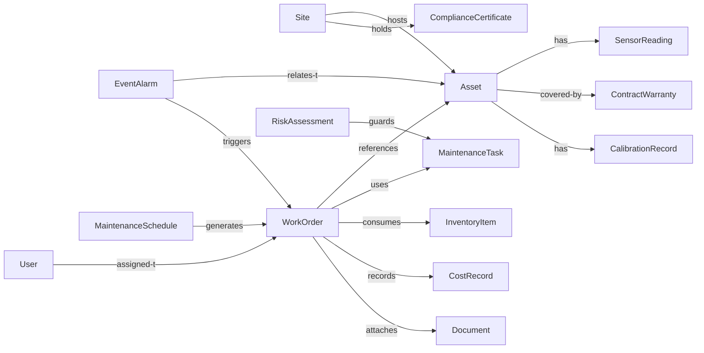

# Research: CMMS for Non-Conventional Energy (Wind & Solar)

Date: 2025-11-01
Author: Market Research & Product Engineering (research draft)

## Executive summary

This document summarizes research for building a Computerized Maintenance Management System (CMMS) targeting the non-conventional energy sector (solar PV farms, wind farms, hybrid microgrids, energy storage). It covers recommended features, preferred development and deployment platforms, data flows and metadata schemas, performance targets, concurrency and volume estimates, security/compliance, integration touchpoints, and recommended architecture.

Acceptance criteria

- The report lists functional and non-functional features for a CMMS in this domain.
- It provides recommended hardware/software platforms for development and deployment (cloud and on-premise options).
- It defines the primary datasets and example JSON schemas for core entities.
- It estimates performance, concurrency, and data volumes with clear assumptions.
- It offers architecture and integration recommendations and a short roadmap for proof-of-concept.

## Table of Contents

- [Research: CMMS for Non-Conventional Energy (Wind \& Solar)](#research-cmms-for-non-conventional-energy-wind--solar)
  - [Executive summary](#executive-summary)
  - [Table of Contents](#table-of-contents)
  - [1. Domain context and usage patterns](#1-domain-context-and-usage-patterns)
  - [2. Features (functional)](#2-features-functional)
  - [3. Preferred hardware/software platforms (cloud-infrastructure agnostic)](#3-preferred-hardwaresoftware-platforms-cloud-infrastructure-agnostic)
  - [4. Data that flows through the system \& metadata](#4-data-that-flows-through-the-system--metadata)
    - [Entity relationships overview](#entity-relationships-overview)
    - [Schemas (local definitions)](#schemas-local-definitions)
  - [13. Power generation prediction (solar \& wind)](#13-power-generation-prediction-solar--wind)
  - [5. Typical performance requirements](#5-typical-performance-requirements)
  - [6. Concurrency and volumes (estimates)](#6-concurrency-and-volumes-estimates)
  - [7. Architecture recommendations](#7-architecture-recommendations)
    - [7.1 Detailed Security Architecture](#71-detailed-security-architecture)
      - [Authentication \& Authorization](#authentication--authorization)
      - [Data Protection](#data-protection)
      - [Network Security](#network-security)
      - [Compliance \& Audit](#compliance--audit)
      - [Operational Security](#operational-security)
      - [Mobile \& Remote Access Security](#mobile--remote-access-security)
      - [Incident Response](#incident-response)
  - [7.2 Data Governance \& Privacy](#72-data-governance--privacy)
      - [Data Governance Framework](#data-governance-framework)
      - [Privacy \& Compliance](#privacy--compliance)
      - [Data Retention Policies](#data-retention-policies)
      - [Data Access \& Usage Controls](#data-access--usage-controls)
      - [Data Ethics \& Responsible AI](#data-ethics--responsible-ai)
      - [Data Security \& Risk Management](#data-security--risk-management)
      - [Monitoring \& Reporting](#monitoring--reporting)
  - [7.3 Disaster Recovery \& Business Continuity](#73-disaster-recovery--business-continuity)
      - [Recovery Objectives](#recovery-objectives)
      - [Backup Strategies](#backup-strategies)
      - [High Availability Architecture](#high-availability-architecture)
      - [Disaster Recovery Procedures](#disaster-recovery-procedures)
      - [Business Continuity Planning](#business-continuity-planning)
      - [Testing \& Maintenance](#testing--maintenance)
      - [Monitoring \& Alerting](#monitoring--alerting)
      - [Compliance \& Audit](#compliance--audit-1)
  - [7.4 Change Management Process](#74-change-management-process)
      - [Change Management Framework](#change-management-framework)
      - [Version Control \& Release Management](#version-control--release-management)
      - [Configuration Management](#configuration-management)
      - [Deployment Strategies](#deployment-strategies)
      - [Testing \& Validation](#testing--validation)
      - [Rollback Procedures](#rollback-procedures)
      - [Monitoring \& Incident Management](#monitoring--incident-management)
      - [Compliance \& Audit](#compliance--audit-2)
      - [Continuous Improvement](#continuous-improvement)
  - [7.5 User Experience Design](#75-user-experience-design)
      - [User Research \& Personas](#user-research--personas)
      - [Information Architecture](#information-architecture)
      - [Interface Design Patterns](#interface-design-patterns)
      - [Accessibility \& Inclusive Design](#accessibility--inclusive-design)
      - [Mobile Experience Optimization](#mobile-experience-optimization)
      - [Workflow Optimization](#workflow-optimization)
      - [Usability Testing \& Validation](#usability-testing--validation)
      - [Design System \& Consistency](#design-system--consistency)
      - [Training \& Adoption](#training--adoption)
  - [8. Integration and open standards](#8-integration-and-open-standards)
  - [9. Testing, validation and compliance](#9-testing-validation-and-compliance)
  - [10. Cost considerations](#10-cost-considerations)
  - [11. Proof-of-concept roadmap (90 days)](#11-proof-of-concept-roadmap-90-days)
  - [12. Next steps \& recommendations](#12-next-steps--recommendations)
  - [14. Sustainability \& ESG Integration](#14-sustainability--esg-integration)
      - [Carbon Footprint Tracking](#carbon-footprint-tracking)
      - [Environmental Impact Monitoring](#environmental-impact-monitoring)
      - [ESG Reporting \& Compliance](#esg-reporting--compliance)
      - [Renewable Energy Certification](#renewable-energy-certification)
      - [Social Impact \& Community Relations](#social-impact--community-relations)
      - [Data Collection \& Integration](#data-collection--integration)
      - [Analytics \& Insights](#analytics--insights)
      - [Implementation Roadmap](#implementation-roadmap)
  - [15. Mobile Strategy \& Field Operations](#15-mobile-strategy--field-operations)
      - [Mobile Application Architecture](#mobile-application-architecture)
      - [Offline Capabilities \& Synchronization](#offline-capabilities--synchronization)
      - [Field-Specific Features](#field-specific-features)
      - [Mobile Security](#mobile-security)
      - [User Experience Optimization](#user-experience-optimization)
      - [Integration \& Connectivity](#integration--connectivity)
      - [Push Notifications \& Alerts](#push-notifications--alerts)
      - [Performance Monitoring \& Analytics](#performance-monitoring--analytics)
      - [Deployment \& Distribution](#deployment--distribution)
      - [Training \& Adoption](#training--adoption-1)
      - [Future-Proofing](#future-proofing)
  - [16. Financial \& Business Considerations](#16-financial--business-considerations)
      - [ROI and Cost-Benefit Analysis](#roi-and-cost-benefit-analysis)
      - [Revenue Optimization](#revenue-optimization)
      - [Financial System Integration](#financial-system-integration)
      - [Budgeting and Forecasting](#budgeting-and-forecasting)
      - [Risk Management](#risk-management)
      - [Procurement and Supply Chain Finance](#procurement-and-supply-chain-finance)
      - [Analytics and Insights](#analytics-and-insights)
      - [Compliance and Audit](#compliance-and-audit)
  - [17. Supply Chain \& Procurement Integration](#17-supply-chain--procurement-integration)
      - [Vendor Management \& Qualification](#vendor-management--qualification)
      - [Procurement Workflows](#procurement-workflows)
      - [Inventory \& Parts Management](#inventory--parts-management)
      - [International Shipping \& Logistics](#international-shipping--logistics)
      - [Supply Chain Risk Management](#supply-chain-risk-management)
      - [Quality Management](#quality-management)
      - [Cost Optimization](#cost-optimization)
      - [Integration \& Automation](#integration--automation)
      - [Analytics \& Reporting](#analytics--reporting)
  - [18. Energy Trading \& Market Systems Integration](#18-energy-trading--market-systems-integration)
      - [Power Purchase Agreement (PPA) Management](#power-purchase-agreement-ppa-management)
      - [Energy Trading Platform Integration](#energy-trading-platform-integration)
      - [Grid Services \& Ancillary Services](#grid-services--ancillary-services)
      - [Curtailment Management](#curtailment-management)
      - [Regulatory Compliance \& Reporting](#regulatory-compliance--reporting)
      - [Market Data Integration](#market-data-integration)
      - [Risk Management](#risk-management-1)
      - [Analytics \& Optimization](#analytics--optimization)
      - [Integration Architecture](#integration-architecture)
  - [Appendix A: References \& further reading](#appendix-a-references--further-reading)
  - [Appendix B: Standards \& Regulations](#appendix-b-standards--regulations)
  - [Appendix C: Schemas](#appendix-c-schemas)
    - [Core Entity Schemas](#core-entity-schemas)
      - [Asset Schema (asset.schema.json)](#asset-schema-assetschemajson)
      - [Work Order Schema (workorder.schema.json)](#work-order-schema-workorderschemajson)
    - [Telemetry Feed Schemas](#telemetry-feed-schemas)
      - [Energy Output Feed Schema (energy\_output.feed.schema.json)](#energy-output-feed-schema-energy_outputfeedschemajson)
      - [Status Feed Schema (status.feed.schema.json)](#status-feed-schema-statusfeedschemajson)
      - [Issue Feed Schema (issue.feed.schema.json)](#issue-feed-schema-issuefeedschemajson)
    - [Supporting Entity Schemas](#supporting-entity-schemas)
      - [Site Schema (site.schema.json)](#site-schema-siteschemajson)
      - [User Schema (user.schema.json)](#user-schema-userschemajson)
      - [Contract \& Warranty Schema (contractwarranty.schema.json)](#contract--warranty-schema-contractwarrantyschemajson)
      - [Cost Record Schema (costrecord.schema.json)](#cost-record-schema-costrecordschemajson)
      - [Document Schema (document.schema.json)](#document-schema-documentschemajson)
      - [Event \& Alarm Schema (eventalarm.schema.json)](#event--alarm-schema-eventalarmschemajson)
      - [Inventory Item Schema (inventoryitem.schema.json)](#inventory-item-schema-inventoryitemschemajson)
      - [Maintenance Task Schema (maintenancetask.schema.json)](#maintenance-task-schema-maintenancetaskschemajson)
      - [Sensor Reading Schema (sensorreading.schema.json)](#sensor-reading-schema-sensorreadingschemajson)
      - [Calibration Record Schema (calibrationrecord.schema.json)](#calibration-record-schema-calibrationrecordschemajson)
      - [Risk Assessment Schema (riskassessment.schema.json)](#risk-assessment-schema-riskassessmentschemajson)
      - [Compliance Certificate Schema (compliancecertificate.schema.json)](#compliance-certificate-schema-compliancecertificateschemajson)
      - [Maintenance Schedule Schema (maintenanceschedule.schema.json)](#maintenance-schedule-schema-maintenancescheduleschemajson)
  - [Glossary](#glossary)

Appendices:
- [Appendix A: References & Further Reading](#appendix-a-references--further-reading)
- [Appendix B: Standards & Regulations](#appendix-b-standards--regulations)
  - International Standards
  - Grid Codes
  - Health & Safety
  - Indian Standards
  - Implementation Guidelines
- [Appendix C: Schemas](#appendix-c-schemas)
  - Core Entity Schemas
  - Telemetry Feed Schemas
  - Supporting Entity Schemas

[Glossary](#glossary)

---

## 1. Domain context and usage patterns

Non-conventional energy assets include utility-scale solar parks, rooftop solar arrays, distributed generation (DG) sites, wind turbines, battery energy storage systems (BESS), PV inverters, SCADA/RTU devices, and associated mechanical/electrical balance-of-system (BOS) equipment. Typical CMMS responsibilities include asset lifecycle management, preventive maintenance (PM), predictive maintenance (PdM) using telemetry and analytics, spare-parts inventory, work order management, contractor coordination, warranty tracking, regulatory reporting, and safety incident tracking.

Users: maintenance technicians, site managers, reliability engineers, operations centre analysts, procurement/inventory staff, contractors, and executives.

Access patterns: mobile-first for field technicians (low-bandwidth scenarios), web dashboard for operations and management, API/ETL access for reporting and integration with SCADA, ERP, and asset performance management (APM) tools.

---

## 2. Features (functional)

This section transforms high-level feature ideas into explicit, implementable product requirements. Each feature below includes a short description, acceptance criteria (what must be true for the feature to be considered complete), and quick notes on data/entities or API touchpoints.

MVP (minimum viable product) — required for an initial production rollout

- Asset registry & hierarchy
  - Description: CRUD for assets and a hierarchical model (site -> subsite -> asset -> component). Support tagging and metadata.
  - Acceptance criteria:
    - API: Create/Read/Update/Delete assets via REST/GraphQL endpoints.
    - Support parent-child relationships and a query to return full subtree for a given site (e.g., GET /sites/{id}/assets?depth=all).
    - Persist using `asset.schema.json` and enforce required fields.
  - Data: asset, site, metadata, location.

- Work order management
  - Description: Full work order lifecycle (create -> schedule -> assign -> execute -> close). Supports manual and scheduled creation.
  - Acceptance criteria:
    - API: POST /workorders to create, PATCH /workorders/{id} to transition status via validated actions (start, hold, complete, close).
    - State machine enforcement: only allowed transitions succeed; invalid transitions return 4xx with reason.
    - Link WOs to assets, tasks, parts, attachments, labor records and emit events on lifecycle changes (workorder.created, workorder.assigned, workorder.completed).
    - Persist using `workorder.schema.json` and support attachments referenced by URL.
  - Data: workOrder, tasks, user, inventory, documents.

- Preventive maintenance (PM) scheduling
  - Description: Define PM templates and rules (calendar-based, runtime-based, cycle-based) and auto-generate WOs when due.
  - Acceptance criteria:
    - Ability to create PM templates with recurrence rules and target assets.
    - Background job to generate WOs according to schedule and mark generated WOs with automationMetadata.
    - UI/API view to list upcoming PMs and overdue PMs.
  - Data: PM template, schedule, generated work orders.

- Mobile technician client (PWA/native)
  - Description: Mobile-first app for field technicians supporting offline operation, checklists, photos, signatures, time capture, and parts scanning.
  - Acceptance criteria:
    - Offline: technicians can open, update, and close WOs offline; local changes sync when connectivity restores.
    - Checklists: structured tasks with mandatory/optional steps and signature capture on completion.
    - Attachments: support photo uploads (asynchronous upload) and geotagging.
  - Data/API: incremental sync endpoints, conflict resolution strategy (optimistic concurrency with merge rules).

- Inventory & spare-parts management
  - Description: Track stock levels, reservations against WOs, reorder points, and consumption history.
  - Acceptance criteria:
    - API to get/set inventory, reserve parts for scheduled WOs atomically, and decrement stock at WO completion.
    - Reorder rule triggers when quantityOnHand <= reorderPoint (emit inventory.reorder event).
    - Audit history for stock changes (who, when, why).
  - Data: InventoryItem, workOrder.partsUsed, costRecord.

- Reporting & dashboards
  - Description: Provide operational dashboards and report endpoints for common views (open WOs, overdue PMs, asset health, parts consumption).
  - Acceptance criteria:
    - Out-of-the-box reports accessible via UI and API endpoints (e.g., GET /reports/open-workorders).
    - CSV/JSON export capability for report results.
  - Data: aggregated queries on work orders, assets, inventory.

- Security & access control (RBAC)
  - Description: Role-based access control with role definitions (technician, dispatcher, manager, admin, contractor) and permission mapping.
  - Acceptance criteria:
    - Enforce access checks on all APIs and UI actions.
    - Admin UI/API to assign roles and audit role changes.
  - Data: user, role, permission mapping.

- Audit trails & change history
  - Description: Immutable audit records for critical operations (WO state changes, asset edits, inventory adjustments).
  - Acceptance criteria:
    - Store actor, timestamp, action, and before/after snapshots for auditable events.
    - Provide API to query change history per entity.

v1 (short-term enhancements — delivered after stable MVP)

- Telemetry ingestion & device connectors
  - Description: Support for MQTT and REST ingestion and mapping telemetry to assets/sensors.
  - Acceptance criteria:
    - Ingest telemetry into TSDB; map sensorId -> assetId via catalog.
    - Provide connector configs and live health metrics for connectors.

- Condition-based & predictive maintenance (PdM) workflows
  - Description: Workflows that create WOs from analytics and anomaly detectors (with automation metadata and configurable thresholds).
  - Acceptance criteria:
    - Accept analytics events (event.topic) and auto-create work orders with suggested tasks/priority.
    - Store modelVersion and confidence with generated WOs.

- SCADA/HMI/RTU adapters
  - Description: Adapters to pull aggregated plant-level status and alarms from SCADA systems.
  - Acceptance criteria:
    - Provide an adapter template and example for integrating with OPC-UA or a simple SCADA REST endpoint.

- SLA tracking & contractor workflows
  - Description: Track SLAs, response targets, contractor assignments and related billing capture.
  - Acceptance criteria:
    - SLA definitions with timers; SLA breach detection and alerts.
    - Contractor assignment flow and cost capture persisted in cost records.

- Document & certificate management
  - Description: Upload and attach manuals, SOPs, inspection certificates, permits to assets and WOs.
  - Acceptance criteria:
    - Store metadata and URL for documents; support expiry/renewal notifications for certifications.

- Notifications & alerts
  - Description: Configurable alerting rules that notify via email/SMS/push/webhooks.
  - Acceptance criteria:
    - UI/API to create alert rules, and delivery via at least two channels (email + webhook).

- Work-order billing & cost capture
  - Description: Capture labor and parts costs per WO and export to ERP.
  - Acceptance criteria:
    - Store cost records linked to WOs and provide export (CSV/JSON) and webhook integration for ERP ingestion.

v2+ (advanced/strategic features)

- ML-based anomaly detection & RUL predictions
  - Description: Integrate models that provide anomaly alerts and Remaining Useful Life estimates for components.
  - Acceptance criteria:
    - Models emit events with modelVersion; system can attach these events to assets and optionally auto-create WOs.

- Digital twin & asset simulation
  - Description: Digital representation of asset state for simulation and impact analysis.
  - Acceptance criteria:
    - Store digital twin model references and run basic simulation scenarios affecting WO scheduling.

- Field service optimization & dispatch
  - Description: Route optimization and parts-aware dispatch to minimize travel and improve first-time-fix.
  - Acceptance criteria:
    - Provide batch dispatch API that considers crew skills, parts-on-hand, and travel time; return optimized route.

- Multi-tenant and role separation
  - Description: Support multiple customers/tenants with data isolation and per-tenant configuration.
  - Acceptance criteria:
    - Tenant-aware APIs, RBAC scoped by tenant, and tenant-level admin controls.

- Regulatory compliance modules
  - Description: Pre-built templates and workflows for grid/operator reporting and safety compliance per region.
  - Acceptance criteria:
    - Include at least one region's compliance workflow example and exportable reports.

Non-functional requirements (explicit)

- Availability & durability
  - Target: 99.9% service availability for core APIs; multi-AZ deployment and automated backups for data stores.

- Performance
  - Target: p95 API CRUD latency < 300ms for transactional endpoints; telemetry ingestion pipeline supports 10k msgs/sec baseline with burst capacity.

- Security
  - Requirements: TLS everywhere, OAuth2/OpenID Connect for users, mTLS or token-based device auth, encryption at rest, KMS-managed keys.

- Scalability & extensibility
  - Requirements: Horizontally scalable stateless services, pluggable connectors, schema-driven APIs that use the definitions in Appendix C.

- Observability & operations
  - Requirements: Metrics (Prometheus), traces (OpenTelemetry), centralized logs (Elastic/OpenSearch), health checks and alerting.

---

## 3. Preferred hardware/software platforms (cloud-infrastructure agnostic)

Design goals: mobile-first UX, highly available backend, ability to operate in intermittent connectivity environments, and simple edge-deployment for telemetry — while remaining cloud-infrastructure-agnostic. Any platform/service we depend on should be available across major clouds, offer a containerized/self-hosted option, or be available as open-source/source code.

3.1 Development stack (recommended)
- Backend: Node.js (TypeScript) or Python (FastAPI); Go for high-throughput microservices. Deliver services as container images.
- Data processing & streaming: Apache Kafka (self-hosted or container operator such as Strimzi) or alternatives like RabbitMQ; prefer components that can run in Kubernetes or as portable containers. If using managed Kafka, ensure there is a multi-cloud offering or a containerized fallback.
- Time-series database: TimescaleDB (Postgres extension), InfluxDB (OSS or hosted), or VictoriaMetrics. Ensure chosen TSDB can be self-hosted or run as containers.
- Relational DB: PostgreSQL (self-hosted or managed) for transactional data (assets, workorders, users, inventory).
- Object storage: S3-compatible APIs (MinIO self-hosted, or cloud S3). Depend on the S3 API rather than a cloud-only service.
- Search & analytics: OpenSearch / Elasticsearch (self-hosted/container) and ClickHouse for analytics; prefer OSS deployments or container images.
- Frontend: React (TypeScript) recommended; mobile via React Native or Flutter. Build deployable assets (PWA/static) independent of cloud hosting.
- ML/analytics: Python ecosystem (scikit-learn, PyTorch); package models as portable containers or use a model server with container images.
- Containerization & orchestration: Docker images and Kubernetes (any conformant distribution—EKS/GKE/AKS/PKS/on-prem). Prefer Kubernetes-native operators for stateful components (Postgres, Kafka, TSDB) so deployments are repeatable across clouds.

3.2 Deployment platforms and portability
- Multi-target: support deployment to any major cloud (AWS, Azure, GCP) or on-prem/edge environments. Do not hard-code provider-specific APIs into core systems.
- Managed services policy: allowed only when equivalent self-hosted or containerized alternatives exist. If a managed service is chosen for OPEX reasons, confirm a replacement path (container image or OSS stack) exists for other clouds.
- Infrastructure-as-Code: provide Terraform modules or cloud-agnostic IaC to provision resources across providers; avoid provider-specific IaC as the only option.
- Edge/on-prem: edge gateway should be containerized and capable of running on small industrial hardware (Raspberry Pi, Advantech). Use open/source device management (Kura, Balena) or cloud-agnostic IoT runtimes that support container deployment.

3.3 Preferred hardware for field
- Rugged Android tablets/phones for technicians (easier MDM across platforms), barcode/QR scanners, ruggedized cases and hot-swappable batteries.
- Edge gateway hardware: industrial gateway with LTE/5G fallback and local storage; choose vendors that support container runtimes or offer standard Linux images.

3.4 Why these choices (portability rationale)
- Use OSS or containerized services so the stack can be deployed on any cloud or on-premises.
- Favor standard APIs (Postgres, S3, Kafka protocols, MQTT, OPC-UA) over proprietary vendor APIs to reduce lock-in.
- Kubernetes + operators provide a repeatable, cloud-agnostic runtime for both stateless and stateful services.

---

## 4. Data that flows through the system & metadata

4.1 Key data domains (entities)
- Site (location, grid connection, geographical metadata)
- Asset (turbine, inverter, PV string, transformer, BESS) and component
- Sensor / Telemetry (time-series readings, alarms)
- Work Order (creation, state transitions, tasks performed)
- Maintenance Task (checklist items, spares used)
- InventoryItem / SparePart
- Technician / User / Contractor
- Document / Attachment
- Event / Alarm / Notification
- Contract / Warranty
- Cost & Accounting (labor, parts, purchase orders)
 - Compliance Certificate (regulatory approvals, certificates, audits)
 - Calibration Record (instrument/measurement calibration history)
 - Risk Assessment (safety and operational hazard assessments)
 - Maintenance Schedule (PM/CBM/PdM schedule definitions)

4.2 Data flows
- Telemetry ingestion: sensors -> edge gateway -> message broker (MQTT/Kafka) -> time-series DB and event processor -> alerts & PdM
- Work-order lifecycle: request -> planning/scheduling -> assignment -> execution (mobile app) -> closure -> accounting
- Inventory flow: demand from workorders -> stock decrement -> replenishment order -> supplier
- Integration flow: SCADA/RTU <-> CMMS (via adapter), ERP <-> CMMS (parts, billing), APM analytics <-> CMMS

### Entity relationships overview



Notes
- ComplianceCertificate may attach to both Site and Asset depending on scope.
- CalibrationRecord typically applies to sensors/instruments on an Asset and is referenced in audit trails.
- RiskAssessment can be linked to MaintenanceTask templates and/or specific WorkOrders.

4.3 Metadata and schemas
This section summarizes the key schemas and their roles. The full canonical JSON Schemas are maintained in Appendix C (Schemas); use those definitions for validation, code generation, and contract tests. The models are organized as Core Entities, Telemetry Feeds, Supporting Entities, and Compliance & Safety artifacts.

### Schemas (local definitions)

The canonical JSON Schema definitions are included in Appendix C of this document. Use these definitions to validate incoming feeds, generate API contracts, and build tests. The available definitions are:

- [Asset Schema](#asset-schema-asset-schemajson) — Asset entity schema (site/component hierarchy, location, metadata)
- [Work Order Schema](#work-order-schema-workorder-schemajson) — Work Order schema (fields, tasks, assignments)
- [Sensor Reading Schema](#sensor-reading-schema-sensorreading-schemajson) — Sensor/telemetry reading schema (metrics, quality)
- [Inventory Item Schema](#inventory-item-schema-inventoryitem-schemajson) — Inventory / spare-parts schema
- [User Schema](#user-schema-user-schemajson) — User / technician schema
- [Energy Output Feed Schema](#energy-output-feed-schema-energy_outputfeed-schemajson) — Energy output telemetry feed (power, energy, irradiance, rpm)
- [Status Feed Schema](#status-feed-schema-statusfeed-schemajson) — Periodic status feed (operational state, uptime, alarms summary)
- [Issue Feed Schema](#issue-feed-schema-issuefeed-schemajson) — Issue/failure feed (severity, type, snapshot measurements)

- [Site Schema](#site-schema-siteschemajson) — Site metadata (location, grid connection, capacity)
- [Maintenance Task Schema](#maintenance-task-schema-maintenancetask-schemajson) — Maintenance task and checklist schema
Note: Contractors and external technicians are represented using the User schema with `role = "contractor"` and optional `contractorId`, `organization`, `skills`, and `certifications` fields.
- [Document Schema](#document-schema-document-schemajson) — Documents and attachments metadata
- [Event & Alarm Schema](#event--alarm-schema-eventalarm-schemajson) — Events, alarms and notification schema
- [Contract & Warranty Schema](#contract--warranty-schema-contractwarranty-schemajson) — Contract & warranty metadata
- [Cost Record Schema](#cost-record-schema-costrecord-schemajson) — Cost records (labor, parts, external)
- [Calibration Record Schema](#calibration-record-schema-calibrationrecord-schemajson) — Calibration records for instruments and sensors
- [Risk Assessment Schema](#risk-assessment-schema-riskassessment-schemajson) — Safety/operational risk assessments
- [Compliance Certificate Schema](#compliance-certificate-schema-compliancecertificate-schemajson) — Regulatory compliance certificates and approvals
- [Maintenance Schedule Schema](#maintenance-schedule-schema-maintenanceschedule-schemajson) — Preventive/condition-based/predictive maintenance schedules

Reference these files for exact validation rules and to support automated tooling (code generation, contract tests).

4.4 Data retention & partitioning
- Time-series retention: raw telemetry retained for 1-3 years depending on regulatory and analytics needs, aggregated downsampled metrics stored for longer (5+ years) for trend analysis.
- Workorders, assets, inventory: retained indefinitely with soft-deletes and periodic archival to cold storage (S3 Glacier).
- Partition telemetry by site and time (daily/monthly partitions) for efficient queries.


4.5 Work Order (detailed concept)

What is a work order (in this domain)?

A work order (WO) is the unit-of-work representing maintenance or operational activity on one or more assets at a site. In renewable-energy operations it captures why the work is needed (alarm, inspection, scheduled PM), what must be done (tasks, checklists), what parts and tools are required, who will do it (tech/contractor), safety steps, cost/time accounting, and final outcomes (measurements, before/after photos, signatures).

Goal: provide a consistent, auditable, schedulable, and automatable record that ties telemetry/alarms to field execution and inventory.

Typical WO types
- Preventive Maintenance (PM): scheduled cadence (time / runtime / cycles).
- Predictive Maintenance (PdM): created by analytics (RUL, anomaly detection).
- Corrective / Reactive: created after failure or inspection.
- Inspection: planned checks (e.g., blade inspection, earthing checks).
- Emergency / Safety: immediate response (fire, high vibration, hazardous disconnect).
- Upgrade / Modification: non-maintenance changes (retrofits, firmware updates).

Lifecycle and statuses
A canonical state machine (can be extended):

- Draft / Requested — created but not yet approved/planned.
- Scheduled / Planned — date/time/crew assigned.
- Dispatched — crew assigned and notified (mobile push).
- In Progress — technician starts on-site (work started).
- On Hold — waiting for parts/permit/weather.
- Completed — work completed, results logged.
- Reviewed / Closed — QA/manager sign-off, cost recorded.
- Cancelled — not performed; reason logged.

Transitions often driven by scheduling, resource availability, or mobile app actions. Emergency WOs may bypass approval.

Data fields (contract) — what a WO should carry
A WO must capture triggers (manual, telemetry alarm, scheduled rule), site/context, priority, required skills/permits, tasks, parts, and outputs like parts consumed, labor logs and attachments.

Minimum/Recommended fields (expandable):

- workOrderId (string)
- type (enum: PM, PdM, corrective, inspection, emergency, upgrade)
- title / description
- priority (low/medium/high/urgent)
- status (see lifecycle)
- siteId, siteName
- assetId(s) (may reference asset hierarchy)
- tasks (ordered checklist items with required tools/expected duration)
- requiredSkills (e.g., high-voltage, rope access)
- requiredPermits / LOTO (lock-out-tag-out)
- scheduledStart / scheduledEnd
- actualStart / actualEnd
- assignedCrew / assignedTo (user or contractor id)
- estimatedDuration / actualDuration
- partsRequired (reservations)
- partsUsed (partId, qty, lot/batch, serial numbers)
- laborRecords (userId, role, start/end, hours)
- attachments (photos, certificates, reports)
- measurementsBefore / measurementsAfter (key metrics)
- rootCause / failureMode
- cost (labor, parts, external contractor)
- slaId (if linked to SLA)
- createdBy / createdAt / closedBy / closedAt / auditTrail
- automationMetadata (origin: alarmId / scheduleId / ruleId)
- tags / customFields / metadata
- mobileSyncStatus / offlineEdits (for conflict resolution)

Example JSON instance (short)

{
  "workOrderId":"WO-20251101-0001",
  "type":"corrective",
  "title":"Replace inverter AC contactor - Inverter 3A",
  "priority":"high",
  "status":"scheduled",
  "siteId":"SITE-ALPHA-001",
  "assetId":"INV-3A",
  "scheduledStart":"2025-11-03T08:00:00Z",
  "assignedTo":"crew-7",
  "tasks":[{"id":"t1","title":"Isolate AC supply","requiresPermit":true},{"id":"t2","title":"Replace contactor","requiresPermit":false}],
  "partsRequired":[{"partId":"CTR-AC-120","qty":1}],
  "automationMetadata":{"origin":"alarm","alarmId":"ALARM-9876"},
  "createdBy":"ops-user-5",
  "createdAt":"2025-11-01T12:10:00Z"
}

Relationships to other domains
- Assets: WO should reference assets (component-level granularity for BESS cells, inverter modules, turbine gearbox).
- Telemetry/Alarms: link alarmId(s) and relevant sensor readings that triggered the WO.
- Inventory: reserve parts when WO is scheduled; decrement on completion.
- Contractors & SLAs: track external party assignments and SLA timestamps.
- Documents: attach SOPs, safety checklists, certificates.
- ERP/Finance: send cost & invoice data post-completion.

Automation & triggers
Common automations:
- Alarm -> auto-create WO with prefilled tasks, priority and suggested parts.
- Predictive model -> schedule PdM WO when probability of failure crosses threshold.
- PM schedule -> batch-create periodic WOs (monthly/operating-hours).
- Inventory level check -> auto-create procurement WO or PO when parts fall below reorder.
- Weather/availability rules — postpone outdoor works if wind/sun/precipitation unsafe.

Design tip: store automationMetadata on the WO to trace origin, confidence, and model version.

Mobile & field workflows
Mobile is primary for technicians:
- Offline-first: technician can open WO offline, record tasks, add photos; sync later.
- Checklists & signatures: enforced step-by-step check with mandatory fields for safety-critical steps.
- Safety workflows: present LOTO instructions, permit capture, and require checklist completion to proceed.
- Parts scanning: barcode/QR or NFC to attach part serial numbers to the WO.
- Time capture: start/stop timers for labor, auto-suggest time based on task durations.
- Photo & geotagging: require before/after photos and geo-location for evidence/audit.

Conflict handling: allow offline edits with change lists and merge rules (last-write-wins with review for critical fields).

Scheduling, dispatch & optimization
- Skills matrix: match requiredSkills with available technicians.
- Parts-on-hand check: do not dispatch crew unless critical parts reserved or marked as will-order.

4.6 Performance & concurrency estimation

Purpose
- Provide a reproducible sizing calculation to estimate ingestion, storage, and operational concurrency for telemetry, work orders, and mobile usage. These estimates are intentionally conservative and parameterized so they can be adjusted to real-world numbers.

How to use
- Replace the assumptions with your real counts (sites, assets, sensors, sample rates). The worked examples below show a small pilot and a larger production scenario. Use the formulas to scale to any fleet size.

Key assumptions (parameters)
- S: number of sites
- A: average assets per site
- M: average sensors per asset (telemetry metrics)
- R: average sample rate per sensor (samples/second)
- P: average payload size per sample (bytes, including metadata)
- H: hours per day of peak ingestion (if bursts exist)

Core formulas
- Events per second (EPS) = S * A * M * R
- Bytes per second (BPS) = EPS * P
- Daily data volume (GB/day) = BPS * 86400 / (1024^3)
- Retained raw storage (GB) = GB/day * retention_days

Worked example — Pilot
- Assumptions: S=100 sites, A=10 assets/site, M=8 sensors/asset, R=0.1 Hz (1 sample every 10s), P=400 bytes.
- EPS = 100 * 10 * 8 * 0.1 = 800 events/s
- BPS = 800 * 400 = 320kB/s (~0.32 MB/s)
- GB/day = 0.32 * 86400 / 1024 ≈ 26.9 GB/day
- 1 year raw retention ≈ 9.8 TB

Worked example — Production
- Assumptions: S=2,000 sites, A=15 assets/site, M=12 sensors/asset, R=0.2 Hz (1 sample every 5s), P=400 bytes.
- EPS = 2000 * 15 * 12 * 0.2 = 72,000 events/s
- BPS = 72,000 * 400 = 28.8 MB/s
- GB/day = 28.8 * 86400 / 1024 ≈ 2,430 GB/day (~2.4 TB/day)
- 1 year raw retention ≈ 886 TB (consider aggressive downsampling / down-retention strategies)

Storage sizing guidance (TSDB)
- Raw ingestion should be retained only as long as necessary for analytics and regulation. For production fleets, store raw telemetry for 30–90 days, and keep aggregated rollups (1m/5m/1h) for 1–5+ years.
- Use partitioning by site and time (e.g., monthly) to keep queries efficient. For very large fleets, consider sharding by site group / region.
- Example retention policy for production scenario: raw 30d, 1m rollup 2 years, daily aggregates 7+ years — reduces storage needs by 10–50x depending on aggregation.

Ingestion & streaming
- Kafka / streaming cluster sizing rules of thumb:
  - Partitions: one partition per ~5,000–10,000 EPS for optimal throughput (adjust by hardware and topic semantics).
  - Brokers: start with 3 brokers for high availability; scale to 5+ for production heavy loads.
  - IO: use provisioned NVMe or fast disks; network throughput should match BPS with headroom (2–3x).
  - Retention: short retention on raw topic (hours-days) if writing to TSDB, or longer if acting as the durable source of truth.

TSDB node sizing (TimescaleDB/InfluxDB/VictoriaMetrics)
- For pilot (low EPS): a single high-memory node (32–64 GB RAM, 8+ vCPU) may suffice with vertical scaling.
- For production (tens of thousands EPS): use a clustered TSDB with multiple nodes. Example starting point: 3–5 nodes, each with 32–64 vCPU, 128–512 GB RAM and fast local NVMe. Adjust based on query load and cardinality.
- Cardinality: keep high-cardinality tags (e.g., unique serial numbers) in mind — cardinality drives index memory use and must be bounded or sharded.

API & backend concurrency
- Work order / REST APIs: plan for concurrent user sessions and background workers.
- Example concurrency planning (production):
  - Mobile active technicians: 10,000 concurrently active devices with occasional bursts (2–5 RPS each during sync windows) → API RPS requirements concentrated during shift changes.
  - API tier: scale horizontally with stateless services behind a load balancer. Use autoscaling based on request latency and queue length.

Mobile sync & offline considerations
- Devices will often perform batch syncs. Design endpoints for bulk apply and delta sync to reduce API chattiness.
- Typical pattern: mobile apps sync metadata every 5–30 minutes and upload attachments/large payloads asynchronously to object storage.

Operational recommendations
- Throttle and backpressure: put a buffering layer (Kafka/ingress buffer) to absorb bursts and avoid hitting TSDB directly.
- Batch writes: aggregate small writes in the ingestion layer (gateway) to reduce per-event overhead.
- Compression: use Snappy/Zstd on Kafka and columnar/TSDB storage compression to reduce network and storage costs.
- Monitoring & SLOs: track EPS, consumer lag, write latency, query P99/P95 latencies, CPU and disk IO on ingestion/TSDB nodes.

High-level scaling map
- Small pilot (<=1k EPS): single-region, minimal cluster sizes, development-grade HA (3 brokers, 1–2 TSDB nodes)
- Medium (1k–20k EPS): HA clusters for streaming and TSDB (3–5 brokers, 3 TSDB nodes), fronted by stateless API pool with autoscaling
- Large (20k+ EPS): multi-region, sharded TSDB, high-throughput Kafka, object storage scaling, and careful cardinality controls

Next steps to finalize sizing
- Ask operations/product for real fleet numbers: sites, assets/site, sensors/asset, typical sample rates, retention windows, and expected concurrent mobile users.
- Run a short pilot with synthetic telemetry reflect these numbers to validate ingestion path, consumer lag, and storage estimates.
- After pilot, re-run the formulas and produce an IaC-backed cluster sizing recommendation (Terraform modules + Kubernetes manifests).

Acceptance criteria for this section
- Given the user's fleet parameters, compute EPS, BPS, and raw storage for the chosen retention window using the formulas above.
- Provide a recommended minimal cluster topology (streaming brokers, TSDB nodes, API pool) that meets the calculated EPS with 2x headroom.
- Produce a small synthetic load test script (or k6/locust plan) to validate the ingestion pipeline before production rollout.

- Routing optimization: batch WOs for same site or area to minimize travel/time-to-first-fix.
- Weather windows: use forecast to schedule outdoor works (e.g., blade inspections on low wind days).
- Work batching: group similar low-complexity tasks to a single crew visit.

SLAs, KPIs & audits
Important KPIs:
- Time-to-respond (alarm -> assigned)
- Time-to-repair (open -> closed)
- Mean Time To Repair (MTTR), Mean Time Between Failures (MTBF)
- First-time-fix rate
- Parts consumption & stockouts
- WO backlog, overdue PMs
- Safety incidents per WO

Auditables:
- Who signed off, who performed each checklist step, evidence attachments, safety permit logs.

Safety & regulatory considerations
- Permit capture and required certifications for tasks (e.g., live-line work).
- Incident reporting flows tied into WO if safety thresholds hit.
- Retain audit trail for compliance (time/actor/payload).
- Enforce RBAC so only certified users can close/approve certain WO types.

Edge cases and concurrency concerns
- Duplicate WO creation: telemetry spikes may create duplicates — deduplicate using a window + matching rules (asset + alarm type + time).
- Part reservations race: handle inventory reservations atomically to avoid double-booking.
- Concurrent edits: technicians and dispatchers may edit the same WO — implement optimistic concurrency (version/token) and field-level merge for non-conflicting edits.
- Large attachments offline: allow attachments to upload asynchronously and mark WO as “pending attachments” until fully synced.
- Emergency preemption: an emergency WO must be able to supersede scheduled WOs and reassign resources.
- Partial completions / split WOs: sometimes work spans multiple visits — support child WOs or reopen workflow.

Implementation considerations (APIs & events)
Suggested REST/GraphQL operations:
- POST /workorders — create (supports origin metadata)
- GET /workorders/{id} — read (expandable includes)
- PATCH /workorders/{id} — update (use ETag/If-Match)
- POST /workorders/{id}/actions/start|complete|hold — explicit state transitions with validation
- POST /workorders/{id}/attachments — incremental upload
- POST /workorders/search — filtered queries (site, asset, status, date range)
- Webhooks / Events: emit events on creation, assignment, status change, completion for downstream systems (ERP, dashboard, billing)

Event model examples:
- workorder.created
- workorder.assigned
 - workorder.started
 - workorder.completed
 - workorder.partsReserved
 - workorder.closed

---

## 13. Power generation prediction (solar & wind)

One customer requirement is to predict power generation from time-series telemetry collected from wind farms and solar farms. This section outlines objectives, required data, modelling approaches, feature engineering, evaluation, deployment options, retraining cadence, and integration into the CMMS.

13.1 Objectives
- Short-term (nowcast/very short-term): predict power minutes to a few hours ahead for dispatch and real-time operations.
- Short-term forecast: 1-24 hours ahead to support day-ahead scheduling, bidding, and dispatch.
- Medium-term forecast: 1-7 days for planning and maintenance scheduling.
- Long-term trend forecasting: weekly/monthly for asset performance benchmarking and capacity planning.
- Use predictions to feed CMMS workflows: schedule maintenance during low-production windows, validate expected vs actual production for fault detection, optimize dispatch and storage usage.

13.2 Required data inputs
- Time-series telemetry (per-device): active/reactive power, voltage, current, rotor speed (wind), inverter status, pitch/yaw (wind), MPPT metrics (solar), temperature, irradiance (GHI/POA), wind speed & direction, humidity, soiling index, and energy totals.
- SCADA/RTU aggregated signals: plant-level power, converter status, SCADA alarms.
- Weather data: forecasted and historical (numerical weather prediction - NWP) variables — cloud cover, solar irradiance, wind fields at hub height, temperature, pressure.
- Site metadata: turbine hub height, rotor diameter, panel tilt/azimuth, array layout, shading/obstructions, inverter curves, site elevation.
- External data: satellite-derived irradiance, ground-station measurements, terrain/obstruction models.
- Timestamp & quality flags: timezone-normalized timestamps and data quality markers (missing, suspect, bad).

13.3 Data pre-processing & feature engineering
- Clean telemetry: remove or flag bad quality data, impute short gaps (linear/interpolation), mark long gaps for exclusion.
- Resample/align: align telemetry and weather data to common time resolution (e.g., 5min, 15min, 1h) and UTC.
- Features:
  - Lag features: past power values (t-1, t-2...)
  - Rolling stats: moving average, std, min/max over windows
  - Weather features: forecasted irradiance/wind at lead times, cloud index
  - Site features: capacity, inverter clipping indicator, derating flags
  - Categorical/time features: hour-of-day, day-of-week, season, holiday flags
  - Derived features: wind shear adjustments, effective irradiance (POA), soiling degradation factor
- Handle sunrise/sunset windows for solar (production=0 outside daylight).

13.4 Modelling approaches
- Persistence models: use current/last observation as forecast (baseline for both wind & solar).
- Statistical & machine-learning:
  - Linear / ARIMA / SARIMAX for simple baselines (with exogenous weather variables).
  - Gradient-boosted trees (XGBoost, LightGBM, CatBoost) — robust, fast to train, handle tabular features well.
  - Deep learning: LSTM/GRU/Temporal Convolutional Networks (TCN) for sequences; attention-based Transformers for longer contexts.
- Physical / hybrid:
  - Wind: use wind speed forecasts at hub height + turbine power curve (physics) and correct biases with ML residual models.
  - Solar: combine NWP-derived irradiance with clear-sky and PV module/array models (PVLib), then apply ML corrections for local effects.
- Ensemble & probabilistic forecasting:
  - Quantile regression (e.g., gradient boosting with quantile loss) for prediction intervals.
  - Ensembles of models or model+physical to improve robustness.

13.5 Training, validation & evaluation
- Split strategy: time-based splitting (walk-forward / rolling origin) to avoid leakage.
- Cross-validation: use rolling windows and multiple seasons to capture seasonal effects.
- Metrics:
  - Deterministic: MAE, RMSE, MAPE (careful with near-zero in solar), normalized RMSE
  - Probabilistic: CRPS, Pinball loss for quantiles, prediction interval coverage
  - Operational metrics: hit-rate for low-production windows, false alarms for under/over-generation alerts
- Baselines: persistence and deterministic physical models; ensure ML models outperform baselines.

13.6 Model deployment & inference
- Serving options:
  - Batch (daily/hourly) for day-ahead forecasts.
  - Near-real-time micro-batch (e.g., every 5–15 minutes) for intraday operations.
  - Streaming inference for per-turbine or per-inverter predictions using Kafka/Flink + model server (Triton, Seldon Core, TorchServe).
- Edge vs cloud:
  - Cloud for large models combining NWP and multi-site data.
  - Edge inference for local nowcasts (e.g., short-term horizon) to reduce latency and dependence on connectivity.
- Input pipelines: ensure low-latency feature assembly (cached NWP slices, fast TSDB queries) and fallback to persistence if inputs missing.

13.7 Retraining cadence & model management
- Retrain frequency: weekly to monthly for operational models; daily retrain for models sensitive to rapid drift (e.g., seasonal transitions).
- Continuous learning: incremental updates for online models with drift detection.
- Model registry & versioning: track model version, training data window, evaluation metrics, and lineage (MLflow, SageMaker Model Registry).
- Monitoring: data drift, concept drift, prediction error trends, input feature availability, and alerting on drift thresholds.

13.8 Integration points with CMMS
- Use forecasts to schedule maintenance during predicted low-production windows (WO creation with suggested windows).
- Feed expected vs actual production into anomaly detectors that can auto-create WOs for potential faults.
- Use probabilistic forecasts to calculate risk windows for maintenance (e.g., choose time with 90% probability below X MW).
- Store forecast metadata (model version, confidence interval, inputs used) linked to events/WO in the CMMS for auditability.

13.9 Evaluation & acceptance criteria
- Minimum: forecasts outperform persistence baseline (lower MAE) on held-out rolling windows.
- Operational: maintain X% uptime for model inference service (SLO) and keep median latency below target (e.g., <500ms for single-site inference).
- Business: demonstrate maintenance scheduling improvements (reduced lost production hours due to maintenance) or reduced emergency dispatches.

13.10 Example output schema (prediction)

```json
{
  "predictionId": "pred-20251101-0001",
  "siteId": "SITE-ALPHA-001",
  "assetId": "PLANT-001",
  "modelVersion": "v1.3.2",
  "generatedAt": "2025-11-01T12:00:00Z",
  "horizon": "2025-11-01T13:00:00Z",
  "leadTimeMinutes": 60,
  "pointForecastKw": 1234.5,
  "quantiles": {"p10": 1100.0, "p50": 1234.5, "p90": 1400.0},
  "featuresUsed": {"irradiance": 650, "windSpeed": 7.1},
  "confidence": 0.85,
  "metadata": {"nwpSource":"ECMWF-YYYY","trainedOn":"2025-10-01_to_2025-10-31"}
}
```

13.11 Tools & libraries
- Data/feature pipelines: Kafka, Spark, Flink, Airflow, dbt for transformations
- TSDB access: InfluxDB, TimescaleDB queries for fast lookups
- Modelling: scikit-learn, XGBoost/LightGBM, PyTorch/TensorFlow for deep models, PVLib for solar physics
- Serving: Seldon Core, Triton, BentoML, TorchServe, or custom Flask/FastAPI microservices
- Monitoring: Prometheus/Grafana for infra; ML monitoring via Evidently, WhyLabs, or custom dashboards

13.12 Practical considerations & risks
- NWP resolution: coarse-grained NWP may miss local terrain effects (wind) or cloud dynamics (solar). Consider downscaling or integrating local sensors.
- Data gaps & quality: missing sensors, wrong timestamps and daylight-savings issues can break models — robust preprocessing is critical.
- Model explainability: for operational acceptance, provide simple explanations (feature importance, residual plots) especially for PdM-triggered decisions.
- Cost: high-resolution weather data and model inference at scale incurs cost — balance fidelity vs cost.

---

- workorder.started
- workorder.completed
- workorder.partsReserved
- workorder.closed

Metrics and performance concerns for WOs
- Workorder CRUD traffic is low relative to telemetry, but operations must be responsive for dispatching (p95 < 300ms).
- Bulk PM creation (scheduling thousands of WOs) should be done via background jobs.
- Reservation and inventory operations must be transactional and low-latency to avoid dispatch delays.

Acceptance criteria for a WO implementation (minimal)
- Create/update/read/close a WO with required fields.
- Attach photos and structured checklist items via mobile offline sync.
- Reserve parts from inventory at scheduling time and decrement on completion.
- Link WO to telemetry/alarm and show origin in audit trail.
- Support optimistic concurrency and emit events for external systems.

Example improvements / next steps I can do for you
- Produce a full JSON Schema `workorder.schema.json` consistent with your `research.md` asset schema.
- Create example Postgres DDL for a `work_orders` table and related tables (tasks, parts, labor_records).
- Add a small mobile sync sequence diagram or API transaction examples.
- Create sample automation rules (pseudo-DSL) for alarm -> WO creation.

Which of those would you like me to produce next? If you want the JSON schema or DDL, tell me your preferred storage (Postgres with Timescale, MongoDB, etc.) and I’ll generate it.

13.12 AI/ML Governance & Responsible AI

**Model Governance Framework:**
- Model registry with versioning, lineage tracking, and metadata
- Model validation pipelines with automated testing
- Bias detection and fairness assessment frameworks
- Explainability requirements for high-impact predictions
- Regulatory compliance monitoring for AI systems

**Ethical AI Principles:**
- Fairness: Regular bias audits and mitigation strategies
- Transparency: Model explainability and decision traceability
- Accountability: Clear ownership and responsibility for AI outcomes
- Privacy: Data minimization and privacy-preserving techniques
- Safety: Fallback mechanisms and human oversight for critical decisions

**Model Development Lifecycle:**
- Data quality validation and bias assessment
- Model training with reproducible pipelines
- Automated testing for performance, fairness, and robustness
- Peer review and validation before production deployment
- Continuous monitoring for model drift and performance degradation

**Regulatory Compliance:**
- EU AI Act compliance for high-risk AI systems
- Documentation requirements for model development and validation
- Audit trails for AI decision-making processes
- Regular compliance assessments and reporting

**Model Risk Management:**
- Risk assessment for model failures and their business impact
- Contingency plans for model degradation or failure
- Human-in-the-loop processes for critical decisions
- Gradual rollout strategies with monitoring and rollback capabilities

**Monitoring & Alerting:**
- Model performance monitoring (accuracy, fairness, drift)
- Automated alerts for performance degradation
- Regular model retraining and validation cycles
- Stakeholder reporting on AI system performance

13.13 Advanced Weather Integration & Forecasting

Weather conditions significantly impact renewable energy operations, maintenance scheduling, and equipment performance. This subsection outlines comprehensive weather integration requirements.

**Weather Data Sources & APIs:**
- National Oceanic and Atmospheric Administration (NOAA) data feeds
- European Centre for Medium-Range Weather Forecasts (ECMWF) high-resolution models
- Local meteorological services and weather station networks
- Satellite-derived irradiance and cloud cover data
- On-site weather station integration for micro-climate monitoring

**Weather Data Processing:**
- Real-time weather data ingestion and validation
- Historical weather data archival for trend analysis
- Weather data quality assessment and gap filling
- Temporal and spatial interpolation for site-specific forecasts
- Weather data correlation with equipment performance metrics

**Weather-Based Maintenance Scheduling:**
- Optimal maintenance window identification based on weather forecasts
- Automated scheduling of outdoor maintenance during favorable conditions
- Weather contingency planning for maintenance activities
- Seasonal maintenance planning aligned with weather patterns
- Weather risk assessment for maintenance prioritization

**Weather Impact Modeling:**
- Equipment performance degradation under adverse weather conditions
- Wind turbine blade soiling and cleaning schedule optimization
- Solar panel efficiency reduction due to dust and debris accumulation
- Weather-induced stress analysis for asset health monitoring
- Extreme weather event impact assessment and preparedness

**Predictive Weather Analytics:**
- Weather pattern recognition for maintenance planning
- Seasonal weather trend analysis for long-term planning
- Weather anomaly detection and alerting
- Weather forecast accuracy validation and model improvement
- Integration with energy production forecasting models

**Weather Integration Architecture:**
- Weather data pipeline with real-time and batch processing
- Weather API gateway for standardized access across systems
- Weather data caching and optimization for performance
- Weather data visualization in maintenance dashboards
- Weather alert integration with work order creation workflows

**Operational Weather Intelligence:**
- Weather-based route optimization for field technicians
- Weather safety monitoring for outdoor work activities
- Weather impact reporting for regulatory compliance
- Weather data integration with SCADA and control systems
- Weather forecast utilization in energy trading decisions

**Weather Data Governance:**
- Weather data quality standards and validation procedures
- Weather data retention policies and archival strategies
- Weather data sharing agreements with third-party providers
- Weather data privacy and security considerations
- Weather data audit trails for compliance reporting

---

## 5. Typical performance requirements

Performance targets depend on scale. Below are example SLOs for a mid-sized operator (50-200 MW across multiple sites):

- API latency (user-facing): 95th percentile < 300ms for typical CRUD operations (Postgres-backed), < 1000ms for heavier queries (search/aggregations).
- Telemetry ingestion latency: end-to-end from edge -> ingestion bus -> hot store < 5s for most readings; near real-time (< 1s) for critical alarms.
- Time-series query latency: simple point queries < 100ms; rollups/aggregations over weeks < 2-5s depending on window and indices.
- Mobile sync: incremental sync of workorder payloads < 2s on LTE; larger attachments handled asynchronously.
- Throughput: ingestion pipeline supporting sustained tens of thousands of messages/sec for large fleets; spike handling to hundreds of thousands/sec for large utility-scale or IoT bursts.

SLA examples:
- Availability: 99.9% (3 nines) for central cloud services; local edge agents must continue to operate offline.
- Data durability: 11 9s for backups (cloud-managed S3) and replication across AZs/regions.

---

## 6. Concurrency and volumes (estimates)

Assumptions: mid-sized operator with 100 sites, each site has 1-10 inverters and sensors; 100k sensors across all sites (for larger providers this scales linearly).

6.1 Telemetry volumes
- Per sensor sample rate varies (1s to 15min). Typical summary:
  - High-frequency sensors (vibration, high-res power): 1Hz
  - Standard sensors (temperature, voltage, current): 1 sample/10s to 1 sample/60s
  - Low-frequency (weather, status): 1 sample/5-15min

Example calculation (conservative):
- 100k sensors at average 0.1 samples/sec (one every 10s) = 10k messages/sec.
- Message size ~1KB -> 10 MB/s (~864 GB/day) raw telemetry.
- After compression/aggregation, hot-store requirement could be 100-200 GB/day depending on schema and downsampling.

6.2 Workorders and user activity
- Active users: 200-2,000 users (field + operations + managers). Concurrent web sessions: 100-500.
- Workorder creation rate: average 10-200/day; peaks during storms or mass maintenance campaigns.
- Mobile app sync: each technician syncs 10-100KB per sync, sync frequency: on login/periodic/when online.

6.3 Storage volumes
- Time-series DB: for above example expect TBs/month before downsampling. Plan for multi-TB storage with lifecycle policies.
- Postgres (transactional): small relative footprint (GBs to 100s GBs depending on document attachments stored externally).

6.4 Concurrency requirements
- API concurrency: 500-2000 concurrent API calls for alpha/mid-size operators; scale horizontally with stateless services and connection pooling for DB.
- Ingestion concurrency: message broker and stream processors sized to handle sustained peaks. Consider partition count in Kafka matching consumer parallelism.

---

## 7. Architecture recommendations

High-level components:
- Edge Gateway (collect, buffer, forward) with local DB for offline operations
- Message Broker (Kafka / MQTT + bridge to Kafka)
- Ingestion & Stream Processing (Flink / Kafka Streams / KSQL) for alarms, anomalies, and enrichment
- Time-series DB + cold storage
- Transactional DB (Postgres) for CMMS domain
- API Layer (GraphQL/REST) with gateway and microservices
- Frontend (web + mobile) connecting via secure APIs
- Integration layer (adapters for SCADA, ERP, APM)
- ML/Analytics platform (batch + real-time)
- Observability stack (Prometheus, Grafana, ELK/OpenSearch)

Resilience & scalability:
- Design for eventual consistency between telemetry and transactional state
- Use horizontal scaling and autoscaling groups
- Circuit breakers and backpressure handling in ingestion pipeline

Security:
- TLS for all in-transit data
- Mutual TLS or device auth for edge gateways
- OAuth2/OpenID Connect for user auth; RBAC and attribute-based access control (ABAC) for fine-grained permissions
- Encryption at rest for sensitive data (S3/RDS encryption)
- Secure key management (KMS)

### 7.1 Detailed Security Architecture

The CMMS security architecture must address multiple threat vectors across edge devices, network communications, cloud infrastructure, and user access. This section provides detailed security requirements and implementation patterns.

#### Authentication & Authorization

**User Authentication:**
- Primary: OAuth 2.0 / OpenID Connect with identity providers (Azure AD, Google Workspace, Okta)
- Multi-factor authentication (MFA) required for all administrative and field technician accounts
- Certificate-based authentication for service-to-service communications
- API key authentication for system integrations with rotation policies

**Device Authentication:**
- Mutual TLS (mTLS) for edge gateways and IoT devices
- Certificate provisioning and lifecycle management
- Device identity verification before telemetry acceptance
- Automated certificate rotation and revocation

**Authorization Models:**
- Role-Based Access Control (RBAC) for basic permissions
- Attribute-Based Access Control (ABAC) for fine-grained, context-aware permissions
- Example ABAC policies:
  - Technicians can only access work orders for their assigned sites
  - Supervisors can approve work orders up to $10,000; managers required for higher amounts
  - Contractors limited to non-critical maintenance tasks
- Permission inheritance: site-level permissions cascade to assets within that site

#### Data Protection

**Encryption at Rest:**
- AES-256 encryption for all databases (TSDB, PostgreSQL, object storage)
- Key management through cloud KMS (AWS KMS, Azure Key Vault, GCP Cloud KMS)
- Envelope encryption for large datasets
- Secure deletion standards for decommissioned assets

**Encryption in Transit:**
- TLS 1.3 minimum for all communications
- Perfect forward secrecy enabled
- Certificate pinning for mobile applications
- VPN requirements for remote site access

**Data Classification & Handling:**
- Public: Site locations, basic asset information
- Internal: Maintenance records, performance data
- Confidential: Safety incident reports, calibration data
- Restricted: Financial data, PII, security credentials

#### Network Security

**Perimeter Security:**
- Web Application Firewall (WAF) for API endpoints
- DDoS protection through cloud CDN services
- Network segmentation between telemetry ingestion, application, and management zones
- Zero-trust network access (ZTNA) for remote users

**Edge Security:**
- Site gateways implement network isolation
- Local firewall rules prevent unauthorized outbound connections
- Intrusion detection/prevention systems (IDS/IPS) at edge
- Secure boot and TPM-based integrity verification

**API Security:**
- Rate limiting and throttling to prevent abuse
- Input validation and sanitization
- API versioning with deprecation policies
- Comprehensive API documentation with security requirements

#### Compliance & Audit

**Security Standards Compliance:**
- ISO 27001 Information Security Management
- IEC 62443 Industrial Automation Security
- NIST Cybersecurity Framework
- SOC 2 Type II for cloud deployments

**Audit & Monitoring:**
- Comprehensive audit logging for all security events
- SIEM integration for threat detection and response
- Regular security assessments and penetration testing
- Incident response procedures with defined RTO/RPO

**Regulatory Compliance:**
- NERC CIP for critical infrastructure protection
- GDPR compliance for European operations
- Data localization requirements for specific countries
- Industry-specific security certifications

#### Operational Security

**Access Management:**
- Principle of least privilege for all accounts
- Automated account provisioning and deprovisioning
- Regular access reviews and certification
- Emergency access procedures with audit trails

**Vulnerability Management:**
- Automated vulnerability scanning for all components
- Patch management with testing in staging environments
- Container image scanning and signing
- Dependency vulnerability monitoring

**Security Monitoring:**
- Real-time threat detection and alerting
- Anomaly detection for unusual access patterns
- Compliance monitoring and reporting
- Security metrics dashboard integration

#### Mobile & Remote Access Security

**Mobile Application Security:**
- App attestation and integrity checks
- Biometric authentication support
- Secure offline data storage with encryption
- Remote wipe capabilities for lost devices

**Remote Access:**
- VPN or ZTNA for remote maintenance access
- Jump hosts for administrative access
- Session recording for privileged operations
- Time-limited access tokens

#### Incident Response

**Security Incident Response:**
- Defined incident response procedures
- Escalation matrices and contact lists
- Forensic data collection and preservation
- Communication protocols for stakeholders

**Business Continuity:**
- Backup security configurations
- Disaster recovery procedures for security systems
- Alternative communication channels during incidents
- Regular incident response testing and drills

---

## 7.2 Data Governance & Privacy

Effective data governance is critical for CMMS implementations, particularly in regulated energy sectors with strict compliance requirements. This section outlines data management, privacy, and governance frameworks.

#### Data Governance Framework

**Data Ownership & Stewardship:**
- Clear data ownership assignments by business domain
- Data stewards responsible for data quality and compliance
- Data governance council with cross-functional representation
- Regular data governance assessments and audits

**Data Quality Management:**
- Automated data validation rules at ingestion points
- Data quality metrics and monitoring dashboards
- Data cleansing and enrichment pipelines
- Master data management for critical entities (sites, assets, users)

**Data Lifecycle Management:**
- Data classification framework (public, internal, confidential, restricted)
- Automated retention policies based on regulatory requirements
- Secure data disposal procedures
- Archival strategies for long-term data preservation

#### Privacy & Compliance

**GDPR Compliance (European Operations):**
- Lawful basis assessment for all data processing activities
- Data subject rights implementation (access, rectification, erasure, portability)
- Privacy impact assessments for new features
- Data processing agreements with third-party vendors
- Automated consent management for user data collection

**Data Localization Requirements:**
- Country-specific data residency requirements
- Cross-border data transfer mechanisms
- Local data processing capabilities for restricted markets
- Compliance with data sovereignty regulations

**Privacy by Design:**
- Privacy considerations integrated into system architecture
- Minimal data collection principles
- Purpose limitation and data minimization
- User privacy controls and preferences

#### Data Retention Policies

**Regulatory Retention Requirements:**
- Maintenance records: minimum 5 years (extendable to 10+ years for critical assets)
- Safety records: duration of employment + 30 years minimum
- Environmental records: site-specific requirements (typically 3-7 years)
- Calibration and certification records: validity period + 5 years
- Telemetry data: 1-5 years for operational analytics, 7+ years for regulatory compliance

**Operational Retention Policies:**
- Raw telemetry: 30-90 days for active analytics
- Aggregated data: 1-5 years for trending and reporting
- Audit logs: 7 years minimum for compliance
- User activity logs: 2-3 years for security investigations
- Backup retention: aligned with regulatory requirements

#### Data Access & Usage Controls

**Access Governance:**
- Data access request and approval workflows
- Automated access provisioning and deprovisioning
- Regular access certification campaigns
- Data usage monitoring and alerting

**Data Sharing & Integration:**
- Secure data sharing protocols for external integrations
- Data anonymization for analytics and reporting
- API access controls and rate limiting
- Data export capabilities with audit trails

#### Data Ethics & Responsible AI

**AI Governance:**
- Ethical AI principles integrated into ML pipelines
- Bias detection and mitigation in predictive models
- Model explainability requirements for high-impact decisions
- Human oversight for critical AI-driven recommendations

**Algorithmic Accountability:**
- Model validation frameworks and testing procedures
- Performance monitoring and drift detection
- Regular model audits and retraining assessments
- Transparent documentation of AI decision-making processes

#### Data Security & Risk Management

**Risk Assessment:**
- Data risk assessments for new data types and sources
- Privacy risk assessments for new features
- Third-party vendor risk evaluations
- Regular risk reassessment based on threat landscape changes

**Data Breach Response:**
- Incident response procedures for data breaches
- Notification requirements and timelines
- Breach impact assessment frameworks
- Post-incident remediation and improvement processes

#### Monitoring & Reporting

**Compliance Monitoring:**
- Automated compliance checks and alerts
- Regular compliance reporting to regulatory bodies
- Data governance metrics and KPIs
- Audit trail analysis and reporting

**Privacy Monitoring:**
- Privacy compliance monitoring dashboards
- Data subject request tracking and fulfillment
- Privacy impact assessment tracking
- Consent management and audit capabilities

---

## 7.3 Disaster Recovery & Business Continuity

Disaster recovery and business continuity planning is essential for energy sector operations where system downtime can impact power generation and safety. This section outlines comprehensive DR/BC strategies.

#### Recovery Objectives

**Recovery Time Objective (RTO):**
- Critical systems: < 4 hours (telemetry ingestion, alarm processing, emergency work orders)
- Important systems: < 24 hours (scheduled maintenance, reporting, analytics)
- Standard systems: < 72 hours (archival data access, historical reporting)

**Recovery Point Objective (RPO):**
- Critical data: < 15 minutes (active telemetry, current work orders, active alarms)
- Important data: < 1 hour (recent maintenance records, user sessions)
- Standard data: < 24 hours (historical telemetry, completed work orders)

#### Backup Strategies

**Data Backup Types:**
- Full backups: weekly for complete system recovery
- Incremental backups: daily for efficient recovery
- Differential backups: daily for balanced performance/recovery time
- Continuous backup: real-time for critical databases

**Backup Storage:**
- On-site backups: for immediate recovery within same data center
- Off-site backups: geographically distributed for disaster scenarios
- Cloud backups: for long-term retention and cross-region recovery
- Immutable backups: tamper-proof for ransomware protection

**Application Backups:**
- Database snapshots with point-in-time recovery
- Configuration backups (infrastructure as code)
- Container image backups and registry replication
- Code repository backups and release artifact storage

#### High Availability Architecture

**Multi-AZ Deployment:**
- Active-active configuration across availability zones
- Automatic failover for infrastructure failures
- Load balancing across healthy instances
- Database replication with automatic failover

**Redundancy Levels:**
- Infrastructure redundancy: multiple instances across zones
- Data redundancy: multi-AZ database replication
- Network redundancy: multiple connectivity paths
- Power redundancy: backup power systems at data centers

**Service Level Agreements:**
- 99.9% availability for core CMMS functions
- 99.5% availability for advanced analytics
- 99% availability for reporting and historical data

#### Disaster Recovery Procedures

**Declared Disaster Scenarios:**
- Data center outage or destruction
- Regional disaster (flood, earthquake, cyber attack)
- Widespread network failure
- Ransomware or data corruption incident

**Recovery Procedures:**
- Automated failover activation for infrastructure failures
- Manual failover procedures for complex scenarios
- Data restoration from backups with validation
- Application deployment and configuration recovery
- Service validation and gradual traffic restoration

**Communication Plans:**
- Internal communication: status updates to technical teams
- External communication: customer notifications and status pages
- Regulatory reporting: mandatory notifications for critical infrastructure
- Stakeholder updates: regular progress reports during recovery

#### Business Continuity Planning

**Business Impact Analysis:**
- Critical business functions identification
- Impact assessment for various outage scenarios
- Recovery priority matrix based on business impact
- Dependencies mapping between systems and processes

**Continuity Strategies:**
- Alternate work procedures for system outages
- Manual processes for critical operations
- Backup communication channels
- Remote access capabilities for distributed teams

**Vendor Dependencies:**
- Critical vendor assessment and backup suppliers
- Service level agreements with DR provisions
- Alternative sourcing strategies
- Supply chain continuity planning

#### Testing & Maintenance

**DR Testing Schedule:**
- Quarterly automated failover testing
- Semi-annual full disaster recovery simulation
- Annual comprehensive business continuity exercise
- Ad-hoc testing for significant changes

**Test Scenarios:**
- Single component failure (server, database, network)
- Multi-component failure (data center outage)
- Regional disaster simulation
- Cyber attack response simulation

**Testing Metrics:**
- Recovery time actual vs. objective
- Data loss assessment
- Process effectiveness evaluation
- Team performance and gap identification

#### Monitoring & Alerting

**DR Monitoring:**
- Backup success/failure monitoring
- Replication lag monitoring
- Failover capability validation
- Recovery procedure automation testing

**Alerting:**
- Automated alerts for backup failures
- Replication health monitoring
- Capacity threshold alerts
- Manual trigger capabilities for emergency scenarios

#### Compliance & Audit

**Regulatory Compliance:**
- NERC CIP requirements for critical infrastructure
- Industry-specific DR standards
- Insurance requirements validation
- Regulatory reporting capabilities

**Audit Requirements:**
- DR plan regular review and updates
- Testing documentation and results
- Incident response procedure validation
- Compliance audit trail maintenance

---

## 7.4 Change Management Process

Effective change management is crucial for maintaining system reliability and compliance in production CMMS environments. This section outlines structured processes for system changes, updates, and migrations.

#### Change Management Framework

**Change Types:**
- Standard changes: pre-approved, low-risk changes (patch deployments, configuration updates)
- Normal changes: require change approval board review (feature deployments, infrastructure changes)
- Emergency changes: urgent fixes requiring expedited approval (security patches, critical bug fixes)

**Change Lifecycle:**
- Request: Change initiation with detailed impact assessment
- Review: Technical and business impact evaluation
- Approval: CAB (Change Advisory Board) review and authorization
- Planning: Detailed implementation and rollback plans
- Testing: Validation in staging/pre-production environments
- Implementation: Controlled deployment with monitoring
- Validation: Post-deployment verification and monitoring
- Closure: Documentation and lessons learned

#### Version Control & Release Management

**Code Version Control:**
- Git-based version control with protected branches
- Semantic versioning (MAJOR.MINOR.PATCH) for releases
- Branching strategy: main, develop, feature branches, release branches
- Code review requirements for all changes
- Automated testing gates for merge approvals

**Release Management:**
- Release planning with feature flags for gradual rollouts
- Blue-green deployment capabilities for zero-downtime releases
- Canary deployments for high-risk changes
- Automated rollback procedures
- Release notes and change documentation

#### Configuration Management

**Infrastructure as Code:**
- All infrastructure defined as code (Terraform, CloudFormation, Bicep)
- Configuration drift detection and remediation
- Environment parity (dev/staging/prod consistency)
- Secret management and rotation
- Configuration backup and versioning

**Application Configuration:**
- Environment-specific configuration management
- Configuration validation and testing
- Change tracking and audit trails
- Configuration deployment automation
- Rollback capabilities for configuration changes

#### Deployment Strategies

**Deployment Patterns:**
- Rolling deployments for stateless services
- Blue-green deployments for stateful services
- Canary deployments for gradual rollout
- Feature flags for selective feature activation
- Database migration strategies with rollback plans

**Deployment Automation:**
- CI/CD pipelines with automated testing
- Deployment verification and health checks
- Automated rollback triggers
- Deployment metrics and monitoring
- Manual approval gates for production deployments

#### Testing & Validation

**Testing Environments:**
- Development: individual developer environments
- Integration: combined service testing
- Staging: production-like environment for final validation
- Production: live environment with monitoring

**Testing Types:**
- Unit testing: individual component validation
- Integration testing: service interaction validation
- End-to-end testing: complete workflow validation
- Performance testing: load and scalability validation
- Security testing: vulnerability and compliance validation

**Validation Gates:**
- Code quality gates (linting, coverage, security scanning)
- Automated testing completion requirements
- Manual testing checklists for complex changes
- Performance regression testing
- Security assessment completion

#### Rollback Procedures

**Rollback Planning:**
- Pre-deployment rollback plan documentation
- Automated rollback capabilities
- Data migration rollback procedures
- Configuration rollback strategies
- Communication plans for rollback scenarios

**Rollback Execution:**
- Automated rollback triggers based on monitoring alerts
- Manual rollback procedures for complex scenarios
- Rollback validation and verification
- Impact assessment and stakeholder communication
- Post-rollback analysis and improvement

#### Monitoring & Incident Management

**Change Monitoring:**
- Deployment success/failure monitoring
- Performance impact monitoring post-deployment
- Error rate and latency tracking
- User experience monitoring
- Automated alerting for deployment issues

**Incident Response:**
- Incident classification and prioritization
- Escalation procedures for deployment failures
- Root cause analysis for failed changes
- Post-mortem reviews and improvement actions
- Change freeze procedures during incidents

#### Compliance & Audit

**Regulatory Compliance:**
- Change documentation for audit requirements
- Approval trail maintenance
- Testing evidence preservation
- Compliance reporting capabilities

**Audit Trail:**
- Complete change history tracking
- Approval and review documentation
- Testing and validation records
- Deployment and rollback logs
- Stakeholder communication records

#### Continuous Improvement

**Retrospectives:**
- Post-deployment reviews for all major changes
- Process improvement identification
- Tool and automation enhancement
- Team training and skill development

**Metrics & KPIs:**
- Deployment frequency and success rate
- Mean time to recovery (MTTR) for incidents
- Change failure rate and rollback frequency
- Time to market for new features
- Process efficiency improvements

---

## 7.5 User Experience Design

User experience design is critical for CMMS adoption, particularly in field operations where technicians need efficient access to information. This section outlines UX principles, design patterns, and accessibility requirements.

#### User Research & Personas

**User Personas:**
- Field Technician: Mobile-first user, needs offline capabilities, quick access to work orders and procedures
- Maintenance Supervisor: Dashboard-focused, needs overview of team workload, asset status, and KPIs
- Operations Manager: Strategic view, reporting and analytics, compliance monitoring
- Safety Officer: Focused on safety procedures, incident reporting, and compliance tracking
- IT Administrator: System configuration, user management, integration monitoring

**User Journey Mapping:**
- Daily workflows: login, task assignment, work execution, completion, and reporting
- Emergency scenarios: alarm response, emergency work order creation, team coordination
- Maintenance cycles: preventive maintenance scheduling, execution, and documentation
- Compliance workflows: safety checks, certification renewals, audit preparation

#### Information Architecture

**Content Organization:**
- Hierarchical navigation: Sites > Assets > Work Orders > Tasks
- Contextual information: related documents, procedures, and safety information
- Progressive disclosure: essential information first, details on demand
- Search and filtering: multi-faceted search across all content types

**Data Visualization:**
- Dashboard layouts: customizable widgets for KPIs, alerts, and status
- Asset health indicators: color-coded status with trend information
- Work order progress: visual workflow with status indicators
- Performance metrics: charts and graphs for maintenance effectiveness

#### Interface Design Patterns

**Web Application Design:**
- Responsive design for desktop, tablet, and mobile browsers
- Consistent navigation patterns with breadcrumbs and quick access menus
- Form design: progressive forms with validation and auto-save
- Data tables: sortable, filterable, with bulk actions
- Modal dialogs: contextual actions without losing main context

**Mobile Application Design:**
- Native app experience optimized for field use
- Offline-first design with sync indicators
- Touch-optimized controls: large buttons, swipe gestures
- Camera integration: photo capture for documentation
- GPS integration: location tracking and mapping

#### Accessibility & Inclusive Design

**WCAG 2.1 AA Compliance:**
- Keyboard navigation for all interactive elements
- Screen reader compatibility with proper ARIA labels
- Color contrast ratios meeting accessibility standards
- Text resizing support without layout breakage
- Focus indicators and logical tab order

**Inclusive Design Principles:**
- Multi-language support for diverse workforces
- High contrast mode for outdoor visibility
- Voice input capabilities for hands-free operation
- Adjustable text size and font options
- Reduced motion options for users with vestibular disorders

#### Mobile Experience Optimization

**Offline Capabilities:**
- Core functionality available without network connectivity
- Data synchronization with conflict resolution
- Offline indicator and sync status display
- Queued actions for when connectivity returns

**Field-Specific Features:**
- Weather-resistant interface design considerations
- Glove-friendly touch targets (minimum 44px)
- Sunlight-readable displays with appropriate contrast
- Emergency mode with simplified, high-contrast interface

**Performance Optimization:**
- Progressive loading of content
- Image optimization for slow connections
- Caching strategies for frequently accessed data
- Battery optimization for extended field use

#### Workflow Optimization

**Task Management:**
- Drag-and-drop work order assignment
- Bulk operations for multiple work orders
- Template-based work order creation
- Automated task sequencing and dependencies

**Communication Features:**
- In-app messaging and notifications
- Team collaboration tools
- Real-time status updates
- Integration with external communication tools

#### Usability Testing & Validation

**Testing Methodology:**
- User acceptance testing with actual field technicians
- Usability testing sessions with think-aloud protocols
- A/B testing for interface variations
- Performance testing under field conditions

**Feedback Integration:**
- User feedback collection and analysis
- Iterative design improvements
- Feature usage analytics
- Support ticket analysis for UX issues

#### Design System & Consistency

**Design System Components:**
- Standardized UI components library
- Consistent color palette and typography
- Icon library with accessibility considerations
- Spacing and layout guidelines
- Interaction patterns documentation

**Brand Integration:**
- Company branding integration
- Industry-standard color coding (safety, status, priority)
- Consistent terminology across all interfaces
- Cultural adaptation for international deployments

#### Training & Adoption

**User Training:**
- Contextual help and tooltips
- Interactive tutorials and walkthroughs
- Video training materials
- Quick reference guides and cheat sheets

**Change Management:**
- Gradual feature rollout with training
- Super-user programs for peer training
- Feedback loops for continuous improvement
- Adoption metrics and success measurement

---

## 8. Integration and open standards

- Use standard telemetry protocols: MQTT, OPC-UA, Modbus (via gateway), IEC 61850 for substations where applicable.
- For power generation metadata, support OpenADR (demand response), IEEE 2030, IEC 61400 (wind), and OCPP (charging infrastructure) if needed.
- Use OData/REST/GraphQL for enterprise integrations and standard connectors for popular ERPs (SAP, Oracle) and EAM systems.

---

## 9. Testing, validation and compliance

- Functional tests: unit, integration, e2e with device simulators
- Load testing: simulate telemetry ingestion and API load (k6, Gatling)
- Security audits & pen tests
- Compliance: data residency (country-specific), grid/operator reporting standards, ISO 27001 for security posture

---

## 10. Cost considerations

- Telemetry storage and streaming costs dominate for large-scale operations. Use compression, downsampling, and tiered storage.
- Managed services reduce ops overhead but increase monthly OPEX. Edge hardware and mobile device procurement are CAPEX.

---

## 11. Proof-of-concept roadmap (90 days)

- Week 1-2: Define data model and implement core asset/workorder Postgres schema + simple REST API
- Week 3-4: Build a lightweight edge gateway prototype that reads simulated sensors and pushes to Kafka/MQTT
- Week 5-8: Implement telemetry ingestion pipeline into a time-series DB and simple alerting rules
- Week 9-12: Mobile PWA for technicians with offline support for workorders and checklists
- Week 13+: Integrate with ERP for inventory and billing; add PdM analytics prototype

---

## 12. Next steps & recommendations

- Validate assumptions with stakeholders (expected number of sites, sensors, users, retention policies)
- Build small PoC focusing on asset/workorder + telemetry ingestion and mobile offline sync
- Collect sample telemetry from a real site or a realistic simulator to verify storage and processing costs
- Consider partnerships or licensing data models from industry EAM/CMMS vendors if time-to-market is critical

---

## 14. Sustainability & ESG Integration

Sustainability and Environmental, Social, and Governance (ESG) considerations are increasingly important for renewable energy operators. This section outlines integration points for tracking environmental impact, carbon emissions, and ESG reporting.

#### Carbon Footprint Tracking

**Scope 1, 2, and 3 Emissions:**
- Scope 1: Direct emissions from owned assets (fuel consumption, refrigerant leaks)
- Scope 2: Indirect emissions from purchased electricity
- Scope 3: Indirect emissions from supply chain and transportation

**Emission Calculation Methods:**
- Asset-level emission factors based on equipment type and fuel consumption
- Grid emission factors for purchased electricity
- Supply chain emission tracking through vendor reporting
- Transportation emission calculations for logistics and field operations

**Carbon Accounting Integration:**
- Automated calculation of emissions from maintenance activities
- Carbon intensity tracking per asset and site
- Historical emission trends and reduction targets
- Regulatory reporting capabilities (CDP, TCFD, CSRD)

#### Environmental Impact Monitoring

**Resource Consumption Tracking:**
- Water usage monitoring for solar panel cleaning and cooling systems
- Energy consumption tracking for maintenance equipment
- Waste generation and disposal tracking
- Chemical usage monitoring for cleaning and maintenance

**Biodiversity & Land Impact:**
- Land use change tracking for new installations
- Wildlife impact assessments and monitoring
- Habitat restoration project tracking
- Environmental incident reporting and remediation

**Air Quality & Noise Monitoring:**
- Particulate matter and emissions monitoring
- Noise level tracking for wind turbine operations
- Air quality impact assessments
- Community impact monitoring and reporting

#### ESG Reporting & Compliance

**ESG Metrics Framework:**
- Environmental: Carbon emissions, energy efficiency, waste reduction, water conservation
- Social: Community engagement, safety performance, workforce development, supply chain ethics
- Governance: Board diversity, executive compensation, risk management, ethical business practices

**Regulatory Reporting:**
- EU Taxonomy alignment for sustainable activities
- SEC climate disclosure requirements
- SASB standards for energy sector reporting
- GRI standards for sustainability reporting

**Stakeholder Reporting:**
- Investor reporting with ESG performance metrics
- Community transparency reports
- Regulatory compliance submissions
- Annual sustainability report generation

#### Renewable Energy Certification

**Asset-Level Certifications:**
- Tracking of equipment certifications (IEC, UL, CE)
- Warranty and performance guarantee monitoring
- Equipment lifecycle assessment and optimization
- End-of-life planning and recycling tracking

**Site-Level Certifications:**
- ISO 14001 environmental management systems
- ISO 50001 energy management systems
- LEED certification for facilities
- BREEAM or similar sustainability certifications

**Portfolio-Level Tracking:**
- Renewable energy credit (REC) tracking and trading
- Carbon credit generation and management
- Green bond eligibility assessment
- Sustainability-linked financing metrics

#### Social Impact & Community Relations

**Community Engagement:**
- Local employment and skills development tracking
- Community investment and development programs
- Stakeholder consultation and engagement records
- Community complaint and resolution tracking

**Workforce Development:**
- Diversity and inclusion metrics
- Training and development program tracking
- Employee safety and well-being metrics
- Labor practices and human rights compliance

**Supply Chain Sustainability:**
- Supplier ESG assessments and scoring
- Sustainable procurement policies
- Supply chain carbon footprint tracking
- Ethical sourcing and fair labor practice monitoring

#### Data Collection & Integration

**ESG Data Sources:**
- Equipment sensors for energy and emissions data
- Utility bills and grid emission factors
- Supplier sustainability reports
- Employee and community survey data
- Regulatory and certification databases

**Data Quality & Validation:**
- ESG data validation and verification processes
- Third-party assurance and auditing
- Data gap analysis and improvement plans
- Historical data correction and normalization

**Integration with CMMS:**
- ESG metrics embedded in work order processes
- Maintenance impact on sustainability KPIs
- Automated ESG reporting from operational data
- Sustainability alerts and improvement recommendations

#### Analytics & Insights

**Sustainability Dashboards:**
- Real-time ESG performance monitoring
- Trend analysis and forecasting
- Benchmarking against industry peers
- Goal tracking and progress visualization

**Predictive Analytics:**
- Equipment failure prediction with environmental impact assessment
- Maintenance scheduling optimization for carbon reduction
- Supply chain risk assessment and mitigation
- Scenario planning for sustainability targets

**Reporting Automation:**
- Automated regulatory report generation
- Stakeholder communication templates
- ESG score calculation and trending
- Materiality assessment and disclosure prioritization

#### Implementation Roadmap

**Phase 1: Foundation (3-6 months)**
- ESG data collection framework implementation
- Basic carbon accounting and reporting
- Stakeholder engagement process establishment

**Phase 2: Integration (6-12 months)**
- CMMS-ESG system integration
- Advanced analytics and predictive modeling
- Comprehensive reporting capabilities

**Phase 3: Optimization (12+ months)**
- AI-driven sustainability optimization
- Advanced ESG analytics and insights
- Industry-leading sustainability performance

---

## 15. Mobile Strategy & Field Operations

Comprehensive mobile strategy is essential for effective field maintenance operations in renewable energy. This section outlines mobile application architecture, offline capabilities, and field operation optimization.

#### Mobile Application Architecture

**Cross-Platform Development:**
- React Native or Flutter for unified iOS/Android development
- Progressive Web App (PWA) capabilities for web access
- Native modules for device-specific features (camera, GPS, sensors)
- Offline-first architecture with service workers

**Application Structure:**
- Modular architecture with feature-based organization
- State management with Redux/MobX for complex workflows
- Local database (SQLite/SQLCipher) for offline data storage
- Background sync capabilities for data synchronization

**Performance Optimization:**
- Code splitting and lazy loading for faster initial load
- Image optimization and caching strategies
- Battery optimization for extended field use
- Memory management for large datasets

#### Offline Capabilities & Synchronization

**Offline Data Management:**
- Critical data caching for offline access (work orders, assets, procedures)
- Conflict resolution strategies for concurrent edits
- Data compression for efficient storage and sync
- Selective synchronization based on user roles and assignments

**Synchronization Patterns:**
- Incremental sync with change detection
- Bidirectional synchronization with conflict resolution
- Background sync with retry mechanisms
- Sync status indicators and manual sync triggers

**Conflict Resolution:**
- Last-write-wins for simple conflicts
- Manual resolution for complex conflicts
- Version vectors for detecting concurrent modifications
- Audit trail for conflict resolution decisions

#### Field-Specific Features

**Work Order Management:**
- Offline work order creation and editing
- Photo and video capture with metadata
- Voice notes and audio recording
- GPS location tracking for work completion
- Digital signatures for compliance

**Asset Inspection:**
- QR code/barcode scanning for asset identification
- Structured checklists with conditional logic
- Measurement capture with unit conversion
- Equipment condition assessment with photo documentation
- Automated compliance checking

**Safety & Compliance:**
- Lockout/tagout (LOTO) procedure checklists
- Personal protective equipment (PPE) verification
- Safety permit management and tracking
- Emergency procedure access
- Incident reporting with photo/video evidence

#### Mobile Security

**Device Security:**
- Biometric authentication (fingerprint, face ID)
- Device encryption and secure key storage
- Remote wipe capabilities for lost/stolen devices
- Jailbreak/root detection and prevention

**Data Security:**
- End-to-end encryption for data in transit
- Local data encryption at rest
- Secure credential storage and management
- Certificate pinning for API communications

**Access Controls:**
- Role-based feature access
- Time-based access restrictions
- Geofencing for location-based access control
- Session management with automatic logout

#### User Experience Optimization

**Field-Friendly Design:**
- Large touch targets for gloved hands
- High contrast mode for outdoor visibility
- Voice commands for hands-free operation
- Gesture-based navigation for efficiency

**Workflow Optimization:**
- Contextual actions based on user location and task
- Predictive suggestions for common actions
- Quick access to frequently used features
- Customizable dashboards and shortcuts

**Accessibility Features:**
- Screen reader compatibility
- Adjustable text sizes and contrast
- Voice input capabilities
- Reduced motion options

#### Integration & Connectivity

**Network Management:**
- Automatic switching between WiFi, cellular, and satellite
- Bandwidth optimization for low-connectivity areas
- Offline mode detection and user notification
- Connection quality monitoring and adaptation

**Device Integration:**
- Bluetooth connectivity for specialized tools and sensors
- NFC/RFID integration for asset identification
- External device support (printers, scanners, measurement tools)
- Wearable device integration for safety monitoring

#### Push Notifications & Alerts

**Notification Types:**
- Work order assignments and updates
- Safety alerts and emergency notifications
- Maintenance reminders and deadlines
- System status and connectivity alerts

**Notification Management:**
- Customizable notification preferences
- Priority-based notification handling
- Offline notification queuing
- Notification analytics and engagement tracking

#### Performance Monitoring & Analytics

**Mobile Analytics:**
- App usage patterns and feature adoption
- Performance metrics (load times, crash rates, battery usage)
- User behavior analytics for UX improvement
- Field productivity metrics and insights

**Remote Management:**
- Over-the-air updates and configuration changes
- Remote diagnostics and troubleshooting
- Device inventory and management
- Security policy enforcement

#### Deployment & Distribution

**App Distribution:**
- Enterprise app stores (managed distribution)
- Public app stores with enterprise licensing
- Web-based access for non-mobile scenarios
- Progressive Web App installation

**Version Management:**
- Staged rollouts with feature flags
- Automatic updates with user control
- Backward compatibility management
- Beta testing programs for field users

#### Training & Adoption

**User Training:**
- Interactive tutorials and walkthroughs
- Video training materials optimized for mobile
- Quick reference guides and cheat sheets
- Peer training and mentoring programs

**Support & Help:**
- In-app help and documentation
- Context-sensitive assistance
- Remote support capabilities
- User feedback and improvement suggestions

#### Future-Proofing

**Technology Evolution:**
- 5G capabilities utilization for enhanced connectivity
- Augmented reality (AR) integration for maintenance guidance
- IoT sensor integration for enhanced monitoring
- AI-powered assistance for field technicians

**Scalability Considerations:**
- Multi-tenant architecture for large organizations
- Internationalization and localization support
- Regulatory compliance across regions
- Integration with emerging field technologies

---

## 16. Financial & Business Considerations

Financial management is critical for renewable energy operations where maintenance costs directly impact profitability and energy production revenue. This section outlines financial integration, ROI calculations, and business optimization features.

#### ROI and Cost-Benefit Analysis

**Maintenance Cost Metrics:**
- Cost per MWh generated: Total maintenance expenses divided by energy production
- Mean time between failures (MTBF) and mean time to repair (MTTR) cost impact
- Preventive vs. corrective maintenance cost ratios
- Parts and labor cost optimization opportunities

**ROI Calculation Frameworks:**
- Predictive maintenance ROI: Cost savings from reduced unplanned downtime
- Asset lifecycle cost analysis: Total cost of ownership including maintenance
- Energy production loss quantification: Revenue impact of maintenance-related outages
- Payback period analysis for CMMS implementation and feature adoption

**Financial KPIs:**
- Maintenance cost as percentage of asset value
- Cost avoidance from predictive maintenance
- Inventory optimization savings
- Labor productivity improvements

#### Revenue Optimization

**Energy Production Tracking:**
- Maintenance impact on energy generation metrics
- Downtime cost calculation (lost revenue per hour of outage)
- Performance ratio improvements through better maintenance
- Capacity factor optimization through predictive scheduling

**Incentive and Credit Management:**
- Renewable energy credit (REC) tracking and trading
- Tax credit compliance and documentation
- Performance-based incentive program management
- Carbon credit generation and management

**Contract Performance:**
- Power purchase agreement (PPA) compliance monitoring
- Penalty avoidance through proactive maintenance
- Performance guarantee tracking and reporting
- Contractual uptime requirement management

#### Financial System Integration

**ERP Integration:**
- SAP, Oracle, and Microsoft Dynamics integration patterns
- Automated cost posting and approval workflows
- Budget vs. actual spending monitoring
- Purchase order and invoice management

**Procurement Optimization:**
- Multi-vendor cost comparison and negotiation support
- Bulk purchasing and volume discount management
- Supplier performance scoring and optimization
- Critical parts availability and just-in-time procurement

**Cost Allocation:**
- Cost center allocation for multi-site operations
- Activity-based costing for maintenance activities
- Overhead allocation methodologies
- Inter-company cost sharing for large organizations

#### Budgeting and Forecasting

**Maintenance Budget Planning:**
- Historical cost analysis and trend forecasting
- Seasonal maintenance budget planning
- Capital expenditure planning for asset replacements
- Contingency budget allocation for emergencies

**Financial Reporting:**
- Maintenance cost variance analysis
- Budget vs. actual performance dashboards
- Cost center profitability analysis
- Regulatory reporting for financial compliance

#### Risk Management

**Financial Risk Assessment:**
- Asset failure probability and cost impact analysis
- Insurance claim optimization and documentation
- Warranty cost management and optimization
- Regulatory compliance cost tracking

**Investment Optimization:**
- Maintenance investment prioritization
- Return on maintenance investment analysis
- Asset replacement vs. repair decision support
- Lifecycle cost optimization models

#### Procurement and Supply Chain Finance

**Vendor Financial Management:**
- Supplier payment terms and cash flow optimization
- Vendor risk assessment and credit management
- Contract negotiation support with financial terms
- Supplier performance-based payment models

**Inventory Financial Optimization:**
- Carrying cost minimization strategies
- Obsolescence risk management
- Stockout cost vs. holding cost optimization
- Multi-echelon inventory optimization

#### Analytics and Insights

**Financial Analytics:**
- Maintenance cost trend analysis
- Predictive cost modeling
- Benchmarking against industry standards
- Cost driver identification and optimization

**Business Intelligence:**
- Executive dashboards for financial performance
- Automated financial reporting and alerts
- Scenario planning and what-if analysis
- Financial impact assessment for maintenance decisions

#### Compliance and Audit

**Financial Compliance:**
- SOX compliance for financial reporting
- Audit trail for financial transactions
- Cost allocation compliance
- Regulatory financial reporting requirements

**Internal Controls:**
- Segregation of duties in financial processes
- Approval workflow management
- Financial data validation and integrity checks
- Change management for financial processes

---

## 17. Supply Chain & Procurement Integration

Effective supply chain management is critical for minimizing downtime in renewable energy operations where equipment failures can result in significant revenue loss. This section outlines procurement integration, vendor management, and supply chain optimization features.

#### Vendor Management & Qualification

**Supplier Onboarding:**
- Vendor qualification and approval workflows
- Supplier risk assessment and due diligence
- Contract management and performance tracking
- Supplier certification and compliance monitoring

**Vendor Performance Scoring:**
- On-time delivery metrics and tracking
- Quality performance and defect rates
- Response time for emergency requests
- Cost competitiveness and negotiation history
- Overall supplier score calculation and ranking

**Vendor Relationship Management:**
- Preferred supplier programs and tier classification
- Strategic partnership development
- Regular performance reviews and improvement plans
- Supplier development and training programs

#### Procurement Workflows

**Purchase Request Management:**
- Multi-level approval workflows for procurement requests
- Budget checking and cost center allocation
- Purchase requisition to purchase order conversion
- Automated routing based on item criticality and value

**Purchase Order Processing:**
- Electronic purchase order generation and transmission
- Purchase order status tracking and updates
- Change order management for modifications
- Purchase order receipt and goods receipt processing

**Multi-Vendor Procurement:**
- Competitive bidding and quotation management
- Vendor comparison and selection tools
- Bulk purchasing and volume discount optimization
- Framework agreement and blanket order management

#### Inventory & Parts Management

**Critical Parts Availability:**
- Minimum stock level monitoring and reorder point management
- Safety stock calculation based on lead times and demand variability
- Critical parts identification and prioritization
- Alternative parts and interchangeability management

**Parts Lifecycle Management:**
- Parts obsolescence tracking and replacement planning
- Warranty management and claim processing
- Parts return and exchange procedures
- End-of-life parts disposal and recycling

**Inventory Optimization:**
- ABC analysis for parts classification
- Economic order quantity (EOQ) calculations
- Just-in-time inventory management
- Multi-echelon inventory optimization for distributed operations

#### International Shipping & Logistics

**Customs & Import Compliance:**
- Harmonized System (HS) code management
- Customs duty calculation and optimization
- Import/export documentation and compliance
- Free trade agreement utilization and preference programs

**Shipping & Logistics Management:**
- Carrier selection and performance tracking
- Shipment tracking and visibility
- Freight cost optimization and negotiation
- Insurance and risk management for shipments

**Lead Time Management:**
- Supplier lead time tracking and analysis
- Transportation time optimization
- Critical path analysis for procurement timelines
- Expedited shipping options for emergencies

#### Supply Chain Risk Management

**Risk Assessment:**
- Supplier financial stability monitoring
- Geopolitical risk assessment for international suppliers
- Natural disaster and weather impact analysis
- Supply chain disruption scenario planning

**Contingency Planning:**
- Alternative supplier identification and qualification
- Emergency procurement procedures
- Stockpile management for critical components
- Business continuity planning for supply chain disruptions

**Risk Mitigation:**
- Multi-sourcing strategies for critical components
- Local supplier development programs
- Supply chain diversification initiatives
- Risk-sharing agreements with suppliers

#### Quality Management

**Incoming Inspection:**
- Quality control procedures for received parts
- Non-conformance reporting and management
- Supplier quality improvement programs
- Certificate of conformity validation

**Parts Traceability:**
- Batch and lot number tracking
- Serial number management for critical components
- Recall management and notification systems
- Quality history and performance analytics

#### Cost Optimization

**Procurement Cost Analysis:**
- Total cost of ownership calculations
- Cost variance analysis and trend monitoring
- Price benchmarking against market rates
- Cost reduction initiative tracking

**Supplier Negotiation:**
- Contract negotiation support tools
- Price trend analysis and forecasting
- Volume discount optimization
- Long-term agreement management

#### Integration & Automation

**ERP Integration:**
- Seamless integration with procurement modules
- Automated data synchronization
- Real-time inventory updates
- Purchase order status integration

**API Integration:**
- Supplier portal integration
- Electronic data interchange (EDI) support
- API-based supplier communication
- Automated procurement workflows

#### Analytics & Reporting

**Supply Chain Analytics:**
- Supplier performance dashboards
- Procurement cost analysis and trends
- Inventory turnover and optimization metrics
- Supply chain risk monitoring and alerts

**Compliance Reporting:**
- Procurement compliance monitoring
- Regulatory reporting for supply chain activities
- Audit trail maintenance for procurement decisions
- Supplier diversity and inclusion reporting

---

## 18. Energy Trading & Market Systems Integration

Renewable energy operations increasingly participate in energy markets, requiring integration between maintenance systems and trading platforms. This section outlines market integration, trading optimization, and regulatory compliance features.

#### Power Purchase Agreement (PPA) Management

**PPA Performance Tracking:**
- Contractual obligation monitoring and compliance
- Performance milestone tracking and reporting
- Penalty calculation and avoidance strategies
- Contract amendment and change management

**PPA Maintenance Integration:**
- Maintenance scheduling around PPA requirements
- Performance impact assessment for maintenance activities
- Contractual uptime guarantee management
- Maintenance notification requirements to PPA counterparties

**Revenue Optimization:**
- Maintenance scheduling to maximize PPA payments
- Performance-based incentive optimization
- Contractual penalty minimization through proactive maintenance
- Revenue forecasting incorporating maintenance schedules

#### Energy Trading Platform Integration

**Trading Platform APIs:**
- Real-time energy price feed integration
- Bid/offer submission and management
- Trading position monitoring and risk management
- Settlement and reconciliation processes

**Market Participation Optimization:**
- Maintenance scheduling around trading windows
- Curtailment management and trading opportunities
- Ancillary services participation tracking
- Real-time dispatch instruction handling

**Trading Analytics:**
- Trading performance analysis and optimization
- Market price impact assessment
- Trading strategy optimization based on maintenance schedules
- Risk management for trading operations

#### Grid Services & Ancillary Services

**Frequency Regulation:**
- Automatic generation control (AGC) signal handling
- Frequency response capability monitoring
- Maintenance scheduling around regulation requirements
- Performance tracking for regulation services

**Voltage Support:**
- Reactive power capability monitoring
- Voltage control system maintenance scheduling
- Grid stability contribution tracking
- Compliance with grid code requirements

**Reserve Services:**
- Spinning reserve availability tracking
- Non-spinning reserve management
- Emergency reserve capability monitoring
- Reserve service revenue optimization

#### Curtailment Management

**Curtailment Tracking:**
- Grid-directed curtailment logging and analysis
- Economic curtailment decision support
- Curtailment compensation tracking
- Revenue loss calculation and reporting

**Curtailment Optimization:**
- Predictive curtailment risk assessment
- Maintenance scheduling to minimize curtailment impact
- Curtailment forecasting and planning
- Alternative revenue stream optimization during curtailment

#### Regulatory Compliance & Reporting

**Market Compliance:**
- Federal Energy Regulatory Commission (FERC) compliance
- North American Electric Reliability Corporation (NERC) standards
- Regional transmission organization (RTO) requirements
- Market rule compliance monitoring

**Reporting Requirements:**
- Energy production and delivery reporting
- Ancillary services performance reporting
- Curtailment and outage reporting
- Revenue and settlement reporting

**Audit & Compliance:**
- Trading activity audit trails
- Compliance monitoring and alerting
- Regulatory filing automation
- Third-party audit support

#### Market Data Integration

**Price & Market Data:**
- Day-ahead and real-time market price feeds
- Load forecast data integration
- Weather impact on market prices
- Fuel price and cost data integration

**Grid & Transmission Data:**
- Transmission constraint monitoring
- Congestion management data
- Interconnection queue status tracking
- Grid reliability data integration

#### Risk Management

**Market Risk Assessment:**
- Price volatility risk monitoring
- Volume risk management
- Counterparty risk assessment
- Regulatory risk monitoring

**Operational Risk Management:**
- Maintenance impact on market participation
- Equipment failure risk in trading operations
- Compliance risk assessment
- Financial risk modeling

#### Analytics & Optimization

**Market Performance Analytics:**
- Trading performance benchmarking
- Market participation optimization
- Revenue maximization strategies
- Risk-adjusted return analysis

**Predictive Analytics:**
- Market price forecasting integration
- Maintenance scheduling optimization for market participation
- Curtailment prediction and mitigation
- Revenue optimization modeling

#### Integration Architecture

**API Integration Patterns:**
- RESTful API integration with trading platforms
- Real-time data streaming for market data
- Secure API authentication and authorization
- Error handling and retry mechanisms

**Data Synchronization:**
- Real-time synchronization of trading data
- Bidirectional data flow management
- Conflict resolution for concurrent updates
- Data quality validation and monitoring

---

## Appendix A: References & further reading

- TSDB choices: InfluxData vs TimescaleDB benchmarks
- Kafka for IoT ingestion patterns
- IEC and IEEE standards relevant to renewable energy

---

## Appendix B: Standards & Regulations

This appendix covers key standards, regulations, and compliance requirements relevant to CMMS implementation in renewable energy. Compliance with these standards should be built into the system's core functionality.

International standards

- IEC 61400 series (Wind turbines)
  - IEC 61400-25: Communications for monitoring and control of wind power plants
  - IEC 61400-26: Availability for wind energy generation systems
  - IEC 61400-1: Design requirements for wind turbines
  - Required: Log maintenance activities, component changes, and calibration records

- IEC 61724 series (Photovoltaic system performance)
  - IEC 61724-1: Monitoring system requirements and data parameters
  - Required: Track irradiance sensors calibration, monitoring system uptime, data quality checks

- IEC 62446 (Grid-connected PV systems)
  - Requirements for documentation, commissioning tests, and inspection
  - Required: Store test results, inspection checklists, and maintenance records

- ISO 55000 series (Asset management)
  - ISO 55001: Management systems requirements
  - Required: Asset lifecycle tracking, risk assessment, maintenance strategy documentation

- IEC 62933 (Electrical Energy Storage Systems)
  - Safety, environmental requirements for grid-integrated EES systems
  - Required: Track safety procedures, emergency responses, and environmental conditions

Grid codes & regulatory compliance

- Grid Connection Codes
  - Documentation of compliance testing and periodic validations
  - Required: Track grid code tests, parameter changes, certificates

- NERC Standards (North America)
  - PRC-005: Protection System, Automatic Reclosing, and Sudden Pressure Relaying Maintenance
  - FAC-008: Facility Ratings Methodology
  - Required: Document maintenance intervals, test results, ratings changes

Health & Safety

- OSHA 1910.269 (Electric Power Generation)
  - Safety requirements for maintenance work
  - Required: Track safety training, permits, PPE checks

- NFPA 70E (Electrical Safety)
  - Arc flash assessments and electrical safety procedures
  - Required: Document risk assessments, safety procedures, PPE requirements

Environmental regulations

- EPA requirements
  - Tracking of chemical storage, waste disposal, and environmental incidents
  - Required: Log environmental inspections, incidents, and remediation actions

Quality Management

- ISO 9001:2015
  - Quality management system requirements
  - Required: Document control, process documentation, audit trails

- ISO 14001:2015 (Environmental management)
  - Environmental impact tracking
  - Required: Environmental aspect assessments, incident logging

Cybersecurity standards

- IEC 62443 (Industrial network security)
  - Security requirements for industrial automation
  - Required: Access control, audit logging, security incident tracking

- NERC CIP (Critical Infrastructure Protection)
  - For facilities deemed critical infrastructure
  - Required: Change management, access records, security controls

Indian Standards & Regulations

- Central Electricity Authority (CEA) Regulations
  - Technical Standards for Connectivity to the Grid, 2007 (and amendments)
  - Safety Requirements for Construction, Operation and Maintenance of Electrical Plants and Lines, 2011
  - Required: Maintain records of grid compliance, safety audits, and maintenance schedules

- Ministry of New and Renewable Energy (MNRE) Guidelines
  - Guidelines for implementation of Quality Control Order for Solar PV systems/devices/components
  - Required: Track component certifications, testing documentation, and quality assurance records

- State Electricity Regulatory Commission (SERC) Requirements
  - State-specific grid codes and renewable energy regulations
  - Required: Document compliance with state-level technical and operational standards

- CEIG (Chief Electrical Inspector to Government) Requirements
  - Safety protocols and periodic inspections for electrical installations
  - Required: Maintain inspection records, safety certificates, and compliance documentation

- BIS (Bureau of Indian Standards) Compliance
  - IS 16221: Solar PV inverter standards
  - IS 16169: Test procedures for solar PV systems
  - Required: Track equipment certifications and test reports

Implementation Guidelines (India-specific)

1. Documentation requirements
   - Maintain bilingual (English/local language) safety procedures
   - Store digitized copies of statutory forms and returns
   - Record monsoon preparedness and seasonal maintenance activities

2. Compliance reporting
   - Monthly generation reports to SLDC (State Load Dispatch Centre)
   - Quarterly safety audit reports to CEIG
   - Annual environmental compliance reports

3. Personnel requirements
   - Safety officers with recognized qualifications
   - Licensed electrical contractors for specific works
   - Certified operators for grid-connected facilities

4. Environmental considerations
   - Monsoon readiness documentation
   - Water consumption tracking for panel cleaning
   - Waste disposal compliance (particularly for batteries/panels)

Core System Requirements

1. Data validation
   - Required fields based on standard requirements
   - Data quality checks for sensor readings
   - Compliance with reporting format specifications

2. Workflow enforcement
   - Safety procedure sign-offs
   - Qualification checks
   - Mandatory inspection points
   - Calibration due date tracking

3. Integration requirements
   - Standard-compliant data exchange formats
   - Secure communication protocols
   - Audit log retention

4. Mobile requirements
   - Offline checklist completion
   - Photo/document attachment
   - Electronic signatures
   - Geolocation tracking

Documentation requirements

1. Maintenance records
   - Equipment history
   - Repair documentation
   - Test/inspection results
   - Calibration certificates

2. Personnel records
   - Training certifications
   - Safety qualifications
   - Work authorizations

3. Operational records
   - Operating procedures
   - Emergency response plans
   - Incident reports

4. Asset documentation
   - Technical specifications
   - Warranty information
   - Modification history

Data retention requirements

1. General requirements
   - Maintenance records: minimum 5 years
   - Safety records: duration of employment + 30 years
   - Environmental records: site-specific requirements (typically 3-7 years)

2. India-specific requirements
   - Grid outage records: 10 years
   - Safety incident reports: 10 years
   - Environmental compliance: 7 years
   - Generation data: permanent archive
   - Inspection certificates: validity period + 5 years

Additional Standards and Regulations:

- ISO 45001 (Occupational Health and Safety)
  - Occupational health and safety management systems
  - Workplace safety risk assessment and management
  - Safety performance monitoring and improvement
  - Worker participation and consultation requirements

- IEEE 1547 (Interconnection of distributed energy resources)
  - Technical requirements for interconnection of distributed resources
  - Voltage regulation and frequency response requirements
  - Anti-islanding protection and ride-through capabilities
  - Interconnection testing and commissioning procedures

- IEC 62271 (High-voltage switchgear)
  - High-voltage switchgear and controlgear standards
  - Safety requirements for electrical equipment
  - Testing and certification requirements
  - Maintenance and inspection procedures

- FERC Regulations (Federal Energy Regulatory Commission)
  - Electric reliability standards and enforcement
  - Market oversight and transparency requirements
  - Interconnection and transmission planning standards
  - Cybersecurity requirements for critical infrastructure

- State-Specific Renewable Energy Standards
  - Renewable portfolio standards (RPS) compliance
  - Net metering and interconnection requirements
  - Renewable energy credit (REC) tracking and trading
  - State-specific grid codes and technical requirements

---

## Appendix C: Schemas

This appendix contains the canonical JSON Schema definitions for all entities and data feeds used in the CMMS. These schemas define the structure, validation rules, and relationships between different data types.

The schemas in this appendix have been designed to support compliance with the following standards and regulations:

International Standards:
- IEC 61400 series (Wind turbines)
  - IEC 61400-25: Communications for monitoring and control
  - IEC 61400-26: Availability metrics
  - IEC 61400-1: Design requirements
- IEC 61724 series (PV system performance)
  - IEC 61724-1: Monitoring requirements and data parameters
- IEC 62446 (Grid-connected PV systems)
  - Documentation and commissioning requirements
- ISO 55000/55001 (Asset management)
  - Asset lifecycle tracking
  - Risk assessment
  - Maintenance strategy
- IEC 62933 (Electrical Energy Storage Systems)
  - Safety and environmental requirements

Safety and Environmental:
- OSHA 1910.269 (Electric Power Generation)
  - Safety requirements
  - PPE tracking
  - Work authorization
- NFPA 70E (Electrical Safety)
  - Arc flash assessments
  - Safety procedures
- ISO 14001:2015 (Environmental management)
  - Environmental impact tracking
  - Compliance monitoring

Indian Regulatory Requirements:
- Central Electricity Authority (CEA) Regulations
  - Grid connectivity standards
  - Safety requirements
- Ministry of New and Renewable Energy (MNRE) Guidelines
  - Quality control requirements
  - Component certification
- CEIG Requirements
  - Safety protocols
  - Inspection records
- BIS Standards
  - IS 16221 (Solar PV inverters)
  - IS 16169 (Test procedures)

Cybersecurity:
- IEC 62443 (Industrial network security)
- NERC CIP (Critical Infrastructure Protection)

The schema structures ensure proper tracking of:
- Calibration records and intervals
- Safety procedures and risk assessments
- Environmental monitoring
- Regulatory compliance and certifications
- Grid code compliance
- Maintenance schedules and history
- Personnel qualifications and training
- Document control and versioning
- Audit trails and change history

### Core Entity Schemas

#### Asset Schema (asset.schema.json)
```json
{
  "$schema": "http://json-schema.org/draft-07/schema#",
  "title": "Asset",
  "type": "object",
  "properties": {
    "assetId": {"type": "string"},
    "siteId": {"type": "string"},
    "parentAssetId": {"type": ["string","null"]},
    "type": {"type": "string"},
    "category": {"type": "string", "enum": ["turbine", "inverter", "transformer", "panel", "battery", "bos", "sensor"]},
    "manufacturer": {"type": "string"},
    "model": {"type": "string"},
    "serialNumber": {"type": "string"},
    "commissionDate": {"type": "string", "format":"date-time"},
    "warrantyExpiry": {"type": ["string","null"], "format":"date-time"},
    "specifications": {
      "type": "object",
      "properties": {
        "ratedPowerKw": {"type": "number"},
        "operatingVoltage": {"type": "number"},
        "safetyRating": {"type": "string"},
        "environmentalClass": {"type": "string"}
      }
    },
    "compliance": {
      "type": "object",
      "properties": {
        "certifications": {
          "type": "array",
          "items": {
            "type": "object",
            "properties": {
              "type": {"type": "string"},
              "issuer": {"type": "string"},
              "number": {"type": "string"},
              "validUntil": {"type": "string", "format": "date-time"}
            }
          }
        },
        "standards": {
          "type": "array",
          "items": {"type": "string"}
        }
      }
    },
    "calibration": {
      "type": "object",
      "properties": {
        "lastCalibrationDate": {"type": "string", "format": "date-time"},
        "nextCalibrationDue": {"type": "string", "format": "date-time"},
        "calibrationInterval": {"type": "string"},
        "calibrationProcedure": {"type": "string"}
      }
    },
    "location": {
      "type": "object",
      "properties": {
        "lat": {"type": "number"},
        "lon": {"type": "number"},
        "elevation": {"type": "number"},
        "indoor": {"type": "boolean"},
        "accessRequirements": {"type": "array", "items": {"type": "string"}}
      }
    },
    "maintenance": {
      "type": "object",
      "properties": {
        "criticality": {"type": "string", "enum": ["low", "medium", "high", "critical"]},
        "maintenanceStrategy": {"type": "string", "enum": ["run-to-failure", "preventive", "predictive", "condition-based"]},
        "pmInterval": {"type": "string"},
        "requiredPpe": {"type": "array", "items": {"type": "string"}},
        "lotoRequired": {"type": "boolean"}
      }
    },
    "metadata": {"type": "object"}
  },
  "required": ["assetId", "siteId", "type", "category", "specifications", "compliance", "maintenance"]
}
```

#### Work Order Schema (workorder.schema.json)
```json
{
  "$schema": "http://json-schema.org/draft-07/schema#",
  "title": "WorkOrder",
  "type": "object",
  "properties": {
    "workOrderId": {"type":"string"},
    "siteId": {"type":"string"},
    "assetId": {"type":["string","null"]},
    "type": {"type":"string"},
    "priority": {"type":"string","enum":["low","medium","high","urgent"]},
    "status": {"type":"string"},
    "createdBy": {"type":"string"},
    "assignedTo": {"type":["string","null"]},
    "scheduledStart": {"type":["string","null"],"format":"date-time"},
    "scheduledEnd": {"type":["string","null"],"format":"date-time"},
    "tasks": {"type":"array","items":{"type":"object"}},
    "attachments": {"type":"array","items":{"type":"string"}}
  },
  "required": ["workOrderId","siteId","type","status"]
}
```

### Telemetry Feed Schemas

#### Energy Output Feed Schema (energy_output.feed.schema.json)
```json
{
  "$schema": "http://json-schema.org/draft-07/schema#",
  "title": "EnergyOutputFeed",
  "description": "Schema for telemetry feed reporting current energy output from a site/asset.",
  "type": "object",
  "properties": {
    "feedId": {"type":"string"},
    "generatedAt": {"type":"string","format":"date-time"},
    "siteId": {"type":"string"},
    "assetId": {"type":["string","null"]},
    "source": {"type":"string","description":"origin system/gateway id"},
    "intervalSeconds": {"type":"integer","description":"reporting interval in seconds"},
    "measurements": {
      "type": "object",
      "properties": {
        "activePowerKw": {"type":"number"},
        "reactivePowerKvar": {"type":"number"},
        "energyKwh": {"type":"number","description":"cumulative energy reading"},
        "voltageV": {"type":"number"},
        "currentA": {"type":"number"},
        "powerFactor": {"type":"number"},
        "rpm": {"type":"number","description":"rotor speed for wind turbines if applicable"},
        "irradianceWm2": {"type":"number","description":"plane-of-array or global horizontal irradiance for solar"}
      },
      "additionalProperties": true
    },
    "quality": {"type":"string","enum":["good","suspect","bad"],"default":"good"},
    "metadata": {"type":"object","description":"optional additional metadata (e.g., sensorId mapping, aggregation method)"}
  },
  "required": ["feedId","generatedAt","siteId","measurements"]
}
```

#### Status Feed Schema (status.feed.schema.json)
```json
{
  "$schema": "http://json-schema.org/draft-07/schema#",
  "title": "StatusFeed",
  "description": "Schema for periodic status updates from sites/assets.",
  "type": "object",
  "properties": {
    "feedId": {"type":"string"},
    "timestamp": {"type":"string","format":"date-time"},
    "siteId": {"type":"string"},
    "assetId": {"type":["string","null"]},
    "operationalState": {"type":"string","enum":["running","idle","fault","maintenance","offline"]},
    "uptime": {"type":"number","description":"uptime in seconds since last start"},
    "alarmCount": {"type":"integer","description":"number of active alarms"},
    "metadata": {"type":"object"}
  },
  "required": ["feedId","timestamp","siteId","operationalState"]
}
```

#### Issue Feed Schema (issue.feed.schema.json)
```json
{
  "$schema": "http://json-schema.org/draft-07/schema#",
  "title": "IssueFeed",
  "description": "Schema for issue/failure reports from sites/assets.",
  "type": "object",
  "properties": {
    "feedId": {"type":"string"},
    "timestamp": {"type":"string","format":"date-time"},
    "siteId": {"type":"string"},
    "assetId": {"type":"string"},
    "severity": {"type":"string","enum":["info","warning","error","critical"]},
    "type": {"type":"string"},
    "description": {"type":"string"},
    "measurements": {"type":"object","description":"snapshot of relevant measurements"},
    "metadata": {"type":"object"}
  },
  "required": ["feedId","timestamp","siteId","assetId","severity","type"]
}
```

### Supporting Entity Schemas

#### Site Schema (site.schema.json)
```json
{
  "$schema": "http://json-schema.org/draft-07/schema#",
  "title": "Site",
  "type": "object",
  "properties": {
    "siteId": {"type": "string"},
    "name": {"type": "string"},
    "type": {"type": "string", "enum": ["solar", "wind", "hybrid", "storage"]},
    "location": {
      "type": "object",
      "properties": {
        "lat": {"type": "number"},
        "lon": {"type": "number"},
        "address": {"type": "string"},
        "state": {"type": "string"},
        "country": {"type": "string"},
        "climateZone": {"type": "string"},
        "seismicZone": {"type": "string"}
      },
      "required": ["lat", "lon", "state", "country"]
    },
    "capacity": {
      "type": "object",
      "properties": {
        "installedCapacityMw": {"type": "number"},
        "gridCapacityMw": {"type": "number"},
        "storageCapacityMwh": {"type": "number"}
      },
      "required": ["installedCapacityMw"]
    },
    "grid": {
      "type": "object",
      "properties": {
        "connectionPoint": {"type": "string"},
        "voltageLevel": {"type": "number"},
        "substationName": {"type": "string"},
        "meteringPoint": {"type": "string"},
        "discomName": {"type": "string"}
      },
      "required": ["connectionPoint", "voltageLevel"]
    },
    "compliance": {
      "type": "object",
      "properties": {
        "gridCode": {"type": "string"},
        "ceigApprovalNo": {"type": "string"},
        "ceigApprovalExpiry": {"type": "string", "format": "date-time"},
        "environmentalClearance": {"type": "string"},
        "pollutionControlCertificate": {"type": "string"},
        "lastSafetyAudit": {"type": "string", "format": "date-time"},
        "nextSafetyAuditDue": {"type": "string", "format": "date-time"}
      }
    },
    "environment": {
      "type": "object",
      "properties": {
        "waterSource": {"type": "string"},
        "wasteManagementProtocol": {"type": "string"},
        "hazardousMaterialStorage": {"type": "boolean"},
        "environmentalMonitoringRequired": {"type": "boolean"}
      }
    },
    "contacts": {
      "type": "object",
      "properties": {
        "siteManager": {"type": "string"},
        "safetyOfficer": {"type": "string"},
        "gridOperator": {"type": "string"},
        "emergencyContact": {"type": "string"}
      }
    },
    "metadata": {"type": "object"}
  },
  "required": ["siteId", "name", "type", "location", "capacity", "grid", "compliance", "contacts"]
}
```

#### User Schema (user.schema.json)
```json
{
  "$schema": "http://json-schema.org/draft-07/schema#",
  "title": "User",
  "type": "object",
  "properties": {
    "userId": {"type":"string"},
    "name": {"type":"string"},
    "email": {"type":"string"},
    "role": {"type":"string"},
    "active": {"type":"boolean"},
    "contractorId": {"type":["string","null"]},
    "organization": {"type":["string","null"]},
    "skills": {"type":"array","items":{"type":"string"}},
    "certifications": {"type":"array","items":{"type":"string"}},
    "metadata": {"type":"object"}
  },
  "required": ["userId","name","email","role"]
}
```

#### Contract & Warranty Schema (contractwarranty.schema.json)
```json
{
  "$schema": "http://json-schema.org/draft-07/schema#",
  "title": "ContractWarranty",
  "type": "object",
  "properties": {
    "contractId": {"type":"string"},
    "type": {"type":"string"},
    "startDate": {"type":"string","format":"date-time"},
    "endDate": {"type":"string","format":"date-time"},
    "party": {"type":"string"},
    "terms": {"type":"string"}
  },
  "required": ["contractId","type","startDate","endDate"]
}
```

#### Cost Record Schema (costrecord.schema.json)
```json
{
  "$schema": "http://json-schema.org/draft-07/schema#",
  "title": "CostRecord",
  "type": "object",
  "properties": {
    "costId": {"type":"string"},
    "workOrderId": {"type":["string","null"]},
    "amount": {"type":"number"},
    "currency": {"type":"string"},
    "type": {"type":"string","description":"labor, parts, external, misc"},
    "recordedAt": {"type":"string","format":"date-time"},
    "metadata": {"type":"object"}
  },
  "required": ["costId","amount","currency","recordedAt"]
}
```

#### Document Schema (document.schema.json)
```json
{
  "$schema": "http://json-schema.org/draft-07/schema#",
  "title": "Document",
  "type": "object",
  "properties": {
    "docId": {"type":"string"},
    "title": {"type":"string"},
    "type": {"type":"string"},
    "url": {"type":"string","format":"uri"},
    "uploadedBy": {"type":"string"},
    "uploadedAt": {"type":"string","format":"date-time"},
    "tags": {"type":"array","items":{"type":"string"}},
    "metadata": {"type":"object"}
  },
  "required": ["docId","title","url"]
}
```

#### Event & Alarm Schema (eventalarm.schema.json)
```json
{
  "$schema": "http://json-schema.org/draft-07/schema#",
  "title": "EventAlarm",
  "type": "object",
  "properties": {
    "eventId": {"type":"string"},
    "timestamp": {"type":"string","format":"date-time"},
    "siteId": {"type":"string"},
    "assetId": {"type":["string","null"]},
    "alarmCode": {"type":"string"},
    "severity": {"type":"string","enum":["info","warning","minor","major","critical"]},
    "message": {"type":"string"},
    "metricsSnapshot": {"type":"object"},
    "resolved": {"type":"boolean"}
  },
  "required": ["eventId","timestamp","siteId","alarmCode","severity"]
}
```

#### Inventory Item Schema (inventoryitem.schema.json)
```json
{
  "$schema": "http://json-schema.org/draft-07/schema#",
  "title": "InventoryItem",
  "type": "object",
  "properties": {
    "partId": {"type":"string"},
    "name": {"type":"string"},
    "manufacturer": {"type":"string"},
    "sku": {"type":"string"},
    "quantityOnHand": {"type":"number"},
    "reorderPoint": {"type":"number"},
    "locations": {"type":"array","items":{"type":"string"}}
  },
  "required": ["partId","name","quantityOnHand"]
}
```

#### Maintenance Task Schema (maintenancetask.schema.json)
```json
{
  "$schema": "http://json-schema.org/draft-07/schema#",
  "title": "MaintenanceTask",
  "type": "object",
  "properties": {
    "taskId": {"type": "string"},
    "title": {"type": "string"},
    "description": {"type": "string"},
    "type": {"type": "string", "enum": ["inspection", "preventive", "corrective", "testing", "calibration"]},
    "estimatedDurationMinutes": {"type": "integer"},
    "requiredSkills": {"type": "array", "items": {"type": "string"}},
    "requiredParts": {
      "type": "array",
      "items": {
        "type": "object",
        "properties": {
          "partId": {"type": "string"},
          "quantity": {"type": "number"},
          "critical": {"type": "boolean"}
        }
      }
    },
    "safety": {
      "type": "object",
      "properties": {
        "riskLevel": {"type": "string", "enum": ["low", "medium", "high", "critical"]},
        "requiredPpe": {"type": "array", "items": {"type": "string"}},
        "permits": {"type": "array", "items": {"type": "string"}},
        "lotoRequired": {"type": "boolean"},
        "confinedSpace": {"type": "boolean"},
        "workingAtHeight": {"type": "boolean"},
        "specialProcedures": {"type": "array", "items": {"type": "string"}}
      },
      "required": ["riskLevel", "requiredPpe"]
    },
    "compliance": {
      "type": "object",
      "properties": {
        "regulatoryRequirement": {"type": "boolean"},
        "standard": {"type": "string"},
        "qualification": {"type": "string"},
        "certification": {"type": "string"}
      }
    },
    "checklist": {
      "type": "array",
      "items": {
        "type": "object",
        "properties": {
          "stepId": {"type": "string"},
          "description": {"type": "string"},
          "type": {"type": "string", "enum": ["inspection", "measurement", "action", "verification"]},
          "mandatory": {"type": "boolean"},
          "expectedValue": {"type": "string"},
          "tolerance": {"type": "string"},
          "safetyCheck": {"type": "boolean"}
        },
        "required": ["stepId", "description", "type", "mandatory"]
      }
    },
    "references": {
      "type": "array",
      "items": {
        "type": "object",
        "properties": {
          "type": {"type": "string"},
          "documentId": {"type": "string"},
          "version": {"type": "string"}
        }
      }
    }
  },
  "required": ["taskId", "title", "type", "safety", "checklist"]
}
```

#### Sensor Reading Schema (sensorreading.schema.json)
```json
{
  "$schema": "http://json-schema.org/draft-07/schema#",
  "title": "SensorReading",
  "type": "object",
  "properties": {
    "readingId": {"type":"string"},
    "assetId": {"type":"string"},
    "sensorId": {"type":"string"},
    "timestamp": {"type":"string","format":"date-time"},
    "metrics": {"type":"object"},
    "quality": {"type":"string","enum":["good","suspect","bad"]}
  },
  "required": ["readingId","assetId","sensorId","timestamp","metrics"]
}
```

#### Calibration Record Schema (calibrationrecord.schema.json)
```json
{
  "$schema": "http://json-schema.org/draft-07/schema#",
  "title": "CalibrationRecord",
  "description": "Records calibration events for assets/instruments as required by IEC standards",
  "type": "object",
  "properties": {
    "calibrationId": {"type": "string"},
    "assetId": {"type": "string"},
    "type": {"type": "string", "enum": ["initial", "periodic", "post-repair", "verification"]},
    "performedBy": {"type": "string"},
    "calibrationDate": {"type": "string", "format": "date-time"},
    "nextDueDate": {"type": "string", "format": "date-time"},
    "procedure": {"type": "string"},
    "standard": {"type": "string"},
    "equipment": {
      "type": "array",
      "items": {
        "type": "object",
        "properties": {
          "name": {"type": "string"},
          "serialNumber": {"type": "string"},
          "calibrationDue": {"type": "string", "format": "date-time"}
        }
      }
    },
    "measurements": {
      "type": "array",
      "items": {
        "type": "object",
        "properties": {
          "parameter": {"type": "string"},
          "nominal": {"type": "number"},
          "measured": {"type": "number"},
          "tolerance": {"type": "number"},
          "unit": {"type": "string"}
        }
      }
    },
    "result": {"type": "string", "enum": ["pass", "fail", "conditional"]},
    "certificate": {"type": "string"},
    "remarks": {"type": "string"}
  },
  "required": ["calibrationId", "assetId", "type", "performedBy", "calibrationDate", "nextDueDate", "result"]
}
```

#### Risk Assessment Schema (riskassessment.schema.json)
```json
{
  "$schema": "http://json-schema.org/draft-07/schema#",
  "title": "RiskAssessment",
  "description": "Safety and operational risk assessments required by OSHA and other standards",
  "type": "object",
  "properties": {
    "assessmentId": {"type": "string"},
    "siteId": {"type": "string"},
    "assetId": {"type": ["string", "null"]},
    "type": {"type": "string", "enum": ["routine", "non-routine", "emergency", "change"]},
    "assessedBy": {"type": "string"},
    "assessmentDate": {"type": "string", "format": "date-time"},
    "validUntil": {"type": "string", "format": "date-time"},
    "activity": {"type": "string"},
    "hazards": {
      "type": "array",
      "items": {
        "type": "object",
        "properties": {
          "hazardType": {"type": "string"},
          "description": {"type": "string"},
          "likelihood": {"type": "string", "enum": ["rare", "unlikely", "possible", "likely", "almost-certain"]},
          "severity": {"type": "string", "enum": ["negligible", "minor", "moderate", "major", "catastrophic"]},
          "existingControls": {"type": "array", "items": {"type": "string"}},
          "additionalControls": {"type": "array", "items": {"type": "string"}}
        }
      }
    },
    "requiredPpe": {"type": "array", "items": {"type": "string"}},
    "permitRequired": {"type": "boolean"},
    "emergencyProcedures": {"type": "array", "items": {"type": "string"}},
    "status": {"type": "string", "enum": ["draft", "reviewed", "approved", "expired"]},
    "approvedBy": {"type": "string"},
    "reviewDate": {"type": "string", "format": "date-time"}
  },
  "required": ["assessmentId", "type", "assessedBy", "assessmentDate", "validUntil", "activity", "hazards", "status"]
}
```

#### Compliance Certificate Schema (compliancecertificate.schema.json)
```json
{
  "$schema": "http://json-schema.org/draft-07/schema#",
  "title": "ComplianceCertificate",
  "description": "Tracks regulatory compliance certificates and approvals",
  "type": "object",
  "properties": {
    "certificateId": {"type": "string"},
    "siteId": {"type": "string"},
    "assetId": {"type": ["string", "null"]},
    "type": {"type": "string"},
    "issuingAuthority": {"type": "string"},
    "certificateNumber": {"type": "string"},
    "issueDate": {"type": "string", "format": "date-time"},
    "validUntil": {"type": "string", "format": "date-time"},
    "scope": {"type": "string"},
    "conditions": {"type": "array", "items": {"type": "string"}},
    "relatedStandards": {"type": "array", "items": {"type": "string"}},
    "documents": {
      "type": "array",
      "items": {
        "type": "object",
        "properties": {
          "type": {"type": "string"},
          "url": {"type": "string"},
          "validUntil": {"type": "string", "format": "date-time"}
        }
      }
    },
    "status": {"type": "string", "enum": ["active", "expired", "revoked", "suspended"]},
    "lastAuditDate": {"type": "string", "format": "date-time"},
    "nextAuditDue": {"type": "string", "format": "date-time"}
  },
  "required": ["certificateId", "type", "issuingAuthority", "certificateNumber", "issueDate", "validUntil", "status"]
}
```

#### Maintenance Schedule Schema (maintenanceschedule.schema.json)
```json
{
  "$schema": "http://json-schema.org/draft-07/schema#",
  "title": "MaintenanceSchedule",
  "description": "Defines maintenance schedules and intervals as required by standards",
  "type": "object",
  "properties": {
    "scheduleId": {"type": "string"},
    "siteId": {"type": "string"},
    "assetId": {"type": ["string", "null"]},
    "type": {"type": "string", "enum": ["preventive", "predictive", "condition-based", "regulatory"]},
    "frequency": {
      "type": "object",
      "properties": {
        "interval": {"type": "number"},
        "unit": {"type": "string", "enum": ["hours", "days", "months", "cycles", "years"]},
        "seasonalOnly": {"type": "boolean"}
      }
    },
    "tasks": {
      "type": "array",
      "items": {
        "type": "object",
        "properties": {
          "taskId": {"type": "string"},
          "description": {"type": "string"},
          "standard": {"type": "string"},
          "requiredQualifications": {"type": "array", "items": {"type": "string"}},
          "estimatedDuration": {"type": "number"}
        }
      }
    },
    "compliance": {
      "type": "object",
      "properties": {
        "regulatoryRequirement": {"type": "boolean"},
        "standardReference": {"type": "string"},
        "requiredDocumentation": {"type": "array", "items": {"type": "string"}}
      }
    },
    "lastUpdated": {"type": "string", "format": "date-time"},
    "status": {"type": "string", "enum": ["active", "suspended", "under-review"]},
    "metadata": {"type": "object"}
  },
  "required": ["scheduleId", "type", "frequency", "tasks"]
}
```

For complete schema definitions including all additional fields and validation rules, refer to Appendix C in this document.

---

## Glossary

This glossary provides concise definitions for key terms used throughout the report.

- Asset: A physical piece of equipment (e.g., turbine, inverter, transformer) tracked in the CMMS.
- ABAC: Attribute-Based Access Control — security model that grants access based on attributes of the user, resource, and environment.
- API: Application Programming Interface — endpoints/services exposed by the backend for integration and automation.
- BESS: Battery Energy Storage System — large battery installations used to store electrical energy.
- BIS: Bureau of Indian Standards — national standards body of India that certifies products and systems.
- CEA: Central Electricity Authority — regulatory body in India that sets technical standards for power systems.
- CEIG: Chief Electrical Inspector to Government — authority responsible for electrical safety regulations in India.
- CMMS: Computerized Maintenance Management System — software to manage maintenance workflows, assets, inventory, and work orders.
- Downsampling: Process of reducing the resolution of time-series data (e.g., average/aggregate) to save storage and improve query performance.
- EAM: Enterprise Asset Management — broader enterprise systems and processes for managing physical assets across their lifecycle.
- EES: Electrical Energy Storage — systems and equipment used for storing electrical energy.
- Ensemble model: A model that combines multiple individual models to improve accuracy and robustness.
- EPS: Events Per Second — metric used to measure the rate of telemetry or event ingestion.
- IEC: International Electrotechnical Commission — organization that publishes international standards for electrical technologies.
- ISO: International Organization for Standardization — developer of international standards across industries.
- Kafka: Distributed event streaming platform often used for ingesting and processing telemetry at scale.
- KPI: Key Performance Indicator — a measurable value used to evaluate success (e.g., MTTR, MTBF).
- LOTO: Lock-Out Tag-Out — safety procedure used to ensure dangerous machines are properly shut off and not started up again prior to completion of maintenance.
- MNRE: Ministry of New and Renewable Energy — Indian government ministry responsible for renewable energy development.
- MQTT: Lightweight messaging protocol commonly used for IoT telemetry transmission.
- MTBF: Mean Time Between Failures — average time between inherent failures of a system.
- MTTR: Mean Time To Repair — average time required to repair a failed component.
- NERC: North American Electric Reliability Corporation — organization that develops and enforces reliability standards.
- NFPA: National Fire Protection Association — organization that publishes fire and electrical safety standards.
- NWP: Numerical Weather Prediction — weather forecast data produced by numerical models (e.g., ECMWF, GFS).
- OPC-UA: A machine-to-machine communication protocol for industrial automation developed by the OPC Foundation.
- OSHA: Occupational Safety and Health Administration — U.S. agency that sets workplace safety standards.
- PdM: Predictive Maintenance — maintenance strategy that uses data and analytics to predict failures and schedule maintenance proactively.
- PM: Preventive Maintenance — scheduled maintenance based on fixed intervals (time, cycles, or runtime).
- PPE: Personal Protective Equipment — safety gear required for maintenance work.
- PVLib: Open-source library used for modeling photovoltaic systems and calculating expected solar production.
- PWA: Progressive Web App — a web application that can behave like a native app, often used for offline-capable mobile UIs.
- Quantile / Pinball loss: Metrics used for probabilistic forecasts to evaluate predicted quantiles.
- RBAC: Role-Based Access Control — security model that grants access based on user roles.
- RTU: Remote Terminal Unit — an industrial device that interfaces with sensors/actuators and communicates with SCADA systems.
- RUL: Remaining Useful Life — an estimate of how long an asset or component will continue to perform before failure.
- SCADA: Supervisory Control and Data Acquisition — systems used to monitor and control industrial processes, including generation assets.
- SERC: State Electricity Regulatory Commission — state-level bodies in India that regulate electricity distribution and tariffs.
- SLA: Service Level Agreement — contractual commitment on service performance (e.g., response times, availability).
- SLDC: State Load Dispatch Centre — organization in India responsible for monitoring and controlling power flow.
- TSDB: Time-Series Database — specialized database for storing time-ordered data (e.g., InfluxDB, TimescaleDB).
- Telemetry: Continuous or periodic data emitted by sensors and devices describing state and measurements.
- WO / Work Order: A record describing a maintenance activity to be performed on assets.

- AGC: Automatic Generation Control — system that automatically adjusts power generation to maintain grid frequency.
- ECMWF: European Centre for Medium-Range Weather Forecasts — international organization providing global weather forecasts and climate data.
- ERP: Enterprise Resource Planning — integrated management software for business processes including finance, HR, and operations.
- FERC: Federal Energy Regulatory Commission — U.S. agency regulating interstate energy transmission and wholesale energy markets.
- IEEE: Institute of Electrical and Electronics Engineers — professional organization developing standards for electrical and electronic technologies.
- JIT: Just-In-Time — inventory management strategy that minimizes inventory holding costs by receiving goods only when needed.
- NOAA: National Oceanic and Atmospheric Administration — U.S. agency providing weather forecasts, climate monitoring, and oceanographic data.
- PPA: Power Purchase Agreement — contract between energy producers and buyers specifying terms for electricity sales.
- REC: Renewable Energy Credits — tradable certificates representing the environmental benefits of renewable energy generation.
- ROI: Return on Investment — financial metric measuring the profitability of an investment relative to its cost.
- RPS: Renewable Portfolio Standards — regulatory requirements mandating a percentage of energy from renewable sources.
- RTO: Regional Transmission Organization — organization managing electricity transmission in a specific geographic region.
- SKU: Stock Keeping Unit — unique code assigned to each product for inventory tracking and management.
- SOX: Sarbanes-Oxley Act — U.S. legislation establishing corporate governance and financial reporting standards.

