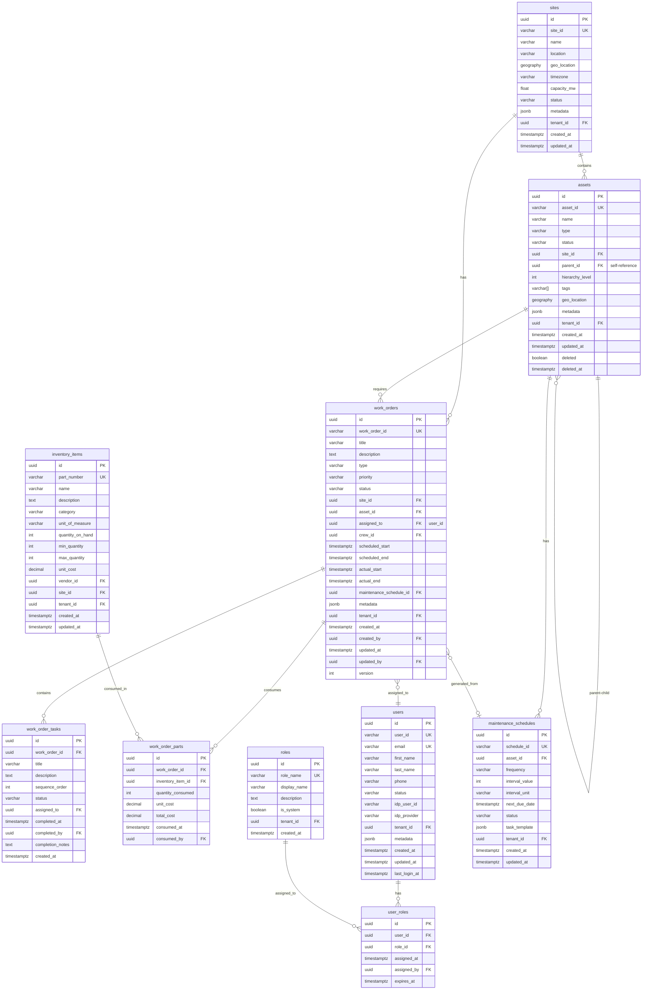
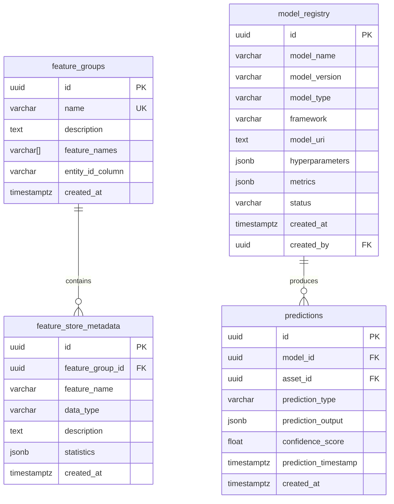

# dCMMS Entity-Relationship Diagram (ERD)

**Version:** 1.0
**Date:** 2025-11-18
**Status:** ✅ Approved for Sprint 0
**Based on:** Spec 11 (Complete Data Models)

---

## Table of Contents

1. [Complete ERD (All Entities)](#complete-erd)
2. [MVP Core Entities](#mvp-core-entities)
3. [Telemetry & Time-Series](#telemetry--time-series)
4. [ML & Analytics](#ml--analytics)
5. [Table Definitions](#table-definitions)
6. [Indexes & Partitioning](#indexes--partitioning)
7. [Data Volumes](#data-volumes)

---

## Complete ERD

### Core Domain Model

```mermaid
erDiagram
    %% ========================================
    %% CORE ENTITIES
    %% ========================================

    tenants ||--o{ sites : "has many"
    tenants ||--o{ users : "has many"
    tenants ||--o{ tenant_idp_config : "has one"

    sites ||--o{ assets : "contains"
    sites ||--o{ work_orders : "has"
    sites ||--o{ crews : "assigned to"
    sites ||--o{ shifts : "operates on"

    assets ||--o{ assets : "parent-child"
    assets ||--o{ work_orders : "requires maintenance"
    assets ||--o{ maintenance_schedules : "has"
    assets ||--o{ sensor_mappings : "monitors"
    assets ||--o{ calibration_records : "calibration history"
    assets ||--o{ risk_assessments : "risk evaluations"

    work_orders ||--o{ work_order_tasks : "contains"
    work_orders ||--o{ work_order_parts : "consumes"
    work_orders ||--o{ work_order_attachments : "has"
    work_orders ||--o{ work_order_comments : "has"
    work_orders ||--o{ work_order_costs : "tracks"
    work_orders }o--|| users : "assigned to"
    work_orders }o--o| crews : "assigned to"
    work_orders }o--|| maintenance_schedules : "generated from"

    users ||--o{ user_roles : "has"
    roles ||--o{ user_roles : "assigned to"
    roles ||--o{ role_permissions : "has"
    permissions ||--o{ role_permissions : "granted to"

    users ||--o{ user_skills : "has"
    skills ||--o{ user_skills : "possessed by"
    users ||--o{ shift_assignments : "assigned to"
    shifts ||--o{ shift_assignments : "contains"

    %% ========================================
    %% INVENTORY & PROCUREMENT
    %% ========================================

    inventory_items ||--o{ work_order_parts : "consumed in"
    inventory_items ||--o{ inventory_transactions : "transaction history"
    inventory_items }o--|| vendors : "supplied by"

    purchase_orders ||--o{ purchase_order_items : "contains"
    purchase_orders }o--|| vendors : "from"
    vendors ||--o{ contracts : "has"

    %% ========================================
    %% NOTIFICATIONS & ALERTS
    %% ========================================

    alert_rules ||--o{ alerts : "triggers"
    alerts ||--o{ notifications : "sends"
    notifications }o--|| users : "sent to"
    users ||--o{ notification_preferences : "has"

    %% ========================================
    %% COMPLIANCE & DOCUMENTS
    %% ========================================

    sites ||--o{ compliance_reports : "generates"
    assets ||--o{ compliance_certificates : "has"
    work_orders ||--o{ permits : "requires"

    assets ||--o{ documents : "has"
    work_orders ||--o{ documents : "has"
    vendors ||--o{ documents : "has"

    %% ========================================
    %% AUDIT & SECURITY
    %% ========================================

    users ||--o{ audit_logs : "performs actions"
    users ||--o{ user_sessions : "has"

    %% ========================================
    %% TELEMETRY (Separate Database - QuestDB)
    %% ========================================

    assets ||--o{ telemetry_data : "generates (QuestDB)"
    alert_rules ||--o{ telemetry_data : "evaluates (QuestDB)"

    %% ========================================
    %% ML/AI PLATFORM
    %% ========================================

    model_registry ||--o{ predictions : "produces"
    predictions }o--|| assets : "for"
    predictions }o--|| work_orders : "generates (optional)"
```



---

## MVP Core Entities

### Simplified MVP ERD (Sprint 0-5)



---

## Telemetry & Time-Series

### QuestDB (Raw Telemetry)

```sql
-- QuestDB Schema (Column-oriented, optimized for time-series)
CREATE TABLE telemetry_data (
    timestamp TIMESTAMP,       -- Partition key
    site_id SYMBOL,           -- Indexed symbol (low cardinality)
    asset_id SYMBOL,          -- Indexed symbol
    tag SYMBOL,               -- Indexed symbol (e.g., "INV-01.Power")
    value DOUBLE,             -- Numeric value
    quality SYMBOL,           -- GOOD, BAD, UNCERTAIN
    source_protocol SYMBOL,   -- modbus, opcua, iec61850, dnp3
    ingested_at TIMESTAMP,    -- Edge gateway timestamp
    metadata VARCHAR          -- JSON metadata (optional)
) TIMESTAMP(timestamp) PARTITION BY DAY;

-- Indexes automatically created on SYMBOL columns
CREATE INDEX ON telemetry_data (site_id);
CREATE INDEX ON telemetry_data (asset_id);
CREATE INDEX ON telemetry_data (tag);
```

**Data Volume:** 72,000 events/sec × 86,400 sec/day = **6.2 billion rows/day**
**Retention:** 90 days (hot data)
**Storage:** ~500 bytes/row × 6.2B rows = **3.1 TB/day** (compressed to ~300 GB/day)

### TimescaleDB (Aggregated Telemetry)

```sql
-- TimescaleDB Hypertable for Aggregated Data
CREATE TABLE telemetry_aggregates (
    time TIMESTAMPTZ NOT NULL,
    site_id UUID NOT NULL,
    asset_id UUID NOT NULL,
    tag VARCHAR(100) NOT NULL,
    interval VARCHAR(10) NOT NULL,  -- '1min', '5min', '15min', '1hour', '1day'

    -- Aggregations
    avg_value DOUBLE PRECISION,
    min_value DOUBLE PRECISION,
    max_value DOUBLE PRECISION,
    sum_value DOUBLE PRECISION,
    count BIGINT,
    stddev DOUBLE PRECISION,

    -- Quality
    good_count BIGINT,
    bad_count BIGINT,
    uncertain_count BIGINT,

    created_at TIMESTAMPTZ DEFAULT NOW()
);

-- Convert to hypertable
SELECT create_hypertable('telemetry_aggregates', 'time');

-- Create indexes
CREATE INDEX idx_telemetry_agg_site ON telemetry_aggregates (site_id, time DESC);
CREATE INDEX idx_telemetry_agg_asset ON telemetry_aggregates (asset_id, time DESC);
CREATE INDEX idx_telemetry_agg_tag ON telemetry_aggregates (tag, time DESC);

-- Continuous Aggregate (automatic computation)
CREATE MATERIALIZED VIEW telemetry_1min
WITH (timescaledb.continuous) AS
SELECT time_bucket('1 minute', timestamp) AS bucket,
       site_id, asset_id, tag,
       AVG(value) AS avg_value,
       MIN(value) AS min_value,
       MAX(value) AS max_value,
       SUM(value) AS sum_value,
       COUNT(*) AS count,
       STDDEV(value) AS stddev
FROM telemetry_raw  -- Federated query to QuestDB
WHERE quality = 'GOOD'
GROUP BY bucket, site_id, asset_id, tag;
```

**Data Volume:** 1,000 tags × 4 intervals × 1,440 min/day = **5.8 million rows/day**
**Retention:** 5 years (compressed)
**Storage:** ~200 bytes/row × 5.8M rows/day × 1,825 days = **2.1 TB** (compressed to ~500 GB)

---

## ML & Analytics

### Feature Store & Model Registry



---

## Table Definitions

### Complete Table List (MVP)

| Table Name | Rows (Year 1) | Primary Key | Partitioned | Notes |
|-----------|---------------|-------------|-------------|-------|
| **tenants** | 100 | uuid | No | Multi-tenancy |
| **sites** | 500 | uuid | No | 5 sites per tenant avg |
| **assets** | 50,000 | uuid | No | 100 assets per site |
| **work_orders** | 500,000 | uuid | By year | 1,000 WO/site/year |
| **work_order_tasks** | 2,000,000 | uuid | By year | 4 tasks per WO avg |
| **work_order_parts** | 1,000,000 | uuid | By year | 2 parts per WO avg |
| **users** | 5,000 | uuid | No | 50 users per tenant |
| **user_roles** | 7,500 | uuid | No | 1.5 roles per user |
| **roles** | 20 | uuid | No | System + custom roles |
| **permissions** | 100 | uuid | No | Feature permissions |
| **role_permissions** | 500 | uuid | No | Many-to-many |
| **inventory_items** | 10,000 | uuid | No | 20 parts per site |
| **inventory_transactions** | 1,000,000 | uuid | By year | Part movements |
| **maintenance_schedules** | 25,000 | uuid | No | 0.5 schedule per asset |
| **alerts** | 10,000,000 | uuid | By month | High volume |
| **notifications** | 20,000,000 | uuid | By month | 2 per alert |
| **audit_logs** | 50,000,000 | uuid | By month | All actions logged |
| **telemetry_data** | 2.2 trillion | composite | By day | QuestDB only |
| **telemetry_aggregates** | 2.1 billion | composite | By month | TimescaleDB |

---

## Indexes & Partitioning

### Primary Indexes (MVP)

```sql
-- Sites
CREATE INDEX idx_sites_tenant ON sites(tenant_id);
CREATE INDEX idx_sites_status ON sites(status) WHERE deleted = false;

-- Assets
CREATE INDEX idx_assets_site ON assets(site_id, deleted) WHERE deleted = false;
CREATE INDEX idx_assets_parent ON assets(parent_id) WHERE parent_id IS NOT NULL;
CREATE INDEX idx_assets_type ON assets(type);
CREATE INDEX idx_assets_status ON assets(status);
CREATE INDEX idx_assets_tags ON assets USING GIN(tags);
CREATE INDEX idx_assets_tenant ON assets(tenant_id);

-- Work Orders
CREATE INDEX idx_wo_site ON work_orders(site_id, status);
CREATE INDEX idx_wo_asset ON work_orders(asset_id);
CREATE INDEX idx_wo_assigned ON work_orders(assigned_to, status);
CREATE INDEX idx_wo_status ON work_orders(status, priority);
CREATE INDEX idx_wo_scheduled ON work_orders(scheduled_start, scheduled_end);
CREATE INDEX idx_wo_created ON work_orders(created_at DESC);
CREATE INDEX idx_wo_tenant ON work_orders(tenant_id);

-- Work Order Tasks
CREATE INDEX idx_wot_wo ON work_order_tasks(work_order_id, sequence_order);
CREATE INDEX idx_wot_assigned ON work_order_tasks(assigned_to, status);

-- Users
CREATE UNIQUE INDEX idx_users_email ON users(email) WHERE deleted = false;
CREATE INDEX idx_users_tenant ON users(tenant_id);
CREATE INDEX idx_users_status ON users(status);

-- Inventory
CREATE INDEX idx_inventory_site ON inventory_items(site_id);
CREATE INDEX idx_inventory_part ON inventory_items(part_number);
CREATE INDEX idx_inventory_category ON inventory_items(category);
CREATE INDEX idx_inventory_low_stock ON inventory_items(site_id)
  WHERE quantity_on_hand <= min_quantity;

-- Audit Logs
CREATE INDEX idx_audit_user_time ON audit_logs(user_id, timestamp DESC);
CREATE INDEX idx_audit_resource ON audit_logs(resource_type, resource_id);
CREATE INDEX idx_audit_action ON audit_logs(action, timestamp DESC);
CREATE INDEX idx_audit_tenant ON audit_logs(tenant_id, timestamp DESC);
```

### Partitioning Strategy

```sql
-- Work Orders (partitioned by year)
CREATE TABLE work_orders (
    -- columns...
) PARTITION BY RANGE (created_at);

CREATE TABLE work_orders_2025 PARTITION OF work_orders
    FOR VALUES FROM ('2025-01-01') TO ('2026-01-01');

CREATE TABLE work_orders_2026 PARTITION OF work_orders
    FOR VALUES FROM ('2026-01-01') TO ('2027-01-01');

-- Audit Logs (partitioned by month)
CREATE TABLE audit_logs (
    -- columns...
) PARTITION BY RANGE (timestamp);

CREATE TABLE audit_logs_2025_11 PARTITION OF audit_logs
    FOR VALUES FROM ('2025-11-01') TO ('2025-12-01');

CREATE TABLE audit_logs_2025_12 PARTITION OF audit_logs
    FOR VALUES FROM ('2025-12-01') TO ('2026-01-01');

-- Alerts (partitioned by month)
CREATE TABLE alerts (
    -- columns...
) PARTITION BY RANGE (triggered_at);
```

---

## Data Volumes

### Storage Estimates (Year 1)

| Database | Purpose | Volume | Growth Rate |
|----------|---------|--------|-------------|
| **PostgreSQL** | Transactional (OLTP) | 500 GB | 40 GB/month |
| **QuestDB** | Raw telemetry (90 days) | 27 TB | 300 GB/day (compressed) |
| **TimescaleDB** | Aggregated telemetry | 150 GB | 12 GB/month |
| **S3 (Iceberg)** | Lakehouse (7 years) | 100 TB | 10 TB/year |
| **Redis** | Cache | 10 GB | Stable |

### Connection Pooling

```yaml
# PgBouncer Configuration
[databases]
dcmms_production = host=postgres-primary port=5432 dbname=dcmms

[pgbouncer]
pool_mode = transaction
max_client_conn = 1000
default_pool_size = 25
reserve_pool_size = 5
reserve_pool_timeout = 3
max_db_connections = 100
```

**Rationale:** With 5,000 concurrent users and connection pooling:
- 1,000 max client connections
- 25 pooled connections per database
- Each API pod gets 25 connections
- 4 API pods × 25 = 100 total database connections

---

## Migration Strategy

### Database Migration Tools

- **PostgreSQL:** Prisma Migrate or Alembic
- **QuestDB:** Schema versioning via SQL scripts
- **TimescaleDB:** Flyway or Liquibase

### Sample Migration (Prisma)

```prisma
// schema.prisma
model Site {
  id         String    @id @default(uuid())
  siteId     String    @unique @map("site_id")
  name       String
  location   String?
  geoLocation Json?   @map("geo_location")
  timezone   String    @default("UTC")
  capacityMw Float?    @map("capacity_mw")
  status     String    @default("active")
  metadata   Json?
  tenantId   String    @map("tenant_id")

  createdAt  DateTime  @default(now()) @map("created_at")
  updatedAt  DateTime  @updatedAt @map("updated_at")

  assets     Asset[]
  workOrders WorkOrder[]

  @@index([tenantId])
  @@index([status])
  @@map("sites")
}
```

---

## References

- [Spec 11: Complete Data Models](../../specs/11_COMPLETE_DATA_MODELS.md)
- [System Architecture](../architecture/system-architecture.md)
- [Data Dictionary](./data-dictionary.md) (to be created in DCMMS-012A)

---

**Last Updated:** 2025-11-18
**Next Review:** Sprint 1 (during schema implementation)
**Status:** ✅ Approved for Implementation
