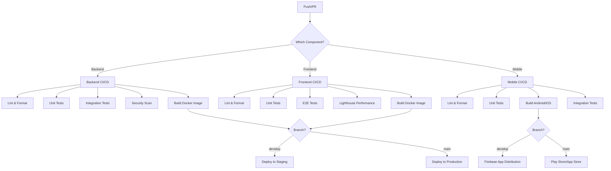

# CI/CD Pipeline Documentation

## Overview

The dCMMS project uses GitHub Actions for Continuous Integration and Continuous Deployment. The pipeline is designed to ensure code quality, security, and automated deployments across multiple environments.

## Pipeline Architecture



## Workflows

### 1. Backend CI/CD (`.github/workflows/backend-ci.yml`)

**Triggers:**
- Push to `main`, `develop`, `feature/**`, `claude/**` branches
- Pull requests to `main` and `develop`
- Changes to `backend/**` files

**Jobs:**
1. **Lint & Format Check**
   - ESLint validation
   - Prettier format check
   - TypeScript type checking

2. **Unit Tests**
   - Jest unit tests with coverage
   - Coverage upload to Codecov

3. **Integration Tests**
   - Runs against PostgreSQL and Redis services
   - Database migrations
   - API integration tests

4. **Security Scan**
   - npm audit
   - Snyk vulnerability scanning
   - Trivy filesystem scanning

5. **Build Docker Image**
   - Builds and pushes to GitHub Container Registry
   - Tags: branch name, SHA, semver

6. **Deploy to Staging** (develop branch)
   - Automated deployment to staging environment
   - Smoke tests

7. **Deploy to Production** (main branch)
   - Deployment to production environment
   - Post-deployment notifications

### 2. Frontend CI/CD (`.github/workflows/frontend-ci.yml`)

**Triggers:**
- Push to `main`, `develop`, `feature/**`, `claude/**` branches
- Pull requests to `main` and `develop`
- Changes to `frontend/**` files

**Jobs:**
1. **Lint & Format Check**
   - ESLint validation
   - Prettier format check
   - TypeScript type checking

2. **Unit Tests**
   - Jest/Vitest unit tests with coverage
   - Coverage upload to Codecov

3. **E2E Tests**
   - Playwright end-to-end tests
   - Cross-browser testing
   - Test report artifacts

4. **Build & Bundle Size Check**
   - Production build
   - Bundle size analysis
   - Size limit enforcement

5. **Lighthouse Performance**
   - Performance auditing
   - Accessibility checks
   - SEO validation
   - PWA compliance

6. **Accessibility Tests**
   - axe-core automated a11y tests

7. **Security Scan**
   - npm audit
   - Snyk vulnerability scanning

8. **Build Docker Image**
   - Builds and pushes to GitHub Container Registry

9. **Deploy to Staging/Production**
   - Automated deployments based on branch

### 3. Mobile CI/CD (`.github/workflows/mobile-ci.yml`)

**Triggers:**
- Push to `main`, `develop`, `feature/**`, `claude/**` branches
- Pull requests to `main` and `develop`
- Changes to `mobile/**` files

**Jobs:**
1. **Lint & Format Check**
   - Flutter analyzer
   - Dart format check
   - Custom lint rules

2. **Unit Tests**
   - Flutter unit tests with coverage
   - Coverage upload to Codecov

3. **Integration Tests**
   - iOS Simulator tests (macOS runner)

4. **Build Android**
   - Debug APK build
   - Release APK build (develop/main)
   - App Bundle build (main)

5. **Build iOS**
   - Debug build (unsigned)
   - Release build (develop/main)

6. **Security Scan**
   - Pub audit
   - OWASP dependency check

7. **Deploy to Firebase App Distribution** (develop)
   - Beta testing distribution

8. **Deploy to Play Store** (develop → beta, main → production)

9. **Deploy to App Store** (develop → TestFlight, main → production)

### 4. Code Quality & Security (`.github/workflows/code-quality.yml`)

**Triggers:**
- Push to all branches
- Pull requests
- Weekly schedule (Mondays 9 AM UTC)

**Jobs:**
1. **CodeQL Analysis**
   - JavaScript/TypeScript security analysis
   - Vulnerability detection

2. **SonarQube Analysis**
   - Code quality metrics
   - Code smells detection
   - Quality gate enforcement

3. **Dependency Review**
   - License compliance check
   - Vulnerability assessment
   - Denied licenses: GPL-3.0, AGPL-3.0

4. **Secret Scanning**
   - TruffleHog secret detection
   - Gitleaks scanning

5. **License Compliance Check**
   - Allowed licenses: MIT, Apache-2.0, BSD, ISC, CC0-1.0

6. **Docker Image Scanning**
   - Trivy vulnerability scanning
   - CRITICAL/HIGH severity alerts

7. **Infrastructure Scanning**
   - Checkov IaC security
   - Kubernetes manifest validation

8. **API Security Testing**
   - OWASP ZAP API scan
   - OpenAPI specification validation

9. **Combined Coverage Report**
   - Backend + Frontend coverage
   - PR comments with coverage delta

### 5. PR Automation (`.github/workflows/pr-automation.yml`)

**Triggers:**
- Pull request events (opened, synchronize, reopened)

**Jobs:**
1. **Auto-label PR**
   - Automatic labeling based on changed files

2. **PR Size Labeling**
   - XS/S/M/L/XL labels based on changes

3. **PR Description Validation**
   - Ensures PR has proper description

4. **Require Issue Reference**
   - Validates issue linking

5. **Auto-assign Reviewers**
   - Team-based reviewer assignment

6. **Stale PR Check**
   - Marks PRs inactive for 30 days
   - Closes after 7 days of inactivity

7. **Auto-merge Dependabot**
   - Auto-approves minor/patch updates
   - Auto-merges if tests pass

8. **Conventional Commits Check**
   - Validates commit message format

## Dependabot Configuration

Automated dependency updates for:
- Backend npm packages (weekly)
- Frontend npm packages (weekly)
- Mobile Dart/Flutter packages (weekly)
- GitHub Actions (weekly)
- Docker base images (weekly)

**Settings:**
- Day: Monday
- Time: 09:00 UTC
- Max open PRs: 10 per ecosystem
- Commit message prefix: `chore(scope)`
- Labels: `dependencies`, component-specific
- Auto-assigned to tech leads

## Branch Strategy

```
main (production)
  ↑
  └── develop (staging)
       ↑
       ├── feature/DCMMS-123-feature-name
       ├── fix/DCMMS-456-bug-fix
       └── claude/automated-changes
```

**Branch Protection Rules:**

**Main Branch:**
- Require pull request reviews (2 approvals)
- Require status checks to pass
  - Backend tests
  - Frontend tests
  - Mobile tests
  - Security scans
  - Code quality checks
- Require signed commits
- Require linear history
- No force pushes
- No deletions

**Develop Branch:**
- Require pull request reviews (1 approval)
- Require status checks to pass
- No force pushes

## Deployment Environments

### Staging Environment
- **Trigger:** Push to `develop` branch
- **Backend URL:** `https://api-staging.dcmms.io`
- **Frontend URL:** `https://staging.dcmms.io`
- **Mobile:** Firebase App Distribution
- **Auto-deploy:** Yes
- **Approval:** Not required

### Production Environment
- **Trigger:** Push to `main` branch
- **Backend URL:** `https://api.dcmms.io`
- **Frontend URL:** `https://dcmms.io`
- **Mobile:** Play Store (production), App Store (production)
- **Auto-deploy:** Yes (after all checks pass)
- **Approval:** GitHub Environment protection rules

## Secrets Management

Required GitHub Secrets:

### Backend
- `SNYK_TOKEN`: Snyk security scanning
- `DATABASE_URL`: Production database connection

### Frontend
- `NEXT_PUBLIC_API_URL`: API endpoint URL
- `VERCEL_TOKEN`: Deployment token (if using Vercel)

### Mobile
- `FIREBASE_APP_ID`: Firebase App Distribution
- `FIREBASE_SERVICE_ACCOUNT`: Firebase credentials
- `PLAY_STORE_SERVICE_ACCOUNT`: Google Play deployment
- `MATCH_PASSWORD`: iOS certificate management
- `FASTLANE_USER`: Apple ID for App Store
- `FASTLANE_PASSWORD`: Apple ID password

### Shared
- `SONAR_TOKEN`: SonarQube authentication
- `SONAR_HOST_URL`: SonarQube server URL
- `CODECOV_TOKEN`: Code coverage reporting

## Performance Benchmarks

**Required Checks:**
- Backend API response time: p95 < 200ms
- Frontend Lighthouse score: > 90
- Frontend bundle size: < 200KB (initial)
- Test coverage: > 80%
- Security vulnerabilities: 0 CRITICAL/HIGH

## Monitoring & Notifications

**Success Notifications:**
- Slack webhook (production deployments)
- Email (production deployments)

**Failure Notifications:**
- GitHub PR comments
- Slack webhook (all failures)
- Email (production failures only)

## Rollback Procedures

### Backend/Frontend
1. Revert commit on main/develop branch
2. CI/CD automatically deploys previous version
3. Monitor metrics for 15 minutes
4. Create incident report

### Mobile
1. Use platform-specific rollback:
   - **Android:** Google Play Console → Release management → Staged rollout
   - **iOS:** App Store Connect → Version rollback
2. Emergency hotfix via expedited review (iOS)

## Testing Strategy

### Unit Tests
- **Backend:** Jest with coverage > 80%
- **Frontend:** Vitest/Jest with coverage > 80%
- **Mobile:** Flutter test with coverage > 80%

### Integration Tests
- **Backend:** API integration tests with real databases
- **Mobile:** Flutter integration tests with simulators

### E2E Tests
- **Frontend:** Playwright cross-browser tests
- **Mobile:** Maestro/Detox E2E tests

### Performance Tests
- **Backend:** Artillery load testing (5,000 concurrent users)
- **Frontend:** Lighthouse CI
- **Mobile:** Flutter performance profiling

## Troubleshooting

### Build Failures

**Symptom:** Build fails with dependency errors
**Solution:**
```bash
# Clear npm cache
npm cache clean --force

# Delete lock files and reinstall
rm -rf node_modules package-lock.json
npm install
```

### Test Failures

**Symptom:** Tests pass locally but fail in CI
**Solution:**
- Check environment variables
- Verify database connection strings
- Check timezone settings (CI uses UTC)

### Docker Build Failures

**Symptom:** Docker image build times out
**Solution:**
- Enable BuildKit caching
- Use multi-stage builds
- Optimize layer caching

### Deployment Failures

**Symptom:** Deployment succeeds but app is down
**Solution:**
1. Check health checks
2. Verify environment variables
3. Check database migrations
4. Review application logs

## Best Practices

1. **Never skip tests** - Always run full test suite
2. **Small PRs** - Keep changes focused and reviewable
3. **Conventional commits** - Follow commit message format
4. **Link issues** - Always reference related issues
5. **Update tests** - Add tests for new features
6. **Security first** - Fix security vulnerabilities immediately
7. **Monitor deployments** - Watch metrics after deployment
8. **Document changes** - Update docs with feature changes

## Future Enhancements

- [ ] Canary deployments for gradual rollouts
- [ ] Blue-green deployment strategy
- [ ] Automated performance regression testing
- [ ] Chaos engineering tests
- [ ] Advanced feature flagging
- [ ] Multi-region deployments
- [ ] A/B testing infrastructure
