# dCMMS Critical User Flow Sequence Diagrams

**Version:** 1.0
**Date:** 2025-11-18
**Status:** ✅ Approved for Sprint 0
**Based on:** Spec 01 (API), Spec 02 (State Machines), Spec 03 (Auth), Spec 04 (Mobile Sync)

---

## Table of Contents

1. [User Login Flow](#1-user-login-flow)
2. [Create Work Order Flow](#2-create-work-order-flow)
3. [Mobile Offline Sync Flow](#3-mobile-offline-sync-flow)
4. [Telemetry Ingestion Flow](#4-telemetry-ingestion-flow)
5. [Alert Generation & Work Order Creation Flow](#5-alert-generation--work-order-creation-flow)
6. [Work Order State Transition Flow](#6-work-order-state-transition-flow)
7. [Asset Hierarchy Traversal Flow](#7-asset-hierarchy-traversal-flow)
8. [ML Prediction & Work Order Generation Flow](#8-ml-prediction--work-order-generation-flow)

---

## 1. User Login Flow

**OAuth2/OIDC Authentication with IdP**


**Key Steps:**
1. User submits credentials to web app
2. API gateway forwards to auth service
3. Auth service uses IdP adapter factory to get correct adapter
4. Adapter authenticates with external IdP (OAuth2/OIDC)
5. If successful, create or update user in local DB
6. Fetch user roles from database
7. Generate JWT access token (15 min) and refresh token (7 days)
8. Store session in Redis
9. Log authentication event to audit log
10. Return tokens to client

**Error Cases:**
- Invalid credentials → 401 with error message
- IdP service unavailable → 503 with retry message
- Network timeout → 504 with retry message

---

## 2. Create Work Order Flow

**Frontend → API → Database with State Machine Validation**


**Key Steps:**
1. User fills work order form in web app
2. Client-side validation (Zod schema)
3. API gateway verifies JWT
4. Work order service checks user permissions (RBAC)
5. Validate asset exists and is operational
6. Begin database transaction
7. Insert work order (status='draft')
8. Insert audit log entry
9. Commit transaction
10. Publish event to Kafka
11. Invalidate relevant caches
12. Return created work order

**Validation Checks:**
- JWT signature valid
- User has 'workorder:create' permission
- Request body matches schema
- Referenced asset exists
- Asset is in valid state for maintenance

---

## 3. Mobile Offline Sync Flow

**Conflict Resolution with Version Tokens**


**Key Steps (Pull):**
1. Mobile app queries last sync timestamp from local DB
2. Request delta changes from server since last sync
3. Server queries updated records (WHERE updated_at > lastSync)
4. Server returns delta changes + new sync timestamp
5. Mobile upserts records into local SQLite database
6. Update last sync timestamp

**Key Steps (Push):**
1. Mobile queries pending changes from sync queue
2. Send changes to server with version tokens
3. Server compares client version vs server version
4. If versions match → accept change (optimistic locking)
5. If versions differ → conflict detected
6. Apply conflict resolution strategy:
   - **server_wins**: Discard client changes
   - **client_wins**: Accept client changes
   - **merge**: Merge both (field-level resolution)
7. Return results to mobile
8. Mobile updates local DB based on results

**Conflict Resolution Strategies:**
- **Read-only data (assets, sites):** Server wins
- **Work order updates:** Client wins (technician has latest info)
- **Work order tasks:** Merge (combine both)

---

## 4. Telemetry Ingestion Flow

**Edge → MQTT → Kafka → Flink → QuestDB**


**Key Steps:**
1. Edge gateway polls SCADA devices (5-second interval)
2. Normalize data to Avro schema
3. Publish to MQTT broker (QoS 1 for reliability)
4. MQTT broker bridges to Kafka topic `telemetry.raw`
5. **Flink Job #1 (Validation):**
   - Validate Avro schema
   - Range checks and quality validation
   - Write to QuestDB (raw data)
   - Invalid data → alert
6. **Flink Job #2 (Aggregation):**
   - Tumbling windows (1-min, 5-min, 15-min)
   - Compute aggregations (AVG, MIN, MAX, STDDEV)
   - Write to TimescaleDB
7. **Flink Job #3 (CEP - Complex Event Processing):**
   - Pattern detection (thresholds, anomalies)
   - Critical patterns → trigger alerts

**Performance:**
- **Target:** 72,000 events/second
- **Kafka partitions:** 24 (3,000 events/sec per partition)
- **Flink parallelism:** 12 task managers
- **QuestDB write speed:** 100,000+ rows/sec (measured)

**Reliability:**
- Edge local buffer: 24 hours (QuestDB)
- MQTT QoS 1: At least once delivery
- Kafka replication: 3 replicas
- Flink checkpointing: Exactly-once semantics

---

## 5. Alert Generation & Work Order Creation Flow

**Anomaly Detection → Alert → Notification → Auto Work Order**

```mermaid
sequenceDiagram
    participant Flink as Apache Flink<br/>(CEP)
    participant Kafka as Kafka
    participant AlertSvc as Alert Service
    participant WOSvc as Work Order Service
    participant NotifSvc as Notification Service
    participant DB as PostgreSQL
    participant SendGrid as SendGrid<br/>(Email)
    participant Twilio as Twilio<br/>(SMS)

    Note over Flink,Twilio: Critical alert triggers automated response

    Flink->>Flink: Detect pattern:<br/>Inverter temp > 85°C<br/>for 3 consecutive readings

    Flink->>Kafka: Publish to alerts.critical<br/>{alertType, severity, assetId, metric, value}

    AlertSvc->>Kafka: Consume alerts.critical

    AlertSvc->>DB: BEGIN TRANSACTION

    AlertSvc->>DB: INSERT INTO alerts<br/>(type='TEMPERATURE_HIGH', severity='CRITICAL', asset_id, ...)
    DB-->>AlertSvc: alert_id

    AlertSvc->>DB: SELECT alert_rules<br/>WHERE type = 'TEMPERATURE_HIGH'
    DB-->>AlertSvc: Rule: auto_create_workorder=true

    AlertSvc->>WOSvc: POST /api/v1/workorders<br/>{title: "Inverter overheating",<br/>type: "emergency", priority: "critical"}

    WOSvc->>DB: INSERT INTO work_orders<br/>(status='open', type='emergency', ...)
    DB-->>WOSvc: work_order_id

    WOSvc->>DB: INSERT INTO audit_logs<br/>(WORKORDER_CREATED_BY_ALERT)

    WOSvc->>Kafka: Publish workorder.created

    WOSvc-->>AlertSvc: 201 Created {workOrderId}

    AlertSvc->>DB: UPDATE alerts<br/>SET work_order_id = ?

    AlertSvc->>DB: COMMIT TRANSACTION

    AlertSvc->>NotifSvc: Send notification<br/>{alertId, workOrderId, severity, recipients}

    NotifSvc->>DB: SELECT notification_preferences<br/>WHERE user_id IN (supervisors, oncall)
    DB-->>NotifSvc: User preferences:<br/>- User1: email + sms<br/>- User2: email only

    NotifSvc->>DB: SELECT notification_templates<br/>WHERE type = 'ALERT_CRITICAL'
    DB-->>NotifSvc: Template (Handlebars)

    NotifSvc->>NotifSvc: Render template<br/>with alert data

    par Send to multiple channels
        NotifSvc->>SendGrid: Send email<br/>to: supervisor@example.com<br/>subject: "🚨 Critical Alert: Inverter Overheating"
        SendGrid-->>NotifSvc: Message ID

        NotifSvc->>Twilio: Send SMS<br/>to: +1234567890<br/>body: "Critical alert: INV-001 temp 87°C. WO-2025-042 created."
        Twilio-->>NotifSvc: Message SID
    end

    NotifSvc->>DB: INSERT INTO notifications<br/>(alert_id, user_id, channel, status='sent')

    NotifSvc->>Kafka: Publish notification.sent

    Note over NotifSvc: Escalation if no acknowledgment

    NotifSvc->>NotifSvc: Schedule escalation<br/>(15 minutes)

    alt No acknowledgment after 15 min
        NotifSvc->>DB: SELECT escalation_rules
        DB-->>NotifSvc: Escalate to: manager@example.com

        NotifSvc->>SendGrid: Send escalation email
        NotifSvc->>Twilio: Send escalation SMS

        NotifSvc->>DB: INSERT INTO notifications<br/>(type='ESCALATION')
    end

    Note over Flink,Twilio: Error Handling

    alt Email send fails
        SendGrid-->>NotifSvc: 5xx Error
        NotifSvc->>NotifSvc: Retry with backoff<br/>(3 attempts)
        NotifSvc->>DB: UPDATE notifications<br/>SET status='failed'
    end

    alt SMS send fails
        Twilio-->>NotifSvc: Error (invalid number)
        NotifSvc->>DB: UPDATE notifications<br/>SET status='failed', error_message
        NotifSvc->>SendGrid: Fallback to email only
    end
```



**Key Steps:**
1. Flink CEP detects critical pattern (e.g., high temperature)
2. Publish alert to Kafka `alerts.critical`
3. Alert service consumes event
4. Insert alert record to database
5. Check alert rules (auto-create work order?)
6. If yes → call work order service to create emergency WO
7. Update alert with work order ID
8. Send notification to configured recipients
9. Query user notification preferences
10. Render notification template
11. Send via multiple channels (email, SMS, push)
12. Schedule escalation if no acknowledgment
13. After 15 minutes → escalate to manager

**Escalation Logic:**
- **Level 1 (0 min):** Assigned technician + on-call supervisor
- **Level 2 (15 min):** Escalate to manager if no ack
- **Level 3 (30 min):** Escalate to director

**Notification Channels:**
- **Email:** SendGrid (critical alerts)
- **SMS:** Twilio (critical only)
- **Push:** Firebase Cloud Messaging (all alerts)
- **In-app:** WebSocket notification

---

## 6. Work Order State Transition Flow

**State Machine Validation with Audit Trail**


**State Machine Rules (See Spec 02):**

```
Valid Transitions:
- draft → open (submit)
- open → in_progress (start)
- open → cancelled (cancel)
- in_progress → on_hold (pause)
- in_progress → completed (complete)
- in_progress → cancelled (cancel)
- on_hold → in_progress (resume)
- on_hold → cancelled (cancel)
```

**Key Steps:**
1. User triggers state transition (e.g., "Start")
2. Work order service fetches current record (with pessimistic lock)
3. Validate transition using state machine rules
4. Check business rules (e.g., technician assigned?)
5. If valid:
   - Update work order status
   - Increment version (optimistic locking)
   - Insert state history record
   - Insert audit log
   - Publish event to Kafka
   - Invalidate caches
6. If invalid:
   - Return error with allowed transitions

**Concurrency Control:**
- **Pessimistic locking:** `SELECT ... FOR UPDATE` during transition
- **Optimistic locking:** Version field checked on UPDATE
- **Conflict resolution:** 409 Conflict → user must refresh

**Audit Trail:**
- `work_order_state_history` table tracks all transitions
- `audit_logs` table records who/when/what changed
- Kafka events for downstream consumers

---

## 7. Asset Hierarchy Traversal Flow

**Recursive Query with Tree Structure**

```mermaid
sequenceDiagram
    participant User
    participant WebApp as Web App
    participant API as API Gateway
    participant AssetSvc as Asset Service
    participant DB as PostgreSQL
    participant Redis as Redis Cache

    User->>WebApp: View asset detail page<br/>(Asset: INV-001)
    WebApp->>API: GET /api/v1/assets/{id}/hierarchy
    API->>AssetSvc: Forward request

    AssetSvc->>Redis: GET cache:asset:{id}:hierarchy

    alt Cache hit
        Redis-->>AssetSvc: Cached hierarchy JSON
        AssetSvc-->>WebApp: 200 OK {hierarchy}
    else Cache miss
        Redis-->>AssetSvc: null

        AssetSvc->>DB: Recursive CTE query:<br/>WITH RECURSIVE asset_tree AS (<br/>  -- Anchor: get current asset<br/>  SELECT * FROM assets WHERE id = ?<br/>  UNION ALL<br/>  -- Recursive: get parents<br/>  SELECT a.* FROM assets a<br/>  JOIN asset_tree t ON a.id = t.parent_id<br/>)<br/>SELECT * FROM asset_tree

        DB-->>AssetSvc: Parents: [Site, Zone, String]

        AssetSvc->>DB: WITH RECURSIVE asset_tree AS (<br/>  -- Anchor: get current asset<br/>  SELECT * FROM assets WHERE id = ?<br/>  UNION ALL<br/>  -- Recursive: get children<br/>  SELECT a.* FROM assets a<br/>  JOIN asset_tree t ON a.parent_id = t.id<br/>)<br/>SELECT * FROM asset_tree

        DB-->>AssetSvc: Children: [Module1, Module2, ...]

        AssetSvc->>AssetSvc: Build hierarchy tree:<br/>{<br/>  asset: current,<br/>  parents: [Site → Zone → String],<br/>  children: [Module1, Module2]<br/>}

        AssetSvc->>Redis: SET cache:asset:{id}:hierarchy<br/>TTL: 1 hour

        AssetSvc-->>API: 200 OK {hierarchy}
    end

    API-->>WebApp: {hierarchy}

    WebApp->>WebApp: Render tree visualization:<br/>Site → Zone → String → INV-001 → Modules
    WebApp-->>User: Show hierarchy tree

    Note over User,Redis: Cache Invalidation

    alt Asset updated/moved
        AssetSvc->>AssetSvc: Asset parent changed
        AssetSvc->>Redis: DEL cache:asset:*:hierarchy<br/>(Invalidate entire hierarchy cache)
    end
```



**Hierarchy Example:**
```
Site: Desert Solar Farm (SITE-001)
  └─ Zone: Zone A
      └─ String: String 1
          └─ Inverter: INV-001 (CURRENT)
              ├─ Module: MOD-001
              ├─ Module: MOD-002
              └─ Module: MOD-003
```

**PostgreSQL Recursive CTE:**
```sql
-- Get parent hierarchy (bottom-up)
WITH RECURSIVE asset_tree AS (
  SELECT id, asset_id, name, parent_id, 0 AS level
  FROM assets
  WHERE id = 'INV-001-UUID'

  UNION ALL

  SELECT a.id, a.asset_id, a.name, a.parent_id, t.level + 1
  FROM assets a
  INNER JOIN asset_tree t ON a.id = t.parent_id
)
SELECT * FROM asset_tree ORDER BY level DESC;

-- Get children hierarchy (top-down)
WITH RECURSIVE asset_tree AS (
  SELECT id, asset_id, name, parent_id, 0 AS level
  FROM assets
  WHERE id = 'INV-001-UUID'

  UNION ALL

  SELECT a.id, a.asset_id, a.name, a.parent_id, t.level + 1
  FROM assets a
  INNER JOIN asset_tree t ON a.parent_id = t.id
  WHERE t.level < 5  -- Prevent infinite loops
)
SELECT * FROM asset_tree ORDER BY level ASC;
```

**Performance Optimization:**
- **Caching:** 1-hour TTL for hierarchy data (rarely changes)
- **Max depth:** 5 levels to prevent infinite loops
- **Indexing:** B-tree index on `parent_id` column
- **Materialized path (future):** Store full path for faster queries

---

## 8. ML Prediction & Work Order Generation Flow

**Predictive Maintenance with Feature Store**


**Key Steps:**
1. **Feature Engineering:**
   - Airflow scheduler triggers daily at 2 AM
   - Spark job extracts features from telemetry data (7-day window)
   - Calculate derived features (operating hours, failure history)
   - Materialize to Feast feature store (Redis)

2. **Batch Prediction:**
   - For each operational asset:
     - Fetch features from Feast
     - Run ML model inference (Random Forest)
     - Get failure probability (0.0-1.0)
   - If probability >= 0.7:
     - Create prediction record in DB
     - Auto-generate predictive work order
     - Link prediction to work order

3. **Real-time Prediction (on-demand):**
   - User requests prediction via API
   - Fetch latest features from Feast
   - Run model inference
   - Return prediction with explanation

**ML Model Details:**
- **Algorithm:** Random Forest Classifier (150 trees)
- **Features:** 15 engineered features
  - Telemetry aggregates (avg, max, stddev)
  - Temporal features (days since maintenance)
  - Historical features (failure count)
- **Output:** Failure probability (0.0-1.0) + failure type
- **Retraining:** Weekly (new data from completed work orders)
- **Model registry:** MLflow
- **Serving:** KServe (Kubernetes)

**Performance:**
- **Batch processing:** 1,000 assets in ~5 minutes
- **Real-time inference:** <100ms p99 latency
- **Feature retrieval:** <10ms (Redis)

---

## Summary

These 8 sequence diagrams cover the critical user flows in dCMMS:

1. ✅ **User Login Flow** - OAuth2/OIDC with IdP adapter pattern
2. ✅ **Create Work Order Flow** - RBAC validation, state machine
3. ✅ **Mobile Offline Sync Flow** - Conflict resolution with version tokens
4. ✅ **Telemetry Ingestion Flow** - Edge → MQTT → Kafka → Flink → QuestDB
5. ✅ **Alert Generation Flow** - Anomaly detection → auto work order → notifications
6. ✅ **Work Order State Transition Flow** - State machine validation with audit
7. ✅ **Asset Hierarchy Traversal Flow** - Recursive CTE queries
8. ✅ **ML Prediction Flow** - Feature store → model inference → predictive WO

**Common Patterns:**
- **Authentication:** JWT Bearer tokens on all protected endpoints
- **Authorization:** RBAC checks via auth service
- **Transactions:** Database transactions for multi-step operations
- **Events:** Kafka events for async communication
- **Caching:** Redis for frequently accessed data
- **Audit:** All critical actions logged to audit_logs table
- **Error Handling:** Graceful degradation with retries

---

**Last Updated:** 2025-11-18
**Next Review:** Sprint 2 (after MVP implementation)
**Status:** ✅ Approved for Implementation
