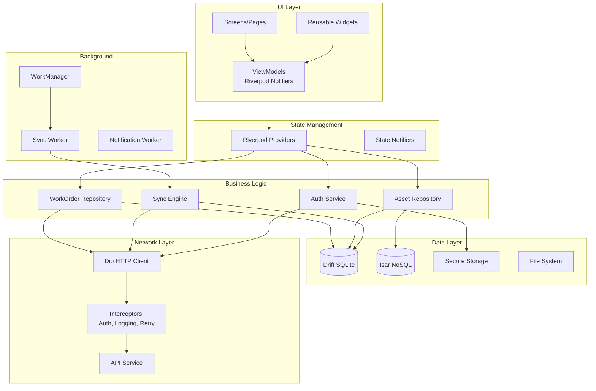

# dCMMS Mobile Application Architecture

**Version:** 1.0
**Date:** 2025-11-18
**Status:** ✅ Approved for Sprint 0
**Based on:** Spec 04 (Mobile Offline Sync), TECHNOLOGY_STACK_EVALUATION.md

---

## Table of Contents

1. [Executive Summary](#executive-summary)
2. [Technology Stack](#technology-stack)
3. [Architecture Overview](#architecture-overview)
4. [Offline-First Data Flow](#offline-first-data-flow)
5. [Local Database Schema](#local-database-schema)
6. [Sync Engine](#sync-engine)
7. [State Management](#state-management)
8. [Navigation](#navigation)
9. [Performance Optimizations](#performance-optimizations)
10. [Security](#security)
11. [Testing Strategy](#testing-strategy)

---

## Executive Summary

The dCMMS mobile application is an **offline-first Flutter app** designed for field technicians to manage work orders, access asset information, and update maintenance tasks without requiring constant internet connectivity.

### Key Requirements

- ✅ **Offline-first:** Full functionality without network (up to 7 days)
- ✅ **Sync reliability:** Automatic conflict resolution with version tokens
- ✅ **Performance:** <16ms frame time (60 FPS), fast app startup
- ✅ **Battery efficiency:** Background sync optimization
- ✅ **Cross-platform:** iOS and Android from single codebase
- ✅ **Data security:** Local encryption, secure storage

### Architecture Decisions

- **Framework:** Flutter 3.16+ (Dart)
- **State Management:** Riverpod (provider-based, type-safe)
- **Local Database:** Drift (SQLite) for relational data
- **Document Storage:** Isar for NoSQL (photos, attachments)
- **Navigation:** GoRouter (declarative routing)
- **Network:** Dio (HTTP client with interceptors)
- **Background Sync:** WorkManager plugin

---

## Technology Stack

### Core Framework

```yaml
dependencies:
  # Framework
  flutter: ^3.16.0

  # State Management
  flutter_riverpod: ^2.4.0
  riverpod_annotation: ^2.3.0

  # Local Database (Relational)
  drift: ^2.14.0
  sqlite3_flutter_libs: ^0.5.0

  # Local Database (NoSQL)
  isar: ^3.1.0
  isar_flutter_libs: ^3.1.0

  # Navigation
  go_router: ^13.0.0

  # Network
  dio: ^5.4.0
  pretty_dio_logger: ^1.3.1

  # Authentication
  flutter_secure_storage: ^9.0.0
  jwt_decoder: ^2.0.1

  # Background Tasks
  workmanager: ^0.5.1

  # Notifications
  firebase_messaging: ^14.7.5
  flutter_local_notifications: ^16.3.0

  # Camera & Media
  camera: ^0.10.5
  image_picker: ^1.0.5

  # Barcode Scanning
  mobile_scanner: ^3.5.5

  # File Storage
  path_provider: ^2.1.1

  # Utilities
  intl: ^0.18.1  # Internationalization
  logger: ^2.0.2
  freezed: ^2.4.6  # Immutable data classes
  json_annotation: ^4.8.1
```

### Development Tools

```yaml
dev_dependencies:
  # Code Generation
  build_runner: ^2.4.7
  riverpod_generator: ^2.3.9
  drift_dev: ^2.14.0
  isar_generator: ^3.1.0
  freezed: ^2.4.6
  json_serializable: ^6.7.1

  # Testing
  flutter_test:
  mockito: ^5.4.4
  integration_test:
  flutter_driver:

  # Linting
  flutter_lints: ^3.0.1
```

---

## Architecture Overview

### Layered Architecture

```
┌──────────────────────────────────────────────────────────────┐
│                    PRESENTATION LAYER                        │
│  ┌────────────┐  ┌────────────┐  ┌────────────┐            │
│  │  Screens   │  │  Widgets   │  │ ViewModels │            │
│  │  (Pages)   │  │(Components)│  │ (Notifiers)│            │
│  └────────────┘  └────────────┘  └────────────┘            │
└───────────────────────┬──────────────────────────────────────┘
                        │
┌───────────────────────▼──────────────────────────────────────┐
│                 STATE MANAGEMENT LAYER                       │
│  ┌──────────────────────────────────────────────────────┐   │
│  │              Riverpod Providers                      │   │
│  │  - AsyncNotifierProvider (remote state)              │   │
│  │  - NotifierProvider (local state)                    │   │
│  │  - StreamProvider (real-time updates)                │   │
│  └──────────────────────────────────────────────────────┘   │
└───────────────────────┬──────────────────────────────────────┘
                        │
┌───────────────────────▼──────────────────────────────────────┐
│                   BUSINESS LOGIC LAYER                       │
│  ┌────────────┐  ┌────────────┐  ┌────────────┐            │
│  │Repositories│  │  Services  │  │   Sync     │            │
│  │            │  │            │  │  Engine    │            │
│  └────────────┘  └────────────┘  └────────────┘            │
└──────┬────────────────┬────────────────┬────────────────────┘
       │                │                │
┌──────▼────────┐  ┌───▼────────┐  ┌───▼──────────┐
│  Local Data   │  │  Network   │  │  Background  │
│    Source     │  │   Source   │  │   Services   │
│ (Drift+Isar)  │  │   (Dio)    │  │(WorkManager) │
└───────────────┘  └────────────┘  └──────────────┘
```

### Component Diagram



---

## Offline-First Data Flow

### Architecture Pattern: Repository Pattern with Dual Data Sources

```dart
abstract class Repository<T> {
  // Always read from local first
  Future<T?> getById(String id);

  // Write to local, queue for sync
  Future<void> save(T entity);

  // Sync with server
  Future<void> sync();
}

class WorkOrderRepository implements Repository<WorkOrder> {
  final WorkOrderLocalDataSource _local;
  final WorkOrderRemoteDataSource _remote;
  final SyncEngine _syncEngine;

  @override
  Future<WorkOrder?> getById(String id) async {
    // ALWAYS read from local database first (offline-first)
    return await _local.getById(id);
  }

  @override
  Future<void> save(WorkOrder workOrder) async {
    // 1. Save to local database immediately
    await _local.save(workOrder);

    // 2. Add to sync queue
    await _syncEngine.enqueue(
      entity: workOrder,
      operation: SyncOperation.update,
    );

    // 3. Attempt background sync (if online)
    _syncEngine.trySync();
  }

  @override
  Future<void> sync() async {
    // Pull changes from server
    final serverChanges = await _remote.getChanges(
      since: await _local.getLastSyncTimestamp(),
    );

    // Apply to local database
    for (final change in serverChanges) {
      await _local.upsert(change);
    }

    // Push local changes to server
    final localChanges = await _syncEngine.getPendingChanges();
    final result = await _remote.push(localChanges);

    // Handle conflicts
    for (final conflict in result.conflicts) {
      await _resolveConflict(conflict);
    }
  }
}
```

### Data Flow Diagram

```
┌─────────────────────────────────────────────────────────────┐
│                         USER ACTION                         │
│           (Create/Update/Delete Work Order)                 │
└────────────────────────┬────────────────────────────────────┘
                         │
                         ▼
┌─────────────────────────────────────────────────────────────┐
│                    UI LAYER (Widget)                        │
│                                                             │
│  onPressed: () {                                           │
│    ref.read(workOrderProvider.notifier)                   │
│       .updateWorkOrder(workOrder);                         │
│  }                                                         │
└────────────────────────┬────────────────────────────────────┘
                         │
                         ▼
┌─────────────────────────────────────────────────────────────┐
│              STATE MANAGEMENT (Riverpod)                    │
│                                                             │
│  class WorkOrderNotifier extends AsyncNotifier {           │
│    Future<void> updateWorkOrder(WorkOrder wo) async {      │
│      await _repository.save(wo);                           │
│      state = AsyncValue.data(wo);                          │
│    }                                                       │
│  }                                                         │
└────────────────────────┬────────────────────────────────────┘
                         │
                         ▼
┌─────────────────────────────────────────────────────────────┐
│            REPOSITORY LAYER (Business Logic)                │
│                                                             │
│  1. Save to local database (Drift)                         │
│  2. Add to sync queue                                      │
│  3. Trigger background sync (if online)                    │
└──────────┬──────────────────────────┬───────────────────────┘
           │                          │
           ▼                          ▼
┌──────────────────────┐   ┌──────────────────────┐
│   LOCAL DATABASE     │   │    SYNC QUEUE        │
│   (Drift SQLite)     │   │  (sync_queue table)  │
│                      │   │                      │
│  work_orders         │   │  entity_type: WO     │
│  ├─ id (PK)          │   │  entity_id: 123      │
│  ├─ title            │   │  operation: UPDATE   │
│  ├─ status           │   │  version: 5          │
│  ├─ version          │   │  synced: false       │
│  └─ ...              │   │  data: JSON          │
└──────────────────────┘   └──────────┬───────────┘
                                      │
           When online ───────────────┘
                                      │
                                      ▼
                         ┌──────────────────────┐
                         │  BACKGROUND SYNC     │
                         │  (WorkManager)       │
                         │                      │
                         │  1. Pull from server │
                         │  2. Push to server   │
                         │  3. Resolve conflicts│
                         └──────────┬───────────┘
                                    │
                                    ▼
                         ┌──────────────────────┐
                         │   REST API           │
                         │   (Backend)          │
                         │                      │
                         │  POST /sync/push     │
                         │  POST /sync/pull     │
                         └──────────────────────┘
```

---

## Local Database Schema

### Drift (SQLite) Schema

**Purpose:** Relational data (work orders, assets, sites, users)

```dart
import 'package:drift/drift.dart';

// Work Orders Table
class WorkOrders extends Table {
  TextColumn get id => text()();
  TextColumn get workOrderId => text().unique()();
  TextColumn get title => text()();
  TextColumn get description => text().nullable()();
  TextColumn get type => text()();
  TextColumn get priority => text()();
  TextColumn get status => text()();
  TextColumn get siteId => text()();
  TextColumn get assetId => text().nullable()();
  TextColumn get assignedTo => text().nullable()();
  DateTimeColumn get scheduledStart => dateTime()();
  DateTimeColumn get scheduledEnd => dateTime()();
  DateTimeColumn get actualStart => dateTime().nullable()();
  DateTimeColumn get actualEnd => dateTime().nullable()();
  IntColumn get version => integer()();
  DateTimeColumn get createdAt => dateTime()();
  DateTimeColumn get updatedAt => dateTime()();
  BoolColumn get deleted => boolean().withDefault(const Constant(false))();

  @override
  Set<Column> get primaryKey => {id};
}

// Work Order Tasks Table
class WorkOrderTasks extends Table {
  TextColumn get id => text()();
  TextColumn get workOrderId => text()();
  TextColumn get title => text()();
  TextColumn get description => text().nullable()();
  IntColumn get sequenceOrder => integer()();
  TextColumn get status => text()();
  TextColumn get assignedTo => text().nullable()();
  DateTimeColumn get completedAt => dateTime().nullable()();
  TextColumn get completionNotes => text().nullable()();

  @override
  Set<Column> get primaryKey => {id};
}

// Assets Table
class Assets extends Table {
  TextColumn get id => text()();
  TextColumn get assetId => text().unique()();
  TextColumn get name => text()();
  TextColumn get type => text()();
  TextColumn get status => text()();
  TextColumn get siteId => text()();
  TextColumn get parentId => text().nullable()();
  IntColumn get hierarchyLevel => integer()();
  TextColumn get tags => text()(); // JSON array
  TextColumn get metadata => text().nullable()(); // JSON
  DateTimeColumn get createdAt => dateTime()();
  DateTimeColumn get updatedAt => dateTime()();
  BoolColumn get deleted => boolean().withDefault(const Constant(false))();

  @override
  Set<Column> get primaryKey => {id};
}

// Sites Table
class Sites extends Table {
  TextColumn get id => text()();
  TextColumn get siteId => text().unique()();
  TextColumn get name => text()();
  TextColumn get location => text().nullable()();
  RealColumn get latitude => real().nullable()();
  RealColumn get longitude => real().nullable()();
  TextColumn get timezone => text()();
  DateTimeColumn get createdAt => dateTime()();
  DateTimeColumn get updatedAt => dateTime()();

  @override
  Set<Column> get primaryKey => {id};
}

// Sync Queue Table
class SyncQueue extends Table {
  IntColumn get id => integer().autoIncrement()();
  TextColumn get entityType => text()(); // 'workOrder', 'asset', etc.
  TextColumn get entityId => text()();
  TextColumn get operation => text()(); // 'create', 'update', 'delete'
  IntColumn get version => integer()();
  TextColumn get data => text()(); // JSON
  BoolColumn get synced => boolean().withDefault(const Constant(false))();
  BoolColumn get hasConflict => boolean().withDefault(const Constant(false))();
  DateTimeColumn get createdAt => dateTime()();
  DateTimeColumn get syncedAt => dateTime().nullable()();
}

// Sync Metadata Table
class SyncMetadata extends Table {
  TextColumn get key => text()(); // 'last_pull_timestamp', 'last_push_timestamp'
  TextColumn get value => text()();
  DateTimeColumn get updatedAt => dateTime()();

  @override
  Set<Column> get primaryKey => {key};
}

// Database Definition
@DriftDatabase(tables: [
  WorkOrders,
  WorkOrderTasks,
  Assets,
  Sites,
  SyncQueue,
  SyncMetadata,
])
class AppDatabase extends _$AppDatabase {
  AppDatabase() : super(_openConnection());

  @override
  int get schemaVersion => 1;

  static LazyDatabase _openConnection() {
    return LazyDatabase(() async {
      final dbFolder = await getApplicationDocumentsDirectory();
      final file = File(path.join(dbFolder.path, 'dcmms.sqlite'));
      return NativeDatabase(file);
    });
  }
}
```

### Isar (NoSQL) Schema

**Purpose:** Document storage (photos, attachments, large JSON blobs)

```dart
import 'package:isar/isar.dart';

// Work Order Attachments Collection
@collection
class WorkOrderAttachment {
  Id id = Isar.autoIncrement;

  @Index()
  late String workOrderId;

  late String fileName;
  late String filePath; // Local file system path
  late String mimeType;
  late int fileSize; // bytes

  @enumerated
  late AttachmentType type; // photo, document, video

  String? description;

  late DateTime capturedAt;
  late DateTime createdAt;

  bool synced = false;
  String? serverUrl; // After upload
}

enum AttachmentType {
  photo,
  document,
  video,
  audio,
  other,
}

// Asset Metadata Collection (large JSON)
@collection
class AssetMetadataDocument {
  Id id = Isar.autoIncrement;

  @Index(unique: true)
  late String assetId;

  late String metadata; // JSON string (specifications, manuals, etc.)

  late DateTime updatedAt;
}
```

---

## Sync Engine

### Sync Algorithm

```dart
class SyncEngine {
  final AppDatabase _db;
  final DioClient _dio;
  final Logger _logger;

  /// Pull changes from server
  Future<void> pullChanges() async {
    try {
      // Get last sync timestamp
      final lastSync = await _db.syncMetadata
          .getByKey('last_pull_timestamp');

      final timestamp = lastSync?.value ??
          DateTime.now().subtract(Duration(days: 30)).toIso8601String();

      // Request delta changes
      final response = await _dio.post('/api/v1/sync/pull', data: {
        'lastSyncTimestamp': timestamp,
        'entities': ['workOrders', 'assets', 'sites'],
      });

      // Apply changes to local database
      await _db.transaction(() async {
        // Upsert work orders
        for (final wo in response.data['workOrders']) {
          await _db.into(_db.workOrders).insertOnConflictUpdate(
            WorkOrder.fromJson(wo),
          );
        }

        // Upsert assets
        for (final asset in response.data['assets']) {
          await _db.into(_db.assets).insertOnConflictUpdate(
            Asset.fromJson(asset),
          );
        }

        // Update last sync timestamp
        await _db.into(_db.syncMetadata).insertOnConflictUpdate(
          SyncMetadataData(
            key: 'last_pull_timestamp',
            value: response.data['syncTimestamp'],
            updatedAt: DateTime.now(),
          ),
        );
      });

      _logger.i('Pull sync completed successfully');
    } catch (e) {
      _logger.e('Pull sync failed: $e');
      rethrow;
    }
  }

  /// Push local changes to server
  Future<void> pushChanges() async {
    try {
      // Get pending changes from sync queue
      final pendingChanges = await (_db.select(_db.syncQueue)
            ..where((tbl) => tbl.synced.equals(false)))
          .get();

      if (pendingChanges.isEmpty) {
        _logger.i('No pending changes to push');
        return;
      }

      // Build sync request
      final changes = pendingChanges.map((change) => {
        'entity': change.entityType,
        'entityId': change.entityId,
        'operation': change.operation,
        'data': jsonDecode(change.data),
        'version': change.version,
      }).toList();

      // Send to server
      final response = await _dio.post('/api/v1/sync/push', data: {
        'changes': changes,
      });

      await _db.transaction(() async {
        // Process accepted changes
        for (final accepted in response.data['accepted']) {
          final changeId = pendingChanges.firstWhere(
            (c) => c.entityId == accepted['entityId'],
          ).id;

          // Mark as synced
          await (_db.update(_db.syncQueue)
                ..where((tbl) => tbl.id.equals(changeId)))
              .write(SyncQueueCompanion(
            synced: Value(true),
            syncedAt: Value(DateTime.now()),
          ));

          // Update local version
          await _updateLocalVersion(
            accepted['entityId'],
            accepted['serverVersion'],
          );
        }

        // Process conflicts
        for (final conflict in response.data['conflicts']) {
          await _handleConflict(conflict);
        }

        // Process errors
        for (final error in response.data['errors']) {
          _logger.e('Sync error for ${error['entityId']}: ${error['error']}');
          // Mark as failed, retry later
        }
      });

      _logger.i('Push sync completed: ${response.data['accepted'].length} accepted, '
          '${response.data['conflicts'].length} conflicts');
    } catch (e) {
      _logger.e('Push sync failed: $e');
      rethrow;
    }
  }

  /// Resolve sync conflict
  Future<void> _handleConflict(Map<String, dynamic> conflict) async {
    final strategy = SyncConflictResolution.fromString(
      conflict['resolution'],
    );

    switch (strategy) {
      case SyncConflictResolution.serverWins:
        // Overwrite local with server data
        await _applyServerData(
          conflict['entityId'],
          conflict['mergedData'],
        );
        break;

      case SyncConflictResolution.clientWins:
        // Server accepted client data, update version
        await _updateLocalVersion(
          conflict['entityId'],
          conflict['serverVersion'],
        );
        break;

      case SyncConflictResolution.merged:
        // Apply merged data from server
        await _applyServerData(
          conflict['entityId'],
          conflict['mergedData'],
        );
        break;
    }

    // Mark sync queue item as resolved
    await (_db.update(_db.syncQueue)
          ..where((tbl) => tbl.entityId.equals(conflict['entityId'])))
        .write(SyncQueueCompanion(
      synced: Value(true),
      hasConflict: Value(false),
      syncedAt: Value(DateTime.now()),
    ));
  }

  /// Full sync (initial or after long offline period)
  Future<void> fullSync() async {
    _logger.i('Starting full sync...');

    await pullChanges();
    await pushChanges();

    _logger.i('Full sync completed');
  }
}
```

### Background Sync (WorkManager)

```dart
import 'package:workmanager/workmanager.dart';

const syncTaskName = 'backgroundSync';

@pragma('vm:entry-point')
void callbackDispatcher() {
  Workmanager().executeTask((task, inputData) async {
    switch (task) {
      case syncTaskName:
        try {
          // Initialize dependencies
          final db = AppDatabase();
          final dio = DioClient();
          final syncEngine = SyncEngine(db, dio);

          // Perform sync
          await syncEngine.fullSync();

          return true; // Success
        } catch (e) {
          print('Background sync failed: $e');
          return false; // Retry
        }
    }
    return true;
  });
}

// Register background sync
void registerBackgroundSync() {
  Workmanager().registerPeriodicTask(
    'sync-task',
    syncTaskName,
    frequency: Duration(minutes: 15), // Minimum on Android
    constraints: Constraints(
      networkType: NetworkType.connected,
      requiresBatteryNotLow: true,
    ),
  );
}
```

---

## State Management

### Riverpod Architecture

```dart
import 'package:flutter_riverpod/flutter_riverpod.dart';

// Repository Provider
final workOrderRepositoryProvider = Provider<WorkOrderRepository>((ref) {
  return WorkOrderRepository(
    localDataSource: ref.watch(localDataSourceProvider),
    remoteDataSource: ref.watch(remoteDataSourceProvider),
    syncEngine: ref.watch(syncEngineProvider),
  );
});

// Work Order List Provider (Stream for real-time updates)
final workOrderListProvider = StreamProvider<List<WorkOrder>>((ref) {
  final repository = ref.watch(workOrderRepositoryProvider);
  return repository.watchAll(); // Returns Stream from Drift
});

// Single Work Order Provider
final workOrderProvider = FutureProvider.family<WorkOrder?, String>((ref, id) async {
  final repository = ref.watch(workOrderRepositoryProvider);
  return await repository.getById(id);
});

// Work Order Notifier (for mutations)
final workOrderNotifierProvider = AsyncNotifierProvider<WorkOrderNotifier, void>(() {
  return WorkOrderNotifier();
});

class WorkOrderNotifier extends AsyncNotifier<void> {
  @override
  Future<void> build() async {
    // Initialize
  }

  Future<void> createWorkOrder(WorkOrder workOrder) async {
    state = const AsyncValue.loading();
    state = await AsyncValue.guard(() async {
      final repository = ref.read(workOrderRepositoryProvider);
      await repository.save(workOrder);
    });
  }

  Future<void> updateWorkOrder(String id, WorkOrderUpdate update) async {
    state = const AsyncValue.loading();
    state = await AsyncValue.guard(() async {
      final repository = ref.read(workOrderRepositoryProvider);
      final workOrder = await repository.getById(id);
      if (workOrder != null) {
        final updated = workOrder.copyWith(
          title: update.title ?? workOrder.title,
          description: update.description ?? workOrder.description,
          version: workOrder.version + 1,
        );
        await repository.save(updated);
      }
    });
  }

  Future<void> transitionWorkOrder(String id, String transition) async {
    state = const AsyncValue.loading();
    state = await AsyncValue.guard(() async {
      final repository = ref.read(workOrderRepositoryProvider);
      await repository.transition(id, transition);
    });
  }
}

// Usage in Widget
class WorkOrderDetailScreen extends ConsumerWidget {
  final String workOrderId;

  const WorkOrderDetailScreen({required this.workOrderId});

  @override
  Widget build(BuildContext context, WidgetRef ref) {
    final workOrderAsync = ref.watch(workOrderProvider(workOrderId));

    return workOrderAsync.when(
      data: (workOrder) {
        if (workOrder == null) {
          return const Text('Work order not found');
        }
        return WorkOrderDetailView(workOrder: workOrder);
      },
      loading: () => const CircularProgressIndicator(),
      error: (error, stack) => Text('Error: $error'),
    );
  }
}
```

---

## Navigation

### GoRouter Configuration

```dart
import 'package:go_router/go_router.dart';

final goRouterProvider = Provider<GoRouter>((ref) {
  final authState = ref.watch(authStateProvider);

  return GoRouter(
    initialLocation: '/login',
    redirect: (context, state) {
      final isLoggedIn = authState.valueOrNull?.isAuthenticated ?? false;
      final isLoggingIn = state.location == '/login';

      if (!isLoggedIn && !isLoggingIn) {
        return '/login';
      }
      if (isLoggedIn && isLoggingIn) {
        return '/';
      }
      return null;
    },
    routes: [
      GoRoute(
        path: '/login',
        builder: (context, state) => const LoginScreen(),
      ),
      GoRoute(
        path: '/',
        builder: (context, state) => const DashboardScreen(),
        routes: [
          GoRoute(
            path: 'workorders',
            builder: (context, state) => const WorkOrderListScreen(),
            routes: [
              GoRoute(
                path: ':id',
                builder: (context, state) {
                  final id = state.pathParameters['id']!;
                  return WorkOrderDetailScreen(workOrderId: id);
                },
              ),
            ],
          ),
          GoRoute(
            path: 'assets',
            builder: (context, state) => const AssetListScreen(),
            routes: [
              GoRoute(
                path: ':id',
                builder: (context, state) {
                  final id = state.pathParameters['id']!;
                  return AssetDetailScreen(assetId: id);
                },
              ),
            ],
          ),
          GoRoute(
            path: 'sync',
            builder: (context, state) => const SyncStatusScreen(),
          ),
          GoRoute(
            path: 'settings',
            builder: (context, state) => const SettingsScreen(),
          ),
        ],
      ),
    ],
  );
});
```

---

## Performance Optimizations

### 1. Image Caching & Compression

```dart
// Capture and compress photo
Future<File> captureAndCompressPhoto() async {
  final picker = ImagePicker();
  final image = await picker.pickImage(
    source: ImageSource.camera,
    maxWidth: 1920,
    maxHeight: 1080,
    imageQuality: 85, // 85% quality
  );

  if (image == null) return null;

  // Further compress if needed
  final compressedBytes = await FlutterImageCompress.compressWithFile(
    image.path,
    quality: 85,
  );

  final tempDir = await getTemporaryDirectory();
  final file = File('${tempDir.path}/${DateTime.now().millisecondsSinceEpoch}.jpg');
  await file.writeAsBytes(compressedBytes);

  return file;
}
```

### 2. Lazy Loading Lists

```dart
class WorkOrderListView extends ConsumerWidget {
  @override
  Widget build(BuildContext context, WidgetRef ref) {
    final workOrders = ref.watch(workOrderListProvider);

    return workOrders.when(
      data: (list) => ListView.builder(
        itemCount: list.length,
        itemBuilder: (context, index) {
          return WorkOrderListTile(workOrder: list[index]);
        },
      ),
      loading: () => const CircularProgressIndicator(),
      error: (error, stack) => Text('Error: $error'),
    );
  }
}
```

### 3. Debounced Search

```dart
import 'package:rxdart/rxdart.dart';

class SearchNotifier extends StateNotifier<String> {
  SearchNotifier() : super('');

  final _searchController = BehaviorSubject<String>();

  Stream<String> get searchStream => _searchController.stream
      .debounceTime(Duration(milliseconds: 300));

  void updateQuery(String query) {
    _searchController.add(query);
    state = query;
  }

  @override
  void dispose() {
    _searchController.close();
    super.dispose();
  }
}
```

---

## Security

### 1. Secure Storage (Tokens)

```dart
import 'package:flutter_secure_storage/flutter_secure_storage.dart';

class SecureStorageService {
  final _storage = const FlutterSecureStorage();

  Future<void> saveAccessToken(String token) async {
    await _storage.write(key: 'access_token', value: token);
  }

  Future<String?> getAccessToken() async {
    return await _storage.read(key: 'access_token');
  }

  Future<void> deleteAccessToken() async {
    await _storage.delete(key: 'access_token');
  }
}
```

### 2. Local Database Encryption

```dart
import 'package:sqflite_sqlcipher/sqflite.dart';

static LazyDatabase _openEncryptedConnection() {
  return LazyDatabase(() async {
    final dbFolder = await getApplicationDocumentsDirectory();
    final file = File(path.join(dbFolder.path, 'dcmms.sqlite'));

    // Use SQLCipher for encryption
    return NativeDatabase(
      file,
      setup: (database) {
        // Set encryption key (from secure storage)
        database.execute("PRAGMA key = 'your-encryption-key';");
      },
    );
  });
}
```

### 3. Certificate Pinning

```dart
import 'package:dio/dio.dart';
import 'package:dio/io.dart';

class DioClient {
  late Dio _dio;

  DioClient() {
    _dio = Dio(BaseOptions(
      baseUrl: 'https://api.dcmms.io',
      connectTimeout: Duration(seconds: 30),
      receiveTimeout: Duration(seconds: 30),
    ));

    // Certificate pinning
    (_dio.httpClientAdapter as IOHttpClientAdapter).onHttpClientCreate = (client) {
      client.badCertificateCallback = (cert, host, port) {
        // Verify certificate hash
        return cert.sha256.toString() == 'expected-cert-hash';
      };
      return client;
    };
  }
}
```

---

## Testing Strategy

### 1. Unit Tests

```dart
// test/repositories/work_order_repository_test.dart
void main() {
  late WorkOrderRepository repository;
  late MockLocalDataSource mockLocal;
  late MockRemoteDataSource mockRemote;

  setUp(() {
    mockLocal = MockLocalDataSource();
    mockRemote = MockRemoteDataSource();
    repository = WorkOrderRepository(mockLocal, mockRemote);
  });

  test('getById returns work order from local database', () async {
    final workOrder = WorkOrder(id: '123', title: 'Test');
    when(mockLocal.getById('123')).thenAnswer((_) async => workOrder);

    final result = await repository.getById('123');

    expect(result, equals(workOrder));
    verify(mockLocal.getById('123')).called(1);
  });
}
```

### 2. Widget Tests

```dart
// test/screens/work_order_detail_test.dart
void main() {
  testWidgets('Work order detail screen displays title', (tester) async {
    await tester.pumpWidget(
      ProviderScope(
        overrides: [
          workOrderProvider('123').overrideWith((ref, id) async {
            return WorkOrder(id: '123', title: 'Test Work Order');
          }),
        ],
        child: MaterialApp(
          home: WorkOrderDetailScreen(workOrderId: '123'),
        ),
      ),
    );

    await tester.pumpAndSettle();

    expect(find.text('Test Work Order'), findsOneWidget);
  });
}
```

### 3. Integration Tests

```dart
// integration_test/sync_test.dart
void main() {
  testWidgets('Sync completes successfully', (tester) async {
    await tester.pumpWidget(const MyApp());

    // Navigate to sync screen
    await tester.tap(find.byIcon(Icons.sync));
    await tester.pumpAndSettle();

    // Tap sync button
    await tester.tap(find.text('Sync Now'));
    await tester.pumpAndSettle();

    // Verify success message
    expect(find.text('Sync completed'), findsOneWidget);
  });
}
```

---

## Summary

The dCMMS mobile architecture is designed for:

✅ **Reliability:** Offline-first with robust sync engine
✅ **Performance:** 60 FPS, optimized images, lazy loading
✅ **Security:** Encrypted storage, certificate pinning, secure tokens
✅ **Maintainability:** Clean architecture, typed providers, code generation
✅ **Testability:** Unit, widget, and integration tests

**Key Features:**
- Offline operation up to 7 days
- Automatic conflict resolution
- Background sync with WorkManager
- Camera integration for photos
- Barcode scanning
- Push notifications
- Battery-optimized

**Next Steps (Sprint 0 Week 2):**
1. Set up Flutter project structure
2. Configure Drift and Isar databases
3. Implement repository pattern
4. Create basic UI scaffolding
5. Test offline sync locally

---

**Last Updated:** 2025-11-18
**Next Review:** Sprint 4 (Mobile App implementation)
**Status:** ✅ Approved for Implementation
