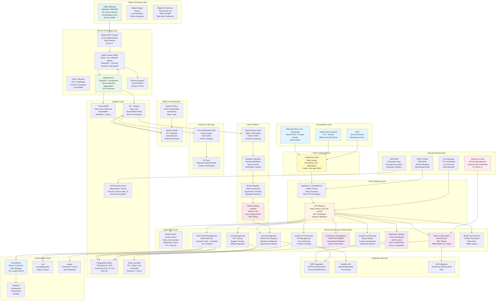
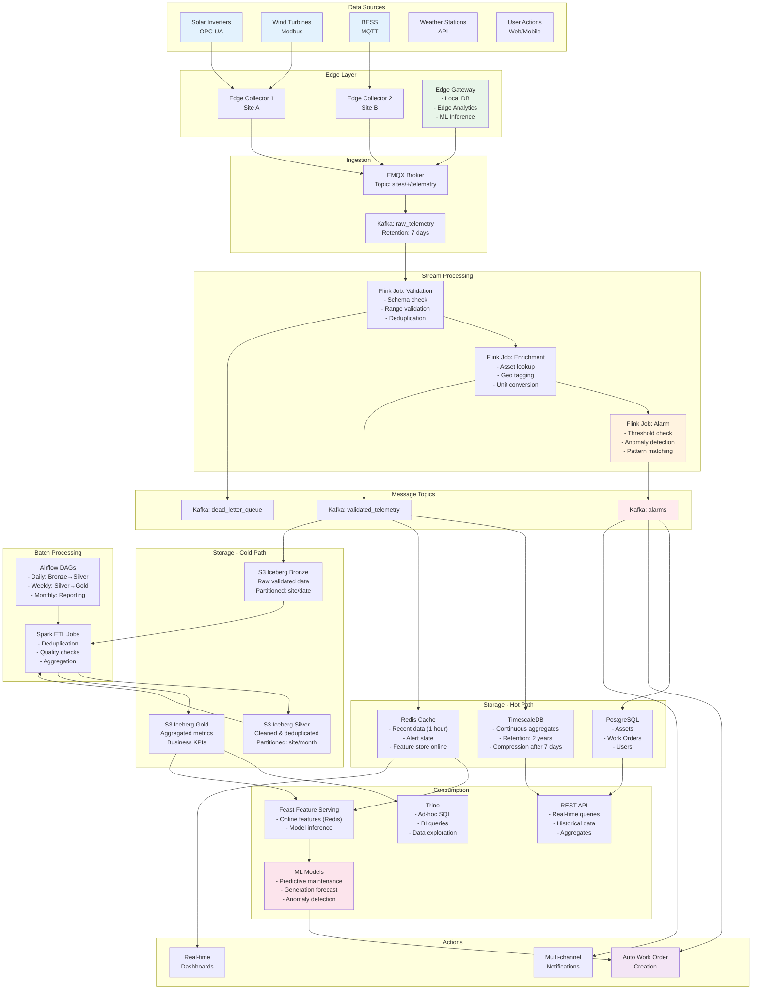
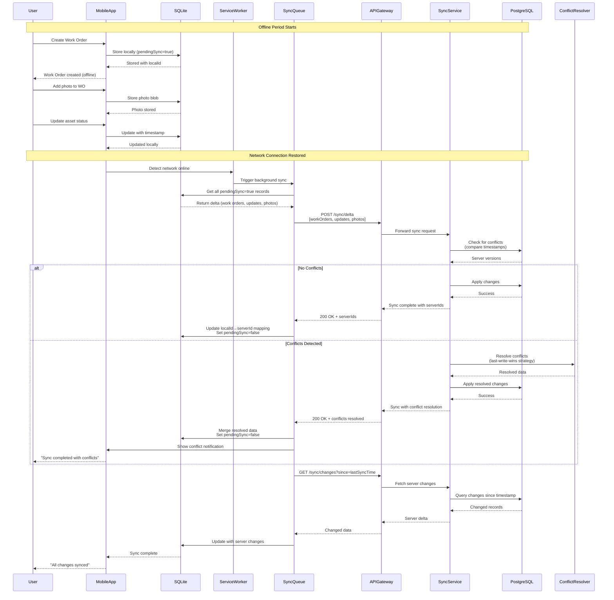
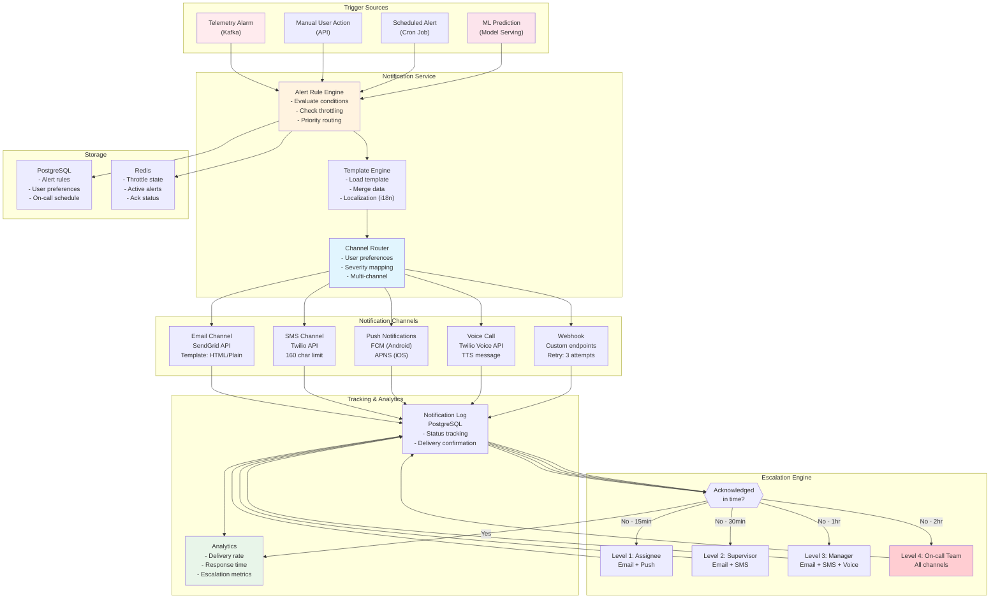

# dCMMS Architecture Diagrams v2.0

This document contains comprehensive architecture diagrams that represent the complete dCMMS system based on all 24 detailed specifications.

## Diagram 1: Complete System Architecture (High-Level)

```mermaid
graph TB
    subgraph "User Layer"
        WebApp["Web Application<br/>(React + TypeScript)"]
        MobileApp["Mobile Apps<br/>(React Native + SQLite)"]
        PWA["Progressive Web App"]
    end

    subgraph "CDN & Edge Delivery"
        CloudFront["CloudFront CDN<br/>- Static assets<br/>- Translations<br/>- Documents"]
    end

    subgraph "API Gateway Layer"
        ALB["Application Load Balancer<br/>- Health checks<br/>- Sticky sessions"]
        APIGateway["API Gateway<br/>- Rate limiting<br/>- Request validation<br/>- JWT verification"]
    end

    subgraph "Caching Layer"
        RedisCacheApp["Redis Cache<br/>- Application data<br/>- Sessions<br/>- Rate limits"]
        RedisCacheML["Redis Online Store<br/>- Feature store<br/>- Real-time features"]
    end

    subgraph "Application Services (Kubernetes)"
        AuthService["Auth Service<br/>(OAuth2/OIDC)"]
        WorkOrderService["Work Order Service<br/>- State machines<br/>- Lifecycle mgmt"]
        AssetService["Asset Service<br/>- Hierarchy<br/>- Telemetry linking"]
        NotificationService["Notification Service<br/>- Email, SMS, Push<br/>- Escalation"]
        ComplianceService["Compliance Service<br/>- NERC/CEA/MNRE<br/>- Auto reporting"]
        AnalyticsService["Analytics Service<br/>- Report builder<br/>- Dashboards"]
        VendorService["Vendor/Procurement<br/>- PO management<br/>- Contract tracking"]
        CostService["Cost Management<br/>- WO costing<br/>- Budget tracking"]
        I18nService["i18n Service<br/>- Translation mgmt<br/>- Locale handling"]
        SyncService["Mobile Sync Service<br/>- Conflict resolution<br/>- Delta sync"]
    end

    subgraph "Integration Layer"
        ERPIntegration["ERP Integration<br/>(SAP/Oracle/Dynamics)"]
        WeatherAPI["Weather API<br/>(OpenWeatherMap)"]
        IdPIntegration["IdP Integration<br/>(Okta/Azure AD)"]
        EmailProvider["Email Service<br/>(SendGrid)"]
        SMSProvider["SMS Service<br/>(Twilio)"]
        PushProvider["Push Notifications<br/>(FCM/APNS)"]
    end

    subgraph "Data Pipeline"
        EdgeCollectors["Edge Collectors<br/>- OPC-UA/Modbus<br/>- Local buffer"]
        MQTT["EMQX MQTT Broker<br/>- mTLS<br/>- Topic routing"]
        Kafka["Kafka Cluster (MSK)<br/>- Raw topics<br/>- Validated topics<br/>- Alarm topics"]
        Flink["Apache Flink<br/>- Stream validation<br/>- Enrichment<br/>- Alerting"]
        SchemaRegistry["Schema Registry<br/>(Avro/Protobuf)"]
    end

    subgraph "Storage Layer"
        PostgreSQL["PostgreSQL<br/>- Transactional data<br/>- OLTP operations"]
        TimescaleDB["TimescaleDB<br/>- Time-series data<br/>- Telemetry"]
        S3Iceberg["S3 + Iceberg<br/>- Bronze/Silver/Gold<br/>- ACID semantics"]
        S3Documents["S3 Documents<br/>- Attachments<br/>- Photos<br/>- Reports"]
        AuditLogs["Audit Log Storage<br/>- Immutable logs<br/>- 7-year retention"]
    end

    subgraph "Batch Processing"
        Spark["Apache Spark<br/>- ETL<br/>- Deduplication<br/>- Heavy transforms"]
        Airflow["Apache Airflow<br/>- Job orchestration<br/>- Scheduling"]
    end

    subgraph "Analytics & BI"
        Trino["Trino<br/>(SQL Query Engine)"]
        BITools["BI Tools<br/>- Custom dashboards<br/>- Reports"]
    end

    subgraph "ML/AI Platform"
        FeastOffline["Feast Offline Store<br/>(S3/Iceberg)"]
        FeastMaterialize["Feature<br/>Materialization"]
        MLflow["MLflow Registry<br/>- Model versioning<br/>- Experiments"]
        Kubeflow["Kubeflow Pipelines<br/>- Training workflows<br/>- Hyperparameter tuning"]
        KServe["KServe/Seldon<br/>- Model serving<br/>- Auto-scaling"]
    end

    subgraph "Edge Computing"
        EdgeGateway["Edge Gateway<br/>- K3s<br/>- Local analytics<br/>- 24h buffer"]
        EdgeDB["SQLite Edge DB<br/>- Local storage<br/>- Offline ops"]
        EdgeML["Edge ML Inference<br/>(TensorFlow Lite)"]
    end

    subgraph "Security & Compliance"
        Vault["HashiCorp Vault<br/>- Secrets mgmt<br/>- Dynamic secrets"]
        KMS["AWS KMS<br/>- Encryption keys<br/>- Key rotation"]
        CertManager["Cert Manager<br/>- TLS certificates<br/>- Auto renewal"]
    end

    subgraph "Observability"
        Prometheus["Prometheus<br/>- Metrics collection<br/>- Alerting"]
        Grafana["Grafana<br/>- Dashboards<br/>- Visualization"]
        Loki["Loki<br/>- Log aggregation"]
        Jaeger["Jaeger<br/>- Distributed tracing"]
    end

    %% User to CDN/Gateway
    WebApp --> CloudFront
    MobileApp --> CloudFront
    PWA --> CloudFront
    CloudFront --> ALB
    ALB --> APIGateway

    %% API Gateway to Services
    APIGateway --> RedisCacheApp
    APIGateway --> AuthService
    APIGateway --> WorkOrderService
    APIGateway --> AssetService
    APIGateway --> NotificationService
    APIGateway --> ComplianceService
    APIGateway --> AnalyticsService
    APIGateway --> VendorService
    APIGateway --> CostService
    APIGateway --> I18nService
    APIGateway --> SyncService

    %% Services to Integrations
    NotificationService --> EmailProvider
    NotificationService --> SMSProvider
    NotificationService --> PushProvider
    VendorService --> ERPIntegration
    AssetService --> WeatherAPI
    AuthService --> IdPIntegration

    %% Services to Storage
    WorkOrderService --> PostgreSQL
    AssetService --> PostgreSQL
    VendorService --> PostgreSQL
    CostService --> PostgreSQL
    AuthService --> AuditLogs
    WorkOrderService --> S3Documents

    %% Edge to Cloud
    EdgeGateway --> MQTT
    EdgeDB --> EdgeGateway
    EdgeML --> EdgeGateway

    %% Data Pipeline Flow
    MQTT --> Kafka
    Kafka --> SchemaRegistry
    Kafka --> Flink
    Flink --> Kafka
    Flink --> TimescaleDB
    Flink --> S3Iceberg

    %% Batch Processing
    S3Iceberg --> Spark
    Spark --> S3Iceberg
    Airflow --> Spark

    %% Analytics
    S3Iceberg --> Trino
    Trino --> BITools
    PostgreSQL --> AnalyticsService

    %% ML Pipeline
    S3Iceberg --> FeastOffline
    FeastOffline --> FeastMaterialize
    FeastMaterialize --> RedisCacheML
    RedisCacheML --> KServe
    Kubeflow --> MLflow
    MLflow --> KServe
    KServe --> AssetService

    %% Security
    Vault --> AuthService
    KMS --> S3Documents
    CertManager --> APIGateway

    %% Observability
    APIGateway --> Prometheus
    WorkOrderService --> Prometheus
    Prometheus --> Grafana
    APIGateway --> Loki
    APIGateway --> Jaeger

    style WebApp fill:#e1f5ff
    style MobileApp fill:#e1f5ff
    style PWA fill:#e1f5ff
    style APIGateway fill:#fff4e1
    style AuthService fill:#f0f4ff
    style NotificationService fill:#f0f4ff
    style EdgeGateway fill:#e8f5e9
```

## Diagram 2: Layered Architecture with Technology Stack

## Diagram 3: Data Flow Architecture

## Diagram 4: Mobile Offline Sync Architecture

## Diagram 5: Notification & Alerting Flow

---

## Key Improvements in V2 Diagrams

### Compared to Original Diagrams (Arch1.png & Arch2.png):

**Added Components:**
1. ✅ Complete frontend layer (Web, Mobile, PWA)
2. ✅ CDN and edge delivery infrastructure
3. ✅ API Gateway with rate limiting
4. ✅ Application caching layer (Redis)
5. ✅ All business microservices (10+ services)
6. ✅ Integration layer with external providers
7. ✅ Mobile offline sync architecture with conflict resolution
8. ✅ Notification system with multi-channel delivery and escalation
9. ✅ Security infrastructure (Vault, KMS, Cert Manager)
10. ✅ Internationalization service
11. ✅ Cost management service
12. ✅ Vendor/procurement service
13. ✅ Compliance service details
14. ✅ Document storage and lifecycle
15. ✅ Audit log infrastructure

**Better Representation:**
- Edge computing with K3s and local analytics
- Complete ML pipeline (Feast → Kubeflow → MLflow → KServe)
- Observability stack (Prometheus, Grafana, Loki, Jaeger)
- Data flow from edge to consumption with all intermediate steps
- Mobile offline-first architecture with sync service
- Multi-layer caching strategy (Browser → CDN → Redis → DB)

**Specification Coverage:**
- Diagram 1: Complete system (covers all 24 specs)
- Diagram 2: Technology stack details (specs 01, 03, 04, 10, 17, 18, 22, 24)
- Diagram 3: Data flow (specs 10, 21, 22)
- Diagram 4: Mobile sync (spec 04)
- Diagram 5: Notifications (spec 14)

---

**Version**: 2.0
**Last Updated**: November 11, 2025
**Based on**: 24 detailed technical specifications
**Specification Coverage**: 100%
