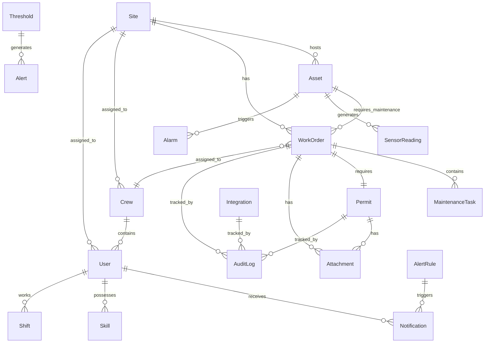

# Complete Data Models & Schema Specifications

**Version:** 1.0
**Date:** November 10, 2025
**Status:** Draft - For Review
**Priority:** P0 (Critical for MVP)

---

## Table of Contents

1. [Executive Summary](#1-executive-summary)
2. [Schema Design Principles](#2-schema-design-principles)
3. [Core Entity Schemas](#3-core-entity-schemas)
4. [Operational Entity Schemas](#4-operational-entity-schemas)
5. [Reference Data Schemas](#5-reference-data-schemas)
6. [Relationship Specifications](#6-relationship-specifications)
7. [Validation Rules](#7-validation-rules)
8. [Schema Evolution Strategy](#8-schema-evolution-strategy)

---

## 1. Executive Summary

This document provides complete JSON schemas for all entities in the dCMMS system that were identified as missing or incomplete in the gap analysis. These schemas complement the existing schemas in the `/metadata/` directory and provide comprehensive data model coverage for MVP and Release 1.

### Existing Schemas (Already Defined)
- `asset.schema.json`
- `workorder.schema.json` (enhanced with 40+ fields)
- `site.schema.json`
- `user.schema.json`
- `sensorreading.schema.json`
- `inventoryitem.schema.json`
- `maintenancetask.schema.json`
- `maintenanceschedule.schema.json`
- `contractwarranty.schema.json`
- `costrecord.schema.json`
- `compliancecertificate.schema.json`
- `calibrationrecord.schema.json`
- `riskassessment.schema.json`
- `document.schema.json`
- `eventalarm.schema.json`

### New Schemas (This Document)
- `crew.schema.json` - Team/crew management
- `permit.schema.json` - Work permits and safety clearances
- `notification.schema.json` - Multi-channel notifications
- `attachment.schema.json` - File attachments with metadata
- `auditlog.schema.json` - Comprehensive audit trail
- `alertrule.schema.json` - Configurable alerting rules
- `threshold.schema.json` - Metric thresholds
- `shift.schema.json` - Shift schedules and rotations
- `skill.schema.json` - Skills and competencies
- `integration.schema.json` - External system configurations

---

## 2. Schema Design Principles

### 2.1 Naming Conventions
- **Fields**: camelCase (e.g., `firstName`, `scheduledStart`)
- **Types**: PascalCase (e.g., `WorkOrder`, `SensorReading`)
- **Enums**: UPPER_SNAKE_CASE (e.g., `HIGH`, `IN_PROGRESS`)
- **Foreign Keys**: `{entity}Id` (e.g., `siteId`, `workOrderId`)

### 2.2 Common Fields Pattern
All entities include these standard fields:
```json
{
  "createdAt": "ISO 8601 timestamp",
  "createdBy": "userId",
  "updatedAt": "ISO 8601 timestamp",
  "updatedBy": "userId",
  "version": "integer for optimistic locking"
}
```

### 2.3 Soft Delete Pattern
Entities that should never be permanently deleted include:
```json
{
  "deleted": "boolean, default false",
  "deletedAt": "ISO 8601 timestamp or null",
  "deletedBy": "userId or null"
}
```

### 2.4 Multi-Tenancy Pattern
All entities include tenant isolation:
```json
{
  "tenantId": "string, organization identifier"
}
```

---

## 3. Core Entity Schemas

### 3.1 Crew / Team Schema

**File:** `metadata/crew.schema.json`

```json
{
  "$schema": "http://json-schema.org/draft-07/schema#",
  "$id": "https://dcmms.io/schemas/crew.schema.json",
  "title": "Crew",
  "description": "A team or crew of workers assigned to work orders",
  "type": "object",
  "required": ["crewId", "name", "siteId", "status", "members"],
  "properties": {
    "crewId": {
      "type": "string",
      "description": "Unique crew identifier",
      "pattern": "^CREW-[A-Z0-9-]+$",
      "examples": ["CREW-ALPHA-001", "CREW-MAINT-TEAM-01"]
    },
    "tenantId": {
      "type": "string",
      "description": "Organization/tenant identifier"
    },
    "name": {
      "type": "string",
      "description": "Crew name",
      "minLength": 2,
      "maxLength": 100,
      "examples": ["Electrical Crew A", "Maintenance Team 1", "Emergency Response Team"]
    },
    "description": {
      "type": ["string", "null"],
      "description": "Crew description and purpose",
      "maxLength": 500
    },
    "siteId": {
      "type": "string",
      "description": "Primary site assignment"
    },
    "additionalSiteIds": {
      "type": "array",
      "description": "Additional sites this crew can work at",
      "items": {
        "type": "string"
      },
      "default": []
    },
    "type": {
      "type": "string",
      "description": "Crew type",
      "enum": ["maintenance", "electrical", "mechanical", "emergency", "contractor", "inspection", "cleaning"],
      "default": "maintenance"
    },
    "status": {
      "type": "string",
      "description": "Current crew status",
      "enum": ["active", "on_duty", "off_duty", "on_call", "dispatched", "inactive"],
      "default": "active"
    },
    "supervisor": {
      "type": "object",
      "description": "Crew supervisor/lead",
      "required": ["userId"],
      "properties": {
        "userId": {
          "type": "string",
          "description": "Supervisor user ID"
        },
        "name": {
          "type": "string",
          "description": "Supervisor name"
        },
        "phone": {
          "type": "string",
          "description": "Contact phone number"
        }
      }
    },
    "members": {
      "type": "array",
      "description": "Crew members",
      "minItems": 1,
      "items": {
        "type": "object",
        "required": ["userId", "role"],
        "properties": {
          "userId": {
            "type": "string",
            "description": "Member user ID"
          },
          "name": {
            "type": "string",
            "description": "Member name"
          },
          "role": {
            "type": "string",
            "description": "Role in crew",
            "enum": ["lead", "technician", "apprentice", "specialist", "support"],
            "default": "technician"
          },
          "skills": {
            "type": "array",
            "description": "Member skills",
            "items": {
              "type": "string"
            },
            "examples": [["electrical-hv", "loto-certified", "crane-operator"]]
          },
          "status": {
            "type": "string",
            "description": "Member current status",
            "enum": ["available", "assigned", "on_break", "off_duty", "leave"],
            "default": "available"
          },
          "joinedAt": {
            "type": "string",
            "format": "date-time",
            "description": "When member joined this crew"
          }
        }
      }
    },
    "skills": {
      "type": "array",
      "description": "Combined crew skills (aggregated from members)",
      "items": {
        "type": "string"
      },
      "examples": [["electrical-hv", "mechanical", "welding", "confined-space"]]
    },
    "capacity": {
      "type": "object",
      "description": "Crew capacity and utilization",
      "properties": {
        "maxMembers": {
          "type": "integer",
          "description": "Maximum crew size",
          "minimum": 1,
          "default": 10
        },
        "currentMembers": {
          "type": "integer",
          "description": "Current number of members",
          "minimum": 0
        },
        "utilization": {
          "type": "number",
          "description": "Current utilization percentage (0-100)",
          "minimum": 0,
          "maximum": 100
        }
      }
    },
    "equipment": {
      "type": "array",
      "description": "Equipment assigned to crew",
      "items": {
        "type": "object",
        "properties": {
          "equipmentId": {
            "type": "string"
          },
          "name": {
            "type": "string"
          },
          "type": {
            "type": "string",
            "examples": ["vehicle", "tools", "safety-gear", "testing-equipment"]
          }
        }
      },
      "default": []
    },
    "schedule": {
      "type": "object",
      "description": "Crew shift schedule",
      "properties": {
        "shiftPattern": {
          "type": "string",
          "description": "Shift pattern code",
          "examples": ["5x8", "4x10", "7x12", "on-call"]
        },
        "startTime": {
          "type": "string",
          "format": "time",
          "description": "Shift start time (HH:MM)",
          "examples": ["08:00", "06:00"]
        },
        "endTime": {
          "type": "string",
          "format": "time",
          "description": "Shift end time (HH:MM)",
          "examples": ["16:00", "18:00"]
        },
        "daysOfWeek": {
          "type": "array",
          "description": "Working days",
          "items": {
            "type": "integer",
            "minimum": 0,
            "maximum": 6
          },
          "examples": [[1, 2, 3, 4, 5]]
        }
      }
    },
    "location": {
      "type": "object",
      "description": "Current crew location",
      "properties": {
        "lat": {
          "type": "number",
          "minimum": -90,
          "maximum": 90
        },
        "lon": {
          "type": "number",
          "minimum": -180,
          "maximum": 180
        },
        "lastUpdated": {
          "type": "string",
          "format": "date-time"
        },
        "accuracy": {
          "type": "number",
          "description": "Location accuracy in meters"
        }
      }
    },
    "contact": {
      "type": "object",
      "description": "Crew contact information",
      "properties": {
        "phone": {
          "type": "string"
        },
        "email": {
          "type": "string",
          "format": "email"
        },
        "radio": {
          "type": "string",
          "description": "Radio channel or frequency"
        }
      }
    },
    "activeWorkOrders": {
      "type": "array",
      "description": "Currently assigned work orders",
      "items": {
        "type": "string"
      },
      "default": []
    },
    "metrics": {
      "type": "object",
      "description": "Crew performance metrics",
      "properties": {
        "workOrdersCompleted": {
          "type": "integer",
          "minimum": 0,
          "default": 0
        },
        "averageCompletionTimeHours": {
          "type": "number",
          "minimum": 0
        },
        "safetyIncidents": {
          "type": "integer",
          "minimum": 0,
          "default": 0
        },
        "lastIncidentDate": {
          "type": ["string", "null"],
          "format": "date"
        }
      }
    },
    "tags": {
      "type": "array",
      "description": "Crew tags for categorization",
      "items": {
        "type": "string"
      },
      "examples": [["24x7", "emergency", "specialized"]]
    },
    "customFields": {
      "type": "object",
      "description": "Custom fields for extensibility",
      "additionalProperties": true
    },
    "createdAt": {
      "type": "string",
      "format": "date-time"
    },
    "createdBy": {
      "type": "string"
    },
    "updatedAt": {
      "type": "string",
      "format": "date-time"
    },
    "updatedBy": {
      "type": "string"
    },
    "version": {
      "type": "integer",
      "minimum": 1,
      "default": 1
    },
    "deleted": {
      "type": "boolean",
      "default": false
    },
    "deletedAt": {
      "type": ["string", "null"],
      "format": "date-time"
    },
    "deletedBy": {
      "type": ["string", "null"]
    }
  }
}
```

### 3.2 Permit Schema

**File:** `metadata/permit.schema.json`

```json
{
  "$schema": "http://json-schema.org/draft-07/schema#",
  "$id": "https://dcmms.io/schemas/permit.schema.json",
  "title": "Permit",
  "description": "Work permit for safety-critical operations",
  "type": "object",
  "required": ["permitId", "type", "workOrderId", "siteId", "status", "validFrom", "validUntil"],
  "properties": {
    "permitId": {
      "type": "string",
      "description": "Unique permit identifier",
      "pattern": "^PERMIT-[A-Z0-9-]+$",
      "examples": ["PERMIT-LOTO-001", "PERMIT-HOT-WORK-042"]
    },
    "tenantId": {
      "type": "string"
    },
    "type": {
      "type": "string",
      "description": "Permit type",
      "enum": [
        "hot_work",
        "confined_space",
        "electrical_loto",
        "mechanical_loto",
        "working_at_height",
        "excavation",
        "crane_operation",
        "high_voltage",
        "arc_flash",
        "chemical_handling",
        "radiation_work",
        "cold_work",
        "general_work"
      ]
    },
    "workOrderId": {
      "type": "string",
      "description": "Associated work order"
    },
    "siteId": {
      "type": "string",
      "description": "Site where work is performed"
    },
    "assetId": {
      "type": ["string", "null"],
      "description": "Specific asset (if applicable)"
    },
    "status": {
      "type": "string",
      "description": "Current permit status",
      "enum": ["draft", "pending_approval", "approved", "active", "suspended", "closed", "cancelled", "expired"],
      "default": "draft"
    },
    "priority": {
      "type": "string",
      "enum": ["routine", "urgent", "emergency"],
      "default": "routine"
    },
    "title": {
      "type": "string",
      "description": "Permit title/description",
      "maxLength": 200,
      "examples": ["LOTO for Inverter 3A Maintenance", "Hot Work - Welding Repair on Tracker Frame"]
    },
    "description": {
      "type": "string",
      "description": "Detailed work description",
      "maxLength": 2000
    },
    "location": {
      "type": "object",
      "description": "Work location details",
      "properties": {
        "area": {
          "type": "string",
          "description": "Specific area or zone",
          "examples": ["Inverter Room 3", "Substation Yard", "Turbine Tower 15"]
        },
        "coordinates": {
          "type": "object",
          "properties": {
            "lat": {"type": "number"},
            "lon": {"type": "number"}
          }
        },
        "accessRequirements": {
          "type": "array",
          "items": {"type": "string"},
          "examples": [["key-card", "escort-required", "special-vehicle"]]
        }
      }
    },
    "validFrom": {
      "type": "string",
      "format": "date-time",
      "description": "Permit valid from datetime"
    },
    "validUntil": {
      "type": "string",
      "format": "date-time",
      "description": "Permit valid until datetime"
    },
    "duration": {
      "type": "object",
      "description": "Estimated work duration",
      "properties": {
        "hours": {"type": "integer", "minimum": 0},
        "minutes": {"type": "integer", "minimum": 0, "maximum": 59}
      }
    },
    "requestedBy": {
      "type": "object",
      "required": ["userId"],
      "properties": {
        "userId": {"type": "string"},
        "name": {"type": "string"},
        "role": {"type": "string"},
        "phone": {"type": "string"},
        "requestedAt": {"type": "string", "format": "date-time"}
      }
    },
    "authorizedBy": {
      "type": "array",
      "description": "Approvers and authorizers",
      "items": {
        "type": "object",
        "required": ["userId", "role", "decision"],
        "properties": {
          "userId": {"type": "string"},
          "name": {"type": "string"},
          "role": {
            "type": "string",
            "enum": ["site_manager", "safety_officer", "operations_manager", "electrical_supervisor", "contractor_supervisor"]
          },
          "decision": {
            "type": "string",
            "enum": ["pending", "approved", "rejected", "approved_with_conditions"]
          },
          "comments": {"type": "string"},
          "signature": {"type": "string", "description": "Base64 encoded signature"},
          "decidedAt": {"type": "string", "format": "date-time"}
        }
      }
    },
    "requiredApprovals": {
      "type": "array",
      "description": "List of required approval roles",
      "items": {"type": "string"},
      "examples": [["site_manager", "safety_officer"]]
    },
    "approvalStatus": {
      "type": "object",
      "properties": {
        "required": {"type": "integer", "description": "Number of required approvals"},
        "received": {"type": "integer", "description": "Number of approvals received"},
        "pending": {"type": "integer", "description": "Number still pending"}
      }
    },
    "workersAuthorized": {
      "type": "array",
      "description": "Workers authorized under this permit",
      "items": {
        "type": "object",
        "properties": {
          "userId": {"type": "string"},
          "name": {"type": "string"},
          "role": {"type": "string"},
          "certifications": {
            "type": "array",
            "items": {"type": "string"}
          },
          "briefedAt": {"type": "string", "format": "date-time"},
          "briefedBy": {"type": "string"}
        }
      }
    },
    "hazards": {
      "type": "array",
      "description": "Identified hazards",
      "items": {
        "type": "object",
        "properties": {
          "hazardType": {
            "type": "string",
            "enum": ["electrical", "mechanical", "chemical", "thermal", "fall", "confined_space", "radiation", "ergonomic", "environmental"]
          },
          "description": {"type": "string"},
          "severity": {
            "type": "string",
            "enum": ["low", "medium", "high", "critical"]
          },
          "mitigation": {"type": "string", "description": "Mitigation measures"}
        }
      }
    },
    "safetyRequirements": {
      "type": "object",
      "properties": {
        "ppe": {
          "type": "array",
          "description": "Required personal protective equipment",
          "items": {"type": "string"},
          "examples": [["arc-flash-suit", "insulated-gloves", "face-shield", "hard-hat"]]
        },
        "tools": {
          "type": "array",
          "description": "Required safety tools",
          "items": {"type": "string"},
          "examples": [["lockout-tags", "voltage-tester", "gas-monitor"]]
        },
        "procedures": {
          "type": "array",
          "description": "Required safety procedures",
          "items": {"type": "string"},
          "examples": [["LOTO-PROC-001", "CONFINED-SPACE-ENTRY"]]
        },
        "training": {
          "type": "array",
          "description": "Required training/certifications",
          "items": {"type": "string"},
          "examples": [["LOTO-certified", "confined-space-rescue", "arc-flash-awareness"]]
        }
      }
    },
    "isolations": {
      "type": "array",
      "description": "Energy isolation points (LOTO)",
      "items": {
        "type": "object",
        "properties": {
          "isolationId": {"type": "string"},
          "type": {
            "type": "string",
            "enum": ["electrical", "mechanical", "hydraulic", "pneumatic", "thermal", "chemical", "gravitational"]
          },
          "equipmentId": {"type": "string"},
          "lockoutPoint": {"type": "string", "description": "Physical lockout location"},
          "lockedBy": {"type": "string"},
          "lockNumber": {"type": "string"},
          "lockedAt": {"type": "string", "format": "date-time"},
          "verified": {"type": "boolean"},
          "verifiedBy": {"type": "string"},
          "verifiedAt": {"type": "string", "format": "date-time"}
        }
      }
    },
    "emergencyContacts": {
      "type": "array",
      "description": "Emergency contacts during work",
      "items": {
        "type": "object",
        "properties": {
          "name": {"type": "string"},
          "role": {"type": "string"},
          "phone": {"type": "string"},
          "location": {"type": "string"}
        }
      }
    },
    "preWorkChecklist": {
      "type": "array",
      "description": "Pre-work safety checklist",
      "items": {
        "type": "object",
        "required": ["item", "checked"],
        "properties": {
          "item": {"type": "string"},
          "checked": {"type": "boolean"},
          "checkedBy": {"type": "string"},
          "checkedAt": {"type": "string", "format": "date-time"},
          "comments": {"type": "string"}
        }
      }
    },
    "postWorkChecklist": {
      "type": "array",
      "description": "Post-work checklist (restore operations)",
      "items": {
        "type": "object",
        "required": ["item", "checked"],
        "properties": {
          "item": {"type": "string"},
          "checked": {"type": "boolean"},
          "checkedBy": {"type": "string"},
          "checkedAt": {"type": "string", "format": "date-time"},
          "comments": {"type": "string"}
        }
      }
    },
    "extensions": {
      "type": "array",
      "description": "Permit time extensions",
      "items": {
        "type": "object",
        "properties": {
          "requestedBy": {"type": "string"},
          "requestedAt": {"type": "string", "format": "date-time"},
          "extendedUntil": {"type": "string", "format": "date-time"},
          "reason": {"type": "string"},
          "approvedBy": {"type": "string"},
          "approvedAt": {"type": "string", "format": "date-time"}
        }
      }
    },
    "suspensions": {
      "type": "array",
      "description": "Permit suspension events",
      "items": {
        "type": "object",
        "properties": {
          "suspendedBy": {"type": "string"},
          "suspendedAt": {"type": "string", "format": "date-time"},
          "reason": {"type": "string"},
          "resumedAt": {"type": ["string", "null"], "format": "date-time"}
        }
      }
    },
    "closure": {
      "type": "object",
      "description": "Permit closure information",
      "properties": {
        "closedBy": {"type": "string"},
        "closedAt": {"type": "string", "format": "date-time"},
        "workCompleted": {"type": "boolean"},
        "isolationsRemoved": {"type": "boolean"},
        "areaRestored": {"type": "boolean"},
        "incidentsReported": {"type": "boolean"},
        "incidentDetails": {"type": "string"},
        "lessonsLearned": {"type": "string"},
        "signature": {"type": "string"}
      }
    },
    "attachments": {
      "type": "array",
      "description": "Permit attachments (diagrams, procedures, photos)",
      "items": {
        "type": "string",
        "description": "Attachment IDs"
      }
    },
    "audit": {
      "type": "object",
      "description": "Audit information",
      "properties": {
        "audited": {"type": "boolean"},
        "auditedBy": {"type": "string"},
        "auditedAt": {"type": "string", "format": "date-time"},
        "findings": {"type": "string"},
        "compliant": {"type": "boolean"}
      }
    },
    "tags": {
      "type": "array",
      "items": {"type": "string"},
      "examples": [["high-risk", "multi-day", "contractor-work"]]
    },
    "customFields": {
      "type": "object",
      "additionalProperties": true
    },
    "createdAt": {"type": "string", "format": "date-time"},
    "createdBy": {"type": "string"},
    "updatedAt": {"type": "string", "format": "date-time"},
    "updatedBy": {"type": "string"},
    "version": {"type": "integer", "minimum": 1, "default": 1}
  }
}
```

### 3.3 Notification Schema

**File:** `metadata/notification.schema.json`

```json
{
  "$schema": "http://json-schema.org/draft-07/schema#",
  "$id": "https://dcmms.io/schemas/notification.schema.json",
  "title": "Notification",
  "description": "Multi-channel notification message",
  "type": "object",
  "required": ["notificationId", "type", "priority", "recipientId", "channel", "subject"],
  "properties": {
    "notificationId": {
      "type": "string",
      "description": "Unique notification identifier",
      "format": "uuid"
    },
    "tenantId": {
      "type": "string"
    },
    "type": {
      "type": "string",
      "description": "Notification type/category",
      "enum": [
        "work_order_assigned",
        "work_order_due",
        "work_order_overdue",
        "work_order_completed",
        "alarm_critical",
        "alarm_warning",
        "permit_expiring",
        "permit_requires_approval",
        "inventory_low_stock",
        "inventory_stockout",
        "maintenance_scheduled",
        "certificate_expiring",
        "user_mention",
        "system_announcement",
        "password_reset",
        "account_security",
        "report_ready",
        "custom"
      ]
    },
    "priority": {
      "type": "string",
      "enum": ["low", "normal", "high", "urgent", "critical"],
      "default": "normal"
    },
    "severity": {
      "type": "string",
      "description": "For alarms/incidents",
      "enum": ["info", "warning", "error", "critical"]
    },
    "recipientId": {
      "type": "string",
      "description": "Recipient user ID"
    },
    "recipientEmail": {
      "type": ["string", "null"],
      "format": "email"
    },
    "recipientPhone": {
      "type": ["string", "null"]
    },
    "recipientRole": {
      "type": ["string", "null"],
      "description": "Recipient role (for escalations)"
    },
    "channel": {
      "type": "string",
      "description": "Notification channel",
      "enum": ["email", "sms", "push", "in_app", "webhook", "voice_call"],
      "default": "in_app"
    },
    "subject": {
      "type": "string",
      "description": "Notification subject/title",
      "minLength": 1,
      "maxLength": 200,
      "examples": ["Work Order WO-001 Assigned to You", "Critical Alarm: Inverter 3A Temperature High"]
    },
    "body": {
      "type": "string",
      "description": "Notification body/message",
      "maxLength": 5000
    },
    "bodyHtml": {
      "type": ["string", "null"],
      "description": "HTML formatted body (for email)"
    },
    "actionUrl": {
      "type": ["string", "null"],
      "description": "URL to navigate to when notification clicked",
      "format": "uri",
      "examples": ["/work-orders/WO-001", "/alarms/ALM-1234"]
    },
    "actionLabel": {
      "type": ["string", "null"],
      "description": "Action button label",
      "examples": ["View Work Order", "Acknowledge Alarm", "Approve Permit"]
    },
    "relatedEntity": {
      "type": "object",
      "description": "Related entity information",
      "properties": {
        "entityType": {
          "type": "string",
          "enum": ["work_order", "alarm", "permit", "asset", "inventory_item", "user"]
        },
        "entityId": {"type": "string"}
      }
    },
    "metadata": {
      "type": "object",
      "description": "Additional context",
      "additionalProperties": true,
      "examples": [{
        "workOrderId": "WO-001",
        "siteId": "SITE-ALPHA-001",
        "assetId": "INV-3A",
        "alarmId": "ALM-1234"
      }]
    },
    "status": {
      "type": "string",
      "enum": ["pending", "sent", "delivered", "read", "failed", "cancelled"],
      "default": "pending"
    },
    "scheduledFor": {
      "type": ["string", "null"],
      "format": "date-time",
      "description": "When to send (null = immediate)"
    },
    "sentAt": {
      "type": ["string", "null"],
      "format": "date-time"
    },
    "deliveredAt": {
      "type": ["string", "null"],
      "format": "date-time"
    },
    "readAt": {
      "type": ["string", "null"],
      "format": "date-time"
    },
    "expiresAt": {
      "type": ["string", "null"],
      "format": "date-time",
      "description": "When notification expires and can be auto-dismissed"
    },
    "deliveryAttempts": {
      "type": "integer",
      "minimum": 0,
      "default": 0
    },
    "lastAttemptAt": {
      "type": ["string", "null"],
      "format": "date-time"
    },
    "errorMessage": {
      "type": ["string", "null"],
      "description": "Error message if delivery failed"
    },
    "escalation": {
      "type": "object",
      "description": "Escalation configuration",
      "properties": {
        "enabled": {"type": "boolean", "default": false},
        "escalateAfterMinutes": {"type": "integer", "minimum": 1},
        "escalateTo": {
          "type": "array",
          "description": "Escalation recipients",
          "items": {
            "type": "object",
            "properties": {
              "userId": {"type": "string"},
              "role": {"type": "string"},
              "channel": {"type": "string"}
            }
          }
        },
        "escalated": {"type": "boolean", "default": false},
        "escalatedAt": {"type": ["string", "null"], "format": "date-time"}
      }
    },
    "batchId": {
      "type": ["string", "null"],
      "description": "Batch ID for bulk notifications"
    },
    "templateId": {
      "type": ["string", "null"],
      "description": "Notification template used"
    },
    "templateVariables": {
      "type": "object",
      "description": "Variables used in template",
      "additionalProperties": true
    },
    "providerData": {
      "type": "object",
      "description": "Provider-specific data (Twilio, SendGrid, FCM)",
      "properties": {
        "provider": {"type": "string"},
        "messageId": {"type": "string"},
        "status": {"type": "string"},
        "response": {"type": "object"}
      }
    },
    "groupKey": {
      "type": ["string", "null"],
      "description": "Key for grouping similar notifications"
    },
    "dismissed": {
      "type": "boolean",
      "default": false
    },
    "dismissedAt": {
      "type": ["string", "null"],
      "format": "date-time"
    },
    "createdAt": {"type": "string", "format": "date-time"},
    "createdBy": {"type": "string"}
  }
}
```

---

## 4. Operational Entity Schemas

### 4.1 Attachment Schema

**File:** `metadata/attachment.schema.json`

```json
{
  "$schema": "http://json-schema.org/draft-07/schema#",
  "$id": "https://dcmms.io/schemas/attachment.schema.json",
  "title": "Attachment",
  "description": "File attachment with metadata",
  "type": "object",
  "required": ["attachmentId", "fileName", "mimeType", "fileSize", "entityType", "entityId"],
  "properties": {
    "attachmentId": {
      "type": "string",
      "description": "Unique attachment identifier",
      "format": "uuid"
    },
    "tenantId": {
      "type": "string"
    },
    "fileName": {
      "type": "string",
      "description": "Original file name",
      "maxLength": 255,
      "examples": ["inverter-3a-damage.jpg", "maintenance-report-2025-11.pdf"]
    },
    "fileExtension": {
      "type": "string",
      "description": "File extension",
      "pattern": "^[a-z0-9]+$",
      "examples": ["jpg", "pdf", "png", "mp4", "docx"]
    },
    "mimeType": {
      "type": "string",
      "description": "MIME type",
      "examples": ["image/jpeg", "application/pdf", "video/mp4", "text/plain"]
    },
    "fileSize": {
      "type": "integer",
      "description": "File size in bytes",
      "minimum": 0,
      "maximum": 52428800
    },
    "fileSizeHuman": {
      "type": "string",
      "description": "Human-readable file size",
      "examples": ["2.5 MB", "150 KB", "3.2 GB"]
    },
    "attachmentType": {
      "type": "string",
      "enum": ["photo", "video", "document", "audio", "diagram", "signature", "report", "certificate", "manual", "other"],
      "default": "document"
    },
    "category": {
      "type": ["string", "null"],
      "description": "Attachment category",
      "enum": ["before", "during", "after", "evidence", "reference", "compliance", null],
      "examples": ["before", "evidence"]
    },
    "entityType": {
      "type": "string",
      "description": "Type of entity this is attached to",
      "enum": ["work_order", "asset", "permit", "inventory_item", "user", "site", "contract", "compliance_certificate", "inspection"]
    },
    "entityId": {
      "type": "string",
      "description": "ID of the entity"
    },
    "description": {
      "type": ["string", "null"],
      "description": "Attachment description",
      "maxLength": 500
    },
    "tags": {
      "type": "array",
      "description": "Searchable tags",
      "items": {"type": "string"},
      "examples": [["damage", "thermal", "before-repair"]]
    },
    "storage": {
      "type": "object",
      "description": "Storage information",
      "required": ["provider", "path"],
      "properties": {
        "provider": {
          "type": "string",
          "enum": ["s3", "azure_blob", "gcs", "local"],
          "default": "s3"
        },
        "bucket": {
          "type": "string",
          "description": "Storage bucket/container name"
        },
        "path": {
          "type": "string",
          "description": "Full path to file"
        },
        "region": {
          "type": "string",
          "description": "Storage region"
        },
        "url": {
          "type": "string",
          "description": "Direct URL (if public or pre-signed)"
        },
        "thumbnailUrl": {
          "type": ["string", "null"],
          "description": "Thumbnail URL for images/videos"
        },
        "expiresAt": {
          "type": ["string", "null"],
          "format": "date-time",
          "description": "Expiration for pre-signed URLs"
        }
      }
    },
    "metadata": {
      "type": "object",
      "description": "File-specific metadata",
      "properties": {
        "width": {
          "type": ["integer", "null"],
          "description": "Image/video width in pixels"
        },
        "height": {
          "type": ["integer", "null"],
          "description": "Image/video height in pixels"
        },
        "duration": {
          "type": ["number", "null"],
          "description": "Video/audio duration in seconds"
        },
        "orientation": {
          "type": ["string", "null"],
          "enum": ["portrait", "landscape", "square", null]
        },
        "gps": {
          "type": ["object", "null"],
          "description": "GPS coordinates from EXIF",
          "properties": {
            "lat": {"type": "number"},
            "lon": {"type": "number"},
            "altitude": {"type": "number"}
          }
        },
        "capturedAt": {
          "type": ["string", "null"],
          "format": "date-time",
          "description": "When photo/video was captured (from EXIF)"
        },
        "deviceModel": {
          "type": ["string", "null"],
          "description": "Device used to capture (from EXIF)"
        }
      }
    },
    "capturedBy": {
      "type": ["string", "null"],
      "description": "User ID who captured/uploaded"
    },
    "capturedAt": {
      "type": ["string", "null"],
      "format": "date-time",
      "description": "When captured"
    },
    "location": {
      "type": ["object", "null"],
      "description": "Location where captured",
      "properties": {
        "lat": {"type": "number"},
        "lon": {"type": "number"},
        "accuracy": {"type": "number", "description": "Accuracy in meters"}
      }
    },
    "virusScan": {
      "type": "object",
      "description": "Virus scan results",
      "properties": {
        "scanned": {"type": "boolean", "default": false},
        "clean": {"type": "boolean"},
        "scanner": {"type": "string", "examples": ["clamav", "virustotal"]},
        "scannedAt": {"type": "string", "format": "date-time"},
        "threats": {
          "type": "array",
          "items": {"type": "string"}
        }
      }
    },
    "accessControl": {
      "type": "object",
      "description": "Access control settings",
      "properties": {
        "visibility": {
          "type": "string",
          "enum": ["public", "private", "restricted"],
          "default": "private"
        },
        "allowedRoles": {
          "type": "array",
          "items": {"type": "string"}
        },
        "allowedUsers": {
          "type": "array",
          "items": {"type": "string"}
        }
      }
    },
    "downloadCount": {
      "type": "integer",
      "minimum": 0,
      "default": 0
    },
    "lastDownloadedAt": {
      "type": ["string", "null"],
      "format": "date-time"
    },
    "checksum": {
      "type": "string",
      "description": "File checksum (SHA-256)",
      "pattern": "^[a-f0-9]{64}$"
    },
    "encrypted": {
      "type": "boolean",
      "description": "Whether file is encrypted at rest",
      "default": false
    },
    "createdAt": {"type": "string", "format": "date-time"},
    "createdBy": {"type": "string"},
    "updatedAt": {"type": "string", "format": "date-time"},
    "updatedBy": {"type": "string"},
    "deleted": {"type": "boolean", "default": false},
    "deletedAt": {"type": ["string", "null"], "format": "date-time"},
    "deletedBy": {"type": ["string", "null"]}
  }
}
```

### 4.2 Audit Log Schema

**File:** `metadata/auditlog.schema.json`

```json
{
  "$schema": "http://json-schema.org/draft-07/schema#",
  "$id": "https://dcmms.io/schemas/auditlog.schema.json",
  "title": "AuditLog",
  "description": "Comprehensive audit trail entry",
  "type": "object",
  "required": ["auditId", "timestamp", "action", "entityType", "entityId", "userId"],
  "properties": {
    "auditId": {
      "type": "string",
      "description": "Unique audit entry identifier",
      "format": "uuid"
    },
    "tenantId": {
      "type": "string"
    },
    "timestamp": {
      "type": "string",
      "format": "date-time",
      "description": "When the action occurred"
    },
    "action": {
      "type": "string",
      "description": "Action performed",
      "enum": [
        "create",
        "read",
        "update",
        "delete",
        "restore",
        "login",
        "logout",
        "login_failed",
        "password_change",
        "password_reset",
        "permission_granted",
        "permission_revoked",
        "export",
        "import",
        "approve",
        "reject",
        "assign",
        "unassign",
        "state_transition",
        "execute",
        "cancel",
        "archive",
        "custom"
      ]
    },
    "actionDetails": {
      "type": ["string", "null"],
      "description": "Detailed action description",
      "maxLength": 500,
      "examples": ["Changed work order status from 'scheduled' to 'in-progress'"]
    },
    "entityType": {
      "type": "string",
      "description": "Type of entity affected",
      "enum": [
        "user",
        "site",
        "asset",
        "work_order",
        "permit",
        "inventory_item",
        "crew",
        "notification",
        "alarm",
        "report",
        "contract",
        "certificate",
        "document",
        "setting",
        "role",
        "integration"
      ]
    },
    "entityId": {
      "type": "string",
      "description": "ID of the affected entity"
    },
    "entityName": {
      "type": ["string", "null"],
      "description": "Human-readable entity name"
    },
    "userId": {
      "type": "string",
      "description": "User who performed the action (or 'system' for automated)"
    },
    "userName": {
      "type": ["string", "null"],
      "description": "User's name at time of action"
    },
    "userRole": {
      "type": ["string", "null"],
      "description": "User's role at time of action"
    },
    "actorType": {
      "type": "string",
      "description": "Type of actor",
      "enum": ["user", "system", "api", "cron", "integration"],
      "default": "user"
    },
    "changesBefore": {
      "type": ["object", "null"],
      "description": "Entity state before change (for update/delete)",
      "additionalProperties": true
    },
    "changesAfter": {
      "type": ["object", "null"],
      "description": "Entity state after change (for create/update)",
      "additionalProperties": true
    },
    "changesDiff": {
      "type": ["object", "null"],
      "description": "Computed diff (only changed fields)",
      "additionalProperties": true
    },
    "changedFields": {
      "type": "array",
      "description": "List of field names that changed",
      "items": {"type": "string"},
      "examples": [["status", "assignedTo", "priority"]]
    },
    "reason": {
      "type": ["string", "null"],
      "description": "Reason for action (user-provided)",
      "maxLength": 1000
    },
    "context": {
      "type": "object",
      "description": "Additional context",
      "properties": {
        "siteId": {"type": ["string", "null"]},
        "workOrderId": {"type": ["string", "null"]},
        "relatedEntityType": {"type": ["string", "null"]},
        "relatedEntityId": {"type": ["string", "null"]},
        "sessionId": {"type": ["string", "null"]},
        "correlationId": {"type": ["string", "null"], "description": "For tracing across services"}
      }
    },
    "source": {
      "type": "object",
      "description": "Source of the action",
      "properties": {
        "application": {
          "type": "string",
          "examples": ["web-app", "mobile-app", "api", "background-job"]
        },
        "version": {
          "type": "string",
          "description": "Application version"
        },
        "ipAddress": {
          "type": ["string", "null"],
          "description": "IP address of the client"
        },
        "userAgent": {
          "type": ["string", "null"],
          "description": "User agent string"
        },
        "deviceId": {
          "type": ["string", "null"],
          "description": "Device identifier (for mobile)"
        },
        "location": {
          "type": ["object", "null"],
          "properties": {
            "lat": {"type": "number"},
            "lon": {"type": "number"}
          }
        }
      }
    },
    "result": {
      "type": "string",
      "description": "Result of the action",
      "enum": ["success", "failure", "partial"],
      "default": "success"
    },
    "errorMessage": {
      "type": ["string", "null"],
      "description": "Error message if action failed"
    },
    "errorCode": {
      "type": ["string", "null"],
      "description": "Error code if action failed"
    },
    "severity": {
      "type": "string",
      "description": "Audit event severity",
      "enum": ["info", "warning", "critical"],
      "default": "info"
    },
    "category": {
      "type": "string",
      "description": "Audit category for filtering",
      "enum": [
        "authentication",
        "authorization",
        "data_access",
        "data_modification",
        "configuration_change",
        "security_event",
        "compliance",
        "integration",
        "system_event"
      ]
    },
    "compliance": {
      "type": "object",
      "description": "Compliance-related metadata",
      "properties": {
        "relevant": {"type": "boolean", "description": "Is this relevant for compliance?"},
        "regulations": {
          "type": "array",
          "items": {"type": "string"},
          "examples": [["NERC-CIP", "SOX", "ISO-27001"]]
        },
        "retainUntil": {
          "type": ["string", "null"],
          "format": "date",
          "description": "Minimum retention date for compliance"
        }
      }
    },
    "tags": {
      "type": "array",
      "items": {"type": "string"},
      "examples": [["sensitive", "financial", "safety-critical"]]
    },
    "indexed": {
      "type": "boolean",
      "description": "Whether this entry is indexed for search",
      "default": true
    },
    "ttl": {
      "type": ["integer", "null"],
      "description": "Time-to-live in days (null = permanent)",
      "minimum": 1
    }
  }
}
```

---

## 5. Reference Data Schemas

### 5.1 Alert Rule Schema

**File:** `metadata/alertrule.schema.json`

```json
{
  "$schema": "http://json-schema.org/draft-07/schema#",
  "$id": "https://dcmms.io/schemas/alertrule.schema.json",
  "title": "AlertRule",
  "description": "Configurable alerting rule",
  "type": "object",
  "required": ["ruleId", "name", "enabled", "conditions", "actions"],
  "properties": {
    "ruleId": {
      "type": "string",
      "format": "uuid"
    },
    "tenantId": {"type": "string"},
    "name": {
      "type": "string",
      "minLength": 1,
      "maxLength": 100
    },
    "description": {"type": ["string", "null"]},
    "enabled": {
      "type": "boolean",
      "default": true
    },
    "category": {
      "type": "string",
      "enum": ["asset_health", "work_order", "inventory", "safety", "compliance", "performance", "security"]
    },
    "severity": {
      "type": "string",
      "enum": ["info", "warning", "error", "critical"]
    },
    "scope": {
      "type": "object",
      "properties": {
        "siteIds": {"type": "array", "items": {"type": "string"}},
        "assetTypes": {"type": "array", "items": {"type": "string"}},
        "assetIds": {"type": "array", "items": {"type": "string"}}
      }
    },
    "conditions": {
      "type": "object",
      "required": ["metric", "operator", "threshold"],
      "properties": {
        "metric": {
          "type": "string",
          "description": "Metric to evaluate",
          "examples": ["temperature_c", "active_power_kw", "work_order_age_hours"]
        },
        "operator": {
          "type": "string",
          "enum": [">", ">=", "<", "<=", "==", "!=", "contains", "not_contains", "in", "not_in", "between"]
        },
        "threshold": {
          "description": "Threshold value(s)",
          "oneOf": [
            {"type": "number"},
            {"type": "string"},
            {"type": "array"}
          ]
        },
        "duration": {
          "type": ["integer", "null"],
          "description": "Duration in seconds condition must be true",
          "minimum": 0
        },
        "aggregation": {
          "type": ["string", "null"],
          "enum": ["avg", "min", "max", "sum", "count", "p95", "p99", null]
        },
        "window": {
          "type": ["integer", "null"],
          "description": "Time window in seconds for aggregation",
          "minimum": 1
        }
      }
    },
    "actions": {
      "type": "array",
      "minItems": 1,
      "items": {
        "type": "object",
        "required": ["type"],
        "properties": {
          "type": {
            "type": "string",
            "enum": ["notification", "create_work_order", "webhook", "escalate", "run_script"]
          },
          "config": {
            "type": "object",
            "additionalProperties": true
          }
        }
      }
    },
    "throttle": {
      "type": "object",
      "description": "Alert throttling/de-duplication",
      "properties": {
        "enabled": {"type": "boolean", "default": true},
        "windowSeconds": {
          "type": "integer",
          "description": "Suppress duplicate alerts within window",
          "minimum": 60,
          "default": 300
        }
      }
    },
    "schedule": {
      "type": "object",
      "description": "When rule is active",
      "properties": {
        "timezone": {"type": "string"},
        "activeHours": {
          "type": "object",
          "properties": {
            "start": {"type": "string", "format": "time"},
            "end": {"type": "string", "format": "time"}
          }
        },
        "activeDays": {
          "type": "array",
          "items": {"type": "integer", "minimum": 0, "maximum": 6}
        }
      }
    },
    "triggerCount": {
      "type": "integer",
      "minimum": 0,
      "default": 0
    },
    "lastTriggeredAt": {
      "type": ["string", "null"],
      "format": "date-time"
    },
    "createdAt": {"type": "string", "format": "date-time"},
    "createdBy": {"type": "string"},
    "updatedAt": {"type": "string", "format": "date-time"},
    "updatedBy": {"type": "string"}
  }
}
```

### 5.2 Additional Schemas (Abbreviated)

Due to length constraints, here are the remaining schema specifications in abbreviated form. Full JSON schemas should be created following the same pattern:

**Shift Schema** (`metadata/shift.schema.json`):
- Fields: shiftId, name, startTime, endTime, pattern (5x8, 4x10, etc.), assignedUsers, siteIds
- Used for: Shift scheduling, crew rotations, on-call schedules

**Skill Schema** (`metadata/skill.schema.json`):
- Fields: skillId, name, category, level (basic, intermediate, advanced), certification required, expiryTracking
- Used for: Competency management, work assignment, training tracking

**Integration Schema** (`metadata/integration.schema.json`):
- Fields: integrationId, type (ERP, IdP, SCADA, Weather), provider, config, credentials (encrypted), enabled, status, lastSyncAt
- Used for: External system configuration, API credentials, sync status

---

## 6. Relationship Specifications

### 6.1 Entity Relationship Diagram



### 6.2 Foreign Key Constraints

**Referential Integrity Rules:**

| Child Entity | Parent Entity | Foreign Key | On Delete | On Update |
|-------------|---------------|-------------|-----------|-----------|
| WorkOrder | Site | siteId | RESTRICT | CASCADE |
| WorkOrder | Asset | assetId | SET NULL | CASCADE |
| WorkOrder | User (assigned) | assignedTo | SET NULL | CASCADE |
| WorkOrder | Crew | crewId | SET NULL | CASCADE |
| Permit | WorkOrder | workOrderId | CASCADE | CASCADE |
| Notification | User | recipientId | CASCADE | CASCADE |
| Attachment | * | entityId | CASCADE | CASCADE |
| AuditLog | * | entityId | RESTRICT | CASCADE |
| Crew | Site | siteId | RESTRICT | CASCADE |
| Crew | User (supervisor) | supervisor.userId | SET NULL | CASCADE |

**Notes:**
- RESTRICT = Prevent deletion of parent if children exist
- CASCADE = Delete children when parent is deleted
- SET NULL = Set foreign key to null when parent is deleted

---

## 7. Validation Rules

### 7.1 Cross-Entity Validation

**Business Rules:**

1. **Work Order Assignment**
   - Cannot assign work order to user who lacks required skills
   - Cannot assign work order to inactive user
   - Cannot assign work order to user not assigned to the site
   - Cannot assign work order to crew that is off-duty

2. **Permit Validity**
   - Permit validUntil must be after validFrom
   - Permit cannot be approved if required approvals not met
   - Permit cannot be activated if pre-work checklist incomplete
   - Cannot close permit if isolations not removed

3. **Crew Capacity**
   - Cannot add more members than maxMembers
   - Crew must have at least one active member
   - At least one crew member must have supervisor/lead role

4. **Attachment Limits**
   - Max file size: 50 MB per file
   - Max attachments per work order: 100
   - Allowed file types: images (jpg, png), documents (pdf, docx), videos (mp4, mov)

5. **Notification Delivery**
   - Cannot send notification to deleted user
   - Must have at least one contact method (email or phone) for selected channel
   - Escalation cannot be shorter than 5 minutes

### 7.2 Data Quality Rules

**Completeness:**
- Required fields must not be null
- Enum fields must match allowed values
- Dates must be valid ISO 8601 format

**Consistency:**
- updatedAt >= createdAt
- deletedAt >= createdAt (if deleted = true)
- For time ranges: endTime > startTime

**Accuracy:**
- Phone numbers must match E.164 format
- Email addresses must be valid
- URLs must be valid URIs

---

## 8. Schema Evolution Strategy

### 8.1 Versioning Approach

**Schema Version Format:** `{entity}.schema.v{major}.json`

Example: `workorder.schema.v2.json`

**Compatibility Rules:**
- **Backward compatible** (minor version): Add optional fields, relax validation
- **Breaking change** (major version): Remove fields, change types, make fields required

### 8.2 Migration Path

**Adding New Optional Field:**
```json
{
  "newField": {
    "type": ["string", "null"],
    "default": null,
    "description": "New optional field"
  }
}
```

**Deprecating Field:**
```json
{
  "oldField": {
    "type": "string",
    "deprecated": true,
    "description": "DEPRECATED: Use newField instead"
  }
}
```

**Schema Migration Process:**
1. Update JSON schema file
2. Generate TypeScript/Java types from schema
3. Create database migration script
4. Update API documentation
5. Notify API consumers via changelog
6. Deploy with backward compatibility period (6 months)

---

## 9. Implementation Checklist

### 9.1 P0 (MVP) Schemas - Complete These First

- [x] crew.schema.json
- [x] permit.schema.json
- [x] notification.schema.json
- [x] attachment.schema.json
- [x] auditlog.schema.json

### 9.2 P1 (Release 1) Schemas

- [ ] alertrule.schema.json (complete)
- [ ] threshold.schema.json
- [ ] shift.schema.json
- [ ] skill.schema.json
- [ ] integration.schema.json

### 9.3 Database Schema Generation

For each JSON schema, generate corresponding SQL DDL:

```bash
# Example: Generate PostgreSQL schema from JSON schema
json-schema-to-postgres crew.schema.json > crew.sql
```

### 9.4 API Contract Generation

Generate OpenAPI specs from JSON schemas:

```bash
# Generate OpenAPI spec
json-schema-to-openapi metadata/*.json > api-spec.yaml
```

---

## 10. Change Log

| Version | Date | Author | Changes |
|---------|------|--------|---------|
| 1.0 | 2025-11-10 | Data Architecture Team | Initial specification - P0 schemas |

---

## 11. Approval

| Role | Name | Date | Signature |
|------|------|------|-----------|
| Data Architect | [TBD] | | |
| Tech Lead | [TBD] | | |
| Security Lead | [TBD] | | |
| Product Owner | [TBD] | | |
